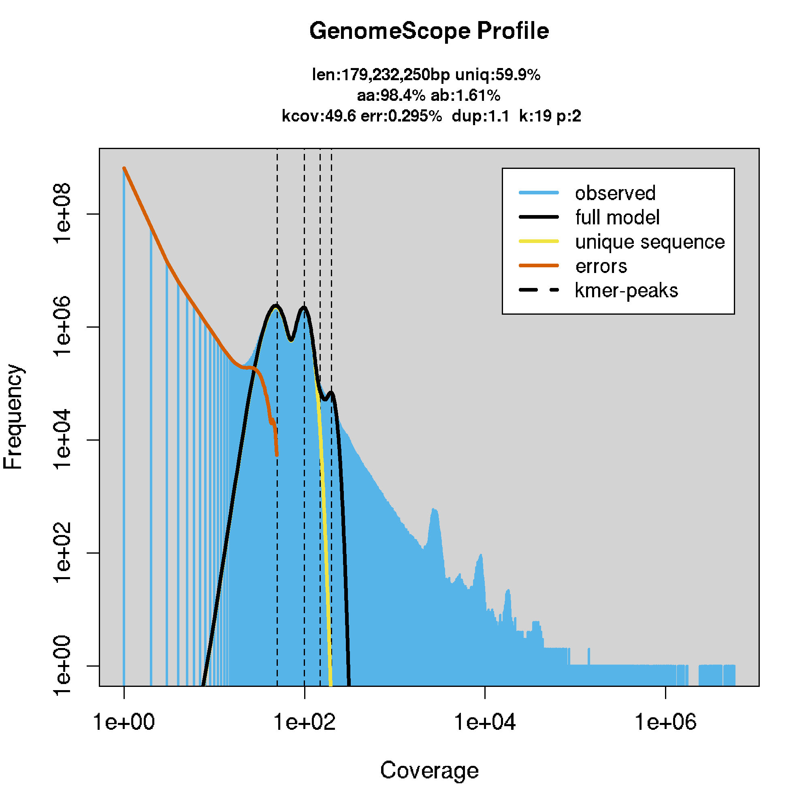
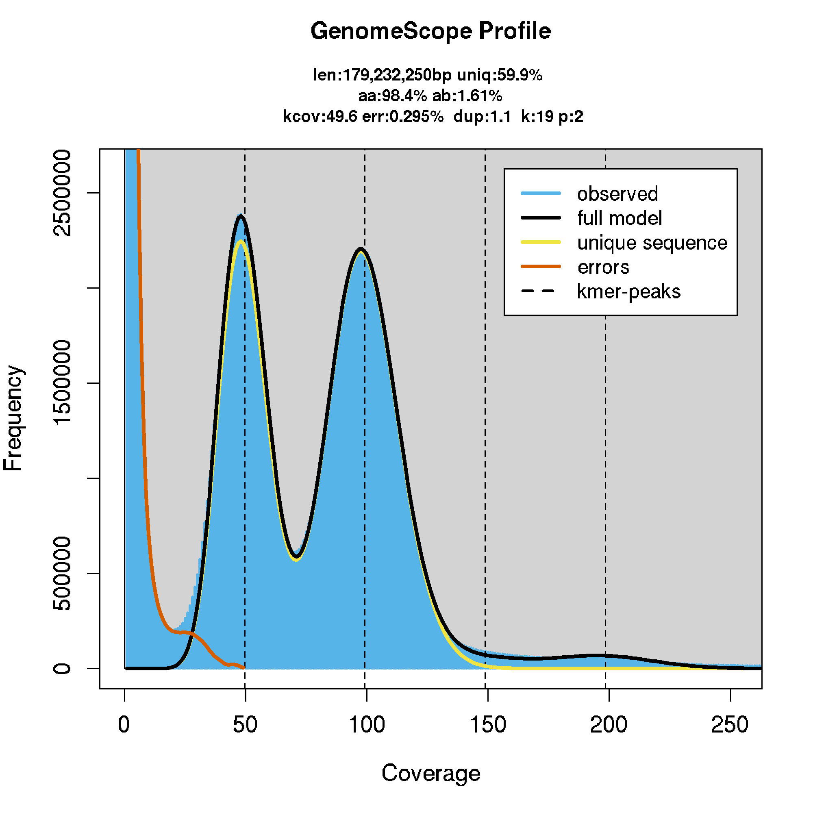

genome size estimation
================
2021-01-07

  - [copy reads](#copy-reads)
  - [submit merqury](#submit-merqury)
  - [srun genomescope](#srun-genomescope-1)
  
## Links

https://github.com/marbl/merqury

https://github.com/tbenavi1/genomescope2.0


## copy reads

``` bash
mkdir -p $USERWORK/arenosa_genomescope/reads
cd $USERWORK/arenosa_genomescope/reads
mkdir -p illumina_2Az6_1 illumina_2Az1_9 pacbio_2Az1_9

cp /cluster/projects/nn9525k/arenosa_genome/Illumina_data/Sample_05-E-2Az6-1_R?_rep.fastq.gz illumina_2Az6_1/

cp /cluster/projects/nn9525k/arenosa_genome/Illumina_data/Sample_06-F-2Az1-9_R?_rep.fastq.gz illumina_2Az1_9/

cp /cluster/projects/nn9525k/arenosa_genome_pb_uncorr/canu_out/arenosa_pp_uncorr_assembly.correctedReads.fasta.gz pacbio_2Az1_9/

for G in */*.gz 
do 
 gunzip $G
done

cat illumina_2Az6_1/*.fastq >> illumina_2Az6_1/Sample_06-F-2Az6-1_R_sum.fastq
rm illumina_2Az6_1/Sample_06-F-2Az6_1_R?_rep.fastq

cat illumina_2Az1_9/*.fastq >> illumina_2Az1_9/Sample_05-E-2Az1_9_R_sum.fastq
rm illumina_2Az1_9/Sample_06-F-2Az1-9_R?_rep.fastq
```

<https://github.com/tbenavi1/genomescope2.0>

“We recommend using a k-mer length of 21 for most genomes GenomeScope
also requires relatively low error rate sequencing, such as Illumina
sequencing, so that most k-mers do not have errors in them.”

/cluster/projects/nn9525k/Programs/genomescope2.0/genomescope.R -i
histogram\_file -o output\_dir -k k-mer\_length

“The input histogram\_file (from KMC or jellyfish), output\_dir, and
k-mer\_length are required parameters. The optional parameter -p ploidy
sets the ploidy of the model for GenomeScope to use. The optional
parameter -l lambda sets the initial guess for the average k-mer
coverage of the sequencing. The optional parameter -n ‘name\_prefix’
sets the prefix for the output files. The optional parameter -m
max\_kmercov specifies the cutoff for excluding high frequence k-mers
from the analysis. The output plots and a text file of the inferred
genome characteristics will be output to the specified output\_dir
directory.”

``` bash
module purge
module load R/3.6.2-foss-2019b

Rscript /cluster/projects/nn9525k/Programs/genomescope2.0/genomescope.R -i Sample_05-F-2Az6-1_R_sum_k16/Sample_05-F-2Az6-1_R_sum.histo -o Sample_05-F-2Az6-1_R_sum_k16/out -n "Sample_05-F-2Az6-1" -k 16 -p 2 -m 1000
```

## submit merqury

``` bash
mkdir -p MERQURY
ls reads/*/*.fast* > input.fofn
export MERQURY=/cluster/projects/nn9525k/Programs/merqury

#$MERQURY/_submit_build.sh 19 input.fofn arenosa_illumina

for R in reads/*/*.fast*
do
 PREFIX=$(basename ${R%.*})
 mkdir -p merqury_${PREFIX}
 realpath ${R} > merqury_${PREFIX}/input_${PREFIX}.fofn
 cd merqury_${PREFIX}
 k=19
 echo "$MERQURY/_submit_build_2h.sh "$k" input_${PREFIX}.fofn arenosa_${PREFIX}"
 $MERQURY/_submit_build_2h.sh "$k" input_${PREFIX}.fofn arenosa_${PREFIX}
 cd ..
done

$MERQURY/_submit_build_2h_split.sh 19 input_Sample_06-F-2Az1-9_R_sum.fofn arenosa_Sample_06-F-2Az1-9_R_sum

$MERQURY/_submit_build_2h_split.sh 19 input_Sample_05-F-2Az6-1_R_sum.fofn arenosa_Sample_05-F-2Az6-1_R_sum
```

``` bash
for R in reads/*/*.fast*
do
 PREFIX=$(basename ${R%.*})
 cd merqury_${PREFIX}
 cat arenosa_${PREFIX}.k19.hist | sed 's/\t/ /' > arenosa_${PREFIX}.k19_space.hist
 #rm arenosa_${PREFIX}.k19.hist
 cd ..
done
```

# srun genomescope

``` bash
srun --cpus-per-task=2 --mem-per-cpu=2G --time=02:00:00 --account=nn9525k --x11 --pty bash -i

module purge
module load R/3.6.2-foss-2019b

for HISTO in merqury_*/*space.hist
do
  for M in 100000000 
  do 
    echo "HISTO: $HISTO"
    PRIFIX=$(basename $HISTO _space.hist)
    echo "PRIFIX: $PRIFIX"
    OUTDIR=$(dirname $HISTO)/maxcov$M
    echo "OUTDIR: $OUTDIR"
    K=$(echo $PRIFIX | sed 's/.*\.k//')
    echo "K: $K"
    Rscript /cluster/projects/nn9525k/Programs/genomescope2.0/genomescope.R -i $HISTO -o $OUTDIR -n $PRIFIX -k $K -p 2 -m $M
  done 
done
```

| arenosa_illumina_log               | arenosa_illumina_linear               |
|------------------------------------|---------------------------------------|
|  |  |

length: 200,144,702 bp
