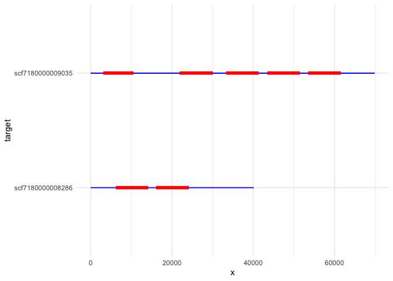
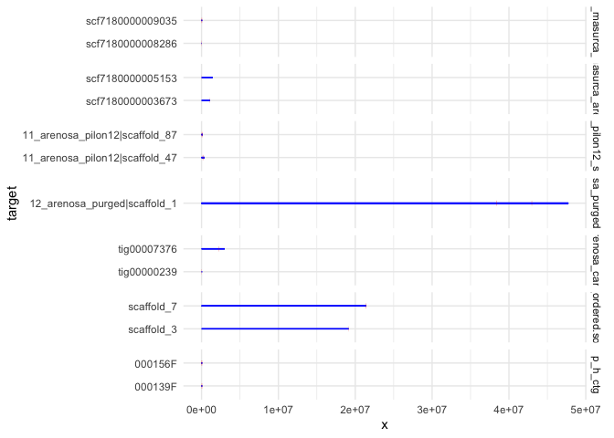
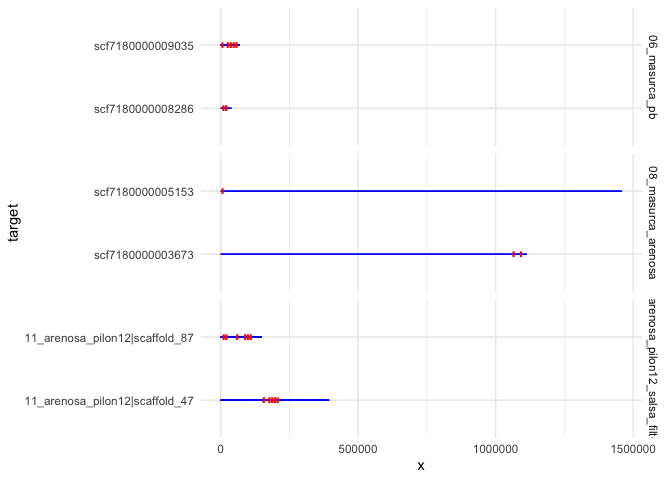
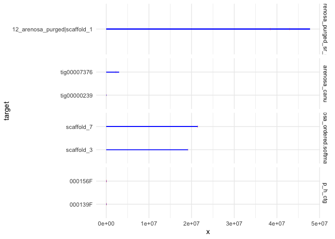
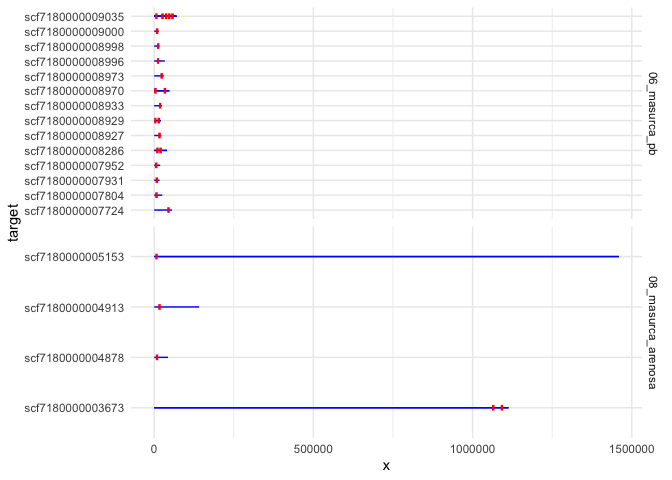

getOrganelle
================
2021-01-22

-   [round 2](#round-2)
-   [round 3 inf](#round-3-inf)
-   [chloroplast](#chloroplast)
-   [mitochondria](#mitochondria)
-   [same for 2nd plant](#same-for-2nd-plant)
-   [2nd round for better rDNA](#nd-round-for-better-rdna)
-   [3rd round for better rDNA with rDNA\_consensus as
    seed](#rd-round-for-better-rdna-with-rdna_consensus-as-seed)
-   [minimap2 some assemblies](#minimap2-some-assemblies)
-   [count nr paf alignments](#count-nr-paf-alignments)
-   [compare to thaliana
    mitochondria](#compare-to-thaliana-mitochondria)
    -   [count mitochondria paf
        alignments](#count-mitochondria-paf-alignments)
-   [count chloroplast](#count-chloroplast)
-   [count chloroplast paf
    alignments](#count-chloroplast-paf-alignments)
-   [Plot](#plot)


## Links 
https://github.com/Kinggerm/GetOrganelle

``` r
library(tidyverse)
library(fs)
library(here)
theme_set(theme_minimal())
```

``` bash
srun --cpus-per-task=2 --mem-per-cpu=8G --time=05:00:00 --account=nn9525k --pty bash -i

#https://github.com/Kinggerm/GetOrganelle
#module availe GetOrganelle
module load GetOrganelle/1.7.1-foss-2019b-Python-3.7.4
module load pigz/2.4-GCCcore-8.3.0 
#get_organelle_from_reads.py --version

cd $USERWORK/
mkdir -p getorganelle_arenosa/reads
cd getorganelle_arenosa/reads 
mkdir -p illumina_2Az6_1 illumina_2Az1_9 pacbio_2Az1_9

#plant 2Az6_1
cp /cluster/projects/nn9525k/arenosa_genome/Illumina_data/Sample_05-E-2Az6-1_R?_rep.fastq.gz illumina_2Az6_1

#plant used for PacBio 
cp /cluster/projects/nn9525k/arenosa_genome/Illumina_data/Sample_06-F-2Az1-9_R?_rep.fastq.gz illumina_2Az1_9/

#pacbio_2Az1_9
cp /cluster/projects/nn9525k/arenosa_genome_pb_uncorr/canu_out/arenosa_pp_uncorr_assembly.correctedReads.fasta.gz pacbio_2Az1_9/

cd ..
```

``` bash
mkdir -p seeds
cp rDNA_Arabidopsis.fasta seeds/
```

``` bash
#To assembly Embryophyta plant nuclear ribosomal RNA (18S-ITS1-5.8S-ITS2-26S):

R1=reads/illumina_2Az1_9/Sample_06-F-2Az1-9_R1_rep.fastq.gz
R2=reads/illumina_2Az1_9/Sample_06-F-2Az1-9_R2_rep.fastq.gz
SEED=seeds/rDNA_Arabidopsis.fasta

get_organelle_from_reads.py -1 $R1 -2 $R2 -o Sample_06-F-2Az1-9_nr_output -s $SEED -R 7 -k 35,85,115 -F embplant_nr
```

## round 2

``` bash
R1=reads/illumina_2Az1_9/Sample_06-F-2Az1-9_R1_rep.fastq.gz
R2=reads/illumina_2Az1_9/Sample_06-F-2Az1-9_R2_rep.fastq.gz
SEED=Sample_06-F-2Az1-9_nr_output/embplant_nr.K115.scaffolds.graph1.1.path_sequence.fasta

get_organelle_from_reads.py -1 $R1 -2 $R2 -o Sample_06-F-2Az1-9_nr_output_round2 -s $SEED -R 7 -k 35,85,115 -F embplant_nr
```

## round 3 inf

``` bash
R1=reads/illumina_2Az1_9/Sample_06-F-2Az1-9_R1_rep.fastq.gz
R2=reads/illumina_2Az1_9/Sample_06-F-2Az1-9_R2_rep.fastq.gz
SEED=Sample_06-F-2Az1-9_nr_output_round2/embplant_nr.K115.scaffolds.graph1.1.path_sequence.fasta

get_organelle_from_reads.py -1 $R1 -2 $R2 -o Sample_06-F-2Az1-9_nr_output_round3 -s $SEED -R 7 -k 35,85,115 -F embplant_nr --reduce-reads-for-coverage inf
```

# chloroplast

``` bash
cd seeds/
cp /cluster/projects/nn9525k/mads_paper/01_genomes/Araport11/assembly/Athaliana_447_TAIR10.fa.gz .
gunzip *.gz

sed -n '/^>ChrC/,/>/p' Athaliana_447_TAIR10.fa | head -n-1 > ChrC_Athaliana_447_TAIR10.fa
sed -n '/^>ChrM/,//p' Athaliana_447_TAIR10.fa > ChrM_Athaliana_447_TAIR10.fa

cd ..
```

``` bash
srun --cpus-per-task=8 --mem-per-cpu=2G --time=04:00:00 --account=nn9525k --pty bash -i

module load GetOrganelle/1.7.1-foss-2019b-Python-3.7.4
module load pigz/2.4-GCCcore-8.3.0 

cd getorganelle_arenosa/

R1=reads/illumina_2Az1_9/Sample_06-F-2Az1-9_R1_rep.fastq.gz
R2=reads/illumina_2Az1_9/Sample_06-F-2Az1-9_R2_rep.fastq.gz
SEED=seeds/ChrC_Athaliana_447_TAIR10.fa
OUT=Sample_06-F-2Az1-9_plastome_output

get_organelle_from_reads.py -1 $R1 -2 $R2 -o $OUT -R 15 -k 21,45,65,85,105 -F embplant_pt -s $SEED -t 8
```

# mitochondria

``` bash
srun --cpus-per-task=8 --mem-per-cpu=2G --time=04:00:00 --account=nn9525k --pty bash -i

module load GetOrganelle/1.7.1-foss-2019b-Python-3.7.4
module load pigz/2.4-GCCcore-8.3.0 

cd getorganelle_arenosa/

R1=reads/illumina_2Az1_9/Sample_06-F-2Az1-9_R1_rep.fastq.gz
R2=reads/illumina_2Az1_9/Sample_06-F-2Az1-9_R2_rep.fastq.gz
SEED=seeds/ChrM_Athaliana_447_TAIR10.fa
OUT=Sample_06-F-2Az1-9_mitochondria_output

get_organelle_from_reads.py -1 $R1 -2 $R2 -o $OUT -R 50 -k 21,45,65,85,105 -P 1000000 -F embplant_mt -s $SEED -t 8
```

# same for 2nd plant

``` bash
R1=/cluster/work/users/jonathbr/getorganelle_arenosa/reads/illumina_2Az6_1/Sample_05-E-2Az6-1_R1_rep.fastq.gz
R2=/cluster/work/users/jonathbr/getorganelle_arenosa/reads/illumina_2Az6_1/Sample_05-E-2Az6-1_R2_rep.fastq.gz

sbatch getrDNA.slurm $R1 $R2 #00:12:17   00:07:00  3 246 368K
sbatch getChloro.slurm $R1 $R2 #00:53:49   00:27:23   4 416 368K
#sbatch getMito.slurm $R1 $R2 #killed by the cgroup out-of-memory handler
sbatch getMito_v2.slurm $R1 $R2 #07:15:52   03:07:03    18 493 088K
```

# 2nd round for better rDNA

``` bash
module load GetOrganelle/1.7.1-foss-2019b-Python-3.7.4
module load pigz/2.4-GCCcore-8.3.0 

R1=/cluster/work/users/jonathbr/getorganelle_arenosa/reads/illumina_2Az6_1/Sample_05-E-2Az6-1_R1_rep.fastq.gz
R2=/cluster/work/users/jonathbr/getorganelle_arenosa/reads/illumina_2Az6_1/Sample_05-E-2Az6-1_R2_rep.fastq.gz
SEED=Sample_05-E-2Az6-1_nr_output/embplant_nr.K115.scaffolds.graph1.1.path_sequence.fasta
PREFIX=$(basename $R1 _R1_rep.fastq.gz)
OUT=${PREFIX}_nr_output_round2

get_organelle_from_reads.py -1 $R1 -2 $R2 -o $OUT -s $SEED -R 7 -k 35,85,115 -F embplant_nr
```

# 3rd round for better rDNA with rDNA\_consensus as seed

``` bash
SEED=seeds/operon_sample_06.fasta
PREFIX=$(basename $R1 _R1_rep.fastq.gz)
OUT=${PREFIX}_nr_output_round3

get_organelle_from_reads.py -1 $R1 -2 $R2 -o $OUT -s $SEED -R 7 -k 35,85,115 -F embplant_nr
```


# minimap2 some assemblies

``` bash
srun --cpus-per-task=2 --mem-per-cpu=4G --time=02:00:00 --account=nn9525k --pty bash -i

cd getorganelle_arenosa/
mkdir minimap_nr
mkdir assemblies
cp /cluster/projects/nn9525k/arenosa_genome/02_scaffolds/02_Salsa_scaffolds_with_matlock/11_arenosa_pilon12_salsa_filtered/11_arenosa_pilon12_salsa_filtered.fasta assemblies/
cp /cluster/projects/nn9525k/arenosa_genome/02_scaffolds/02_Salsa_scaffolds_with_matlock/12_arenosa_purged_sr/12_arenosa_purged_sr_salsa.fasta assemblies/
cp /cluster/projects/nn9525k/arenosa_genome/02_scaffolds/12_repeatmasker_cds_filltered/softmasked_arenosa_ordered/arenosa_ordered.fasta.softmasked.gz assemblies/
cp /cluster/projects/nn9525k/arenosa_genome/02_scaffolds/00_ref_assemblies/06_masurca_pb/final.genome.scf.fasta.gz assemblies/06_masurca_pb.fasta.gz
cp /cluster/projects/nn9525k/arenosa_genome/arenosa_v1.0/Aarenosa_v1.0_assembly.fasta.gz assemblies/08_masurca_arenosa.fasta.gz
cp /cluster/projects/nn9525k/hybrids/jasonrm/GenomeAsssembly/A.arenosa.ver1/arenosa.contigs.fasta.gz assemblies/arenosa_canu.fasta.gz
cp /cluster/projects/nn9525k/arenosa_genome/02_scaffolds/00_ref_assemblies/02_falcon_p_h_ctg/p_h_ctg.fasta.gz assemblies/
gunzip assemblies/*.gz
mv assemblies/arenosa_ordered.fasta.softmasked assemblies/arenosa_ordered.softmasked.fasta

#module availe minimap2
ml minimap2/2.17-GCC-8.3.0
cd minimap_nr/

#./minimap2 -cx asm5 asm1.fa asm2.fa > aln.paf             # intra-species asm-to-asm alignment

SAMPLE=operon_sample_06.fasta
END=$(basename $SAMPLE .fasta)
for FASTA in ../assemblies/*.fasta;
do
 PREFIX=$(basename $FASTA .fasta)
 echo $PREFIX
 mkdir -p $PREFIX
 echo "minimap2 -cx asm5 $FASTA $SAMPLE > ${PREFIX}/${PREFIX}_${END}.paf"
 minimap2 -cx asm5 $FASTA $SAMPLE > ${PREFIX}/${PREFIX}_${END}.paf
done
```

``` bash
#module availe minimap2
ml minimap2/2.17-GCC-8.3.0
mkdir minimap_mitochondria/
cd minimap_mitochondria/

#./minimap2 -cx asm5 asm1.fa asm2.fa > aln.paf             # intra-species asm-to-asm alignment

SAMPLE=../seeds/scaffold_10_arenosa_ordered.fasta
END=$(basename $SAMPLE .fasta)
for FASTA in ../assemblies/*.fasta;
do
 PREFIX=$(basename $FASTA .fasta)
 echo $PREFIX
 mkdir -p $PREFIX
 echo "minimap2 -cx asm5 $FASTA $SAMPLE > ${PREFIX}/${PREFIX}_${END}.paf"
 minimap2 -cx asm5 $FASTA $SAMPLE > ${PREFIX}/${PREFIX}_${END}.paf
done

cd ..
```

# count nr paf alignments

``` r
filenames <- dir_ls(here("01_Data/minimap_nr"), recurse = TRUE, glob = "*.paf")

paf <- map(filenames, read_tsv,
         col_names = c("query", "q_length", "q_start", "q_end", "strand",
                       "target", "t_length", "t_start", "t_end",
                       "matches", "alignment_length", "map_quality",
                       "NM", "ms", "AS", "nn", "tp", "cm", "s1", "s2","de", "rl", "cg"
                       ))

clean_paf <- function(data) {
  data %>% unite(c("NM", "ms", "AS", "nn", 
          "tp", "cm", "s1", "s2",
          "de", "rl", "cg"), col = "sam_like") %>% 
  mutate(query = "rDNA_operon")
}

paf <- map(paf, clean_paf)

paf <- paf %>% set_names(str_remove_all(filenames,".*/|.paf"))
```

``` r
count_alinment <- function(data) {
  data %>% select(query, target, alignment_length) %>% 
  group_by(query, target) %>% 
  summarise(n = n(),
            sum_length = sum(alignment_length)) %>% 
  arrange(desc(sum_length))
}

map(paf, count_alinment)  
```

    ## $`06_masurca_pb_operon_sample_06`
    ## # A tibble: 14 x 4
    ## # Groups:   query [1]
    ##    query       target               n sum_length
    ##    <chr>       <chr>            <int>      <dbl>
    ##  1 rDNA_operon scf7180000009035     5      39841
    ##  2 rDNA_operon scf7180000008286     2      16128
    ##  3 rDNA_operon scf7180000008970     2      15693
    ##  4 rDNA_operon scf7180000008929     2      15293
    ##  5 rDNA_operon scf7180000007804     1       8189
    ##  6 rDNA_operon scf7180000007931     1       8055
    ##  7 rDNA_operon scf7180000008927     1       8024
    ##  8 rDNA_operon scf7180000009000     1       7866
    ##  9 rDNA_operon scf7180000007952     1       7849
    ## 10 rDNA_operon scf7180000007724     1       7848
    ## 11 rDNA_operon scf7180000008973     1       7664
    ## 12 rDNA_operon scf7180000008998     1       7458
    ## 13 rDNA_operon scf7180000008933     1       7339
    ## 14 rDNA_operon scf7180000008996     1       6933
    ## 
    ## $`08_masurca_arenosa_operon_sample_06`
    ## # A tibble: 4 x 4
    ## # Groups:   query [1]
    ##   query       target               n sum_length
    ##   <chr>       <chr>            <int>      <dbl>
    ## 1 rDNA_operon scf7180000003673     2      15569
    ## 2 rDNA_operon scf7180000004913     1       7994
    ## 3 rDNA_operon scf7180000005153     2       7911
    ## 4 rDNA_operon scf7180000004878     1       7863
    ## 
    ## $`11_arenosa_pilon12_salsa_filtered_operon_sample_06`
    ## # A tibble: 8 x 4
    ## # Groups:   query [1]
    ##   query       target                              n sum_length
    ##   <chr>       <chr>                           <int>      <dbl>
    ## 1 rDNA_operon 11_arenosa_pilon12|scaffold_87      6      49135
    ## 2 rDNA_operon 11_arenosa_pilon12|scaffold_47      5      40945
    ## 3 rDNA_operon 11_arenosa_pilon12|scaffold_178     2      16391
    ## 4 rDNA_operon 11_arenosa_pilon12|scaffold_1       2      16152
    ## 5 rDNA_operon 11_arenosa_pilon12|scaffold_144     2      16110
    ## 6 rDNA_operon 11_arenosa_pilon12|scaffold_385     1       8200
    ## 7 rDNA_operon 11_arenosa_pilon12|scaffold_149     1       8189
    ## 8 rDNA_operon 11_arenosa_pilon12|scaffold_191     1       8189
    ## 
    ## $`12_arenosa_purged_sr_salsa_operon_sample_06`
    ## # A tibble: 1 x 4
    ## # Groups:   query [1]
    ##   query       target                           n sum_length
    ##   <chr>       <chr>                        <int>      <dbl>
    ## 1 rDNA_operon 12_arenosa_purged|scaffold_1     7      57228
    ## 
    ## $arenosa_canu_operon_sample_06
    ## # A tibble: 7 x 4
    ## # Groups:   query [1]
    ##   query       target          n sum_length
    ##   <chr>       <chr>       <int>      <dbl>
    ## 1 rDNA_operon tig00007376     3      24545
    ## 2 rDNA_operon tig00001205     2      16389
    ## 3 rDNA_operon tig00000239     2      16377
    ## 4 rDNA_operon tig00001772     2      15940
    ## 5 rDNA_operon tig00000329     2      15938
    ## 6 rDNA_operon tig00000231     1       8199
    ## 7 rDNA_operon tig00000230     1       8010
    ## 
    ## $arenosa_ordered.softmasked_operon_sample_06
    ## # A tibble: 3 x 4
    ## # Groups:   query [1]
    ##   query       target         n sum_length
    ##   <chr>       <chr>      <int>      <dbl>
    ## 1 rDNA_operon scaffold_7     4      32630
    ## 2 rDNA_operon scaffold_3     2      16408
    ## 3 rDNA_operon scaffold_4     1       8199
    ## 
    ## $p_h_ctg_operon_sample_06
    ## # A tibble: 17 x 4
    ## # Groups:   query [1]
    ##    query       target      n sum_length
    ##    <chr>       <chr>   <int>      <dbl>
    ##  1 rDNA_operon 000156F     6      49146
    ##  2 rDNA_operon 000139F     5      40927
    ##  3 rDNA_operon 000202F     5      40923
    ##  4 rDNA_operon 000360F     5      40914
    ##  5 rDNA_operon 000310F     4      32669
    ##  6 rDNA_operon 000032F     4      32668
    ##  7 rDNA_operon 000346F     3      24565
    ##  8 rDNA_operon 000162F     3      24501
    ##  9 rDNA_operon 000334F     3      24501
    ## 10 rDNA_operon 000447F     3      24168
    ## 11 rDNA_operon 000241F     2      16397
    ## 12 rDNA_operon 000017F     2      16382
    ## 13 rDNA_operon 000416F     2      16112
    ## 14 rDNA_operon 000104F     1       8199
    ## 15 rDNA_operon 000028F     1       8183
    ## 16 rDNA_operon 000397F     1       8182
    ## 17 rDNA_operon 000274F     1       7921

``` r
paf_nr <- paf
```

# compare to thaliana mitochondria

``` bash
#module availe minimap2
ml minimap2/2.17-GCC-8.3.0
mkdir -p minimap_mitochondria/
cd minimap_mitochondria/

#./minimap2 -cx asm5 asm1.fa asm2.fa > aln.paf             # intra-species asm-to-asm alignment

SAMPLE=../seeds/ChrM_Athaliana_447_TAIR10.fa
END=$(basename $SAMPLE .fasta)
for FASTA in ../assemblies/*.fasta;
do
 PREFIX=$(basename $FASTA .fasta)
 echo $PREFIX
 mkdir -p $PREFIX
 echo "minimap2 -cx asm5 $FASTA $SAMPLE > ${PREFIX}/${PREFIX}_${END}.paf"
 minimap2 -cx asm5 $FASTA $SAMPLE > ${PREFIX}/${PREFIX}_${END}.paf
done

cd ..
```

## count mitochondria paf alignments

``` r
filenames <- dir_ls(here("01_Data/minimap_mitochondria"), recurse = TRUE, glob = "*.paf")

paf <- map(filenames, read_tsv,
         col_names = c("query", "q_length", "q_start", "q_end", "strand",
                       "target", "t_length", "t_start", "t_end",
                       "matches", "alignment_length", "map_quality",
                       "NM", "ms", "AS", "nn", "tp", "cm", "s1", "s2","de", "rl", "cg"
                       ))


clean_paf <- function(data) {
  data %>% unite(c("NM", "ms", "AS", "nn", 
          "tp", "cm", "s1", "s2",
          "de", "rl", "cg"), col = "sam_like") %>% 
  mutate(query = if_else(query == "ChrM", "ChrM_Athaliana", "scaf_10_M"))
}

paf <- map(paf, clean_paf)

paf <- paf %>% set_names(str_remove_all(filenames,".*/|.paf"))
```

``` r
count_alinment <- function(data) {
  data %>% select(query, target, alignment_length) %>% 
  group_by(query, target) %>% 
  summarise(n = n(),
            sum_length = sum(alignment_length)) %>% 
  arrange(desc(sum_length))
}

map(paf, count_alinment)  
```

    ## $`06_masurca_pb_ChrM_Athaliana_447_TAIR10.fa`
    ## # A tibble: 6 x 4
    ## # Groups:   query [1]
    ##   query          target               n sum_length
    ##   <chr>          <chr>            <int>      <dbl>
    ## 1 ChrM_Athaliana scf7180000009030    42     231891
    ## 2 ChrM_Athaliana scf7180000008957    16      70559
    ## 3 ChrM_Athaliana scf7180000009029    15      64776
    ## 4 ChrM_Athaliana scf7180000008971     9      44411
    ## 5 ChrM_Athaliana scf7180000008972     9      42658
    ## 6 ChrM_Athaliana scf7180000008956     7      28071
    ## 
    ## $`06_masurca_pb_scaffold_10_arenosa_ordered`
    ## # A tibble: 7 x 4
    ## # Groups:   query [1]
    ##   query     target               n sum_length
    ##   <chr>     <chr>            <int>      <dbl>
    ## 1 scaf_10_M scf7180000009030     2     294321
    ## 2 scaf_10_M scf7180000008957     2     108812
    ## 3 scaf_10_M scf7180000008956     1      24406
    ## 4 scaf_10_M scf7180000008971     1      24238
    ## 5 scaf_10_M scf7180000009029     1      23952
    ## 6 scaf_10_M scf7180000008972     1      22489
    ## 7 scaf_10_M scf7180000007156     1        246
    ## 
    ## $`08_masurca_arenosa_ChrM_Athaliana_447_TAIR10.fa`
    ## # A tibble: 2 x 4
    ## # Groups:   query [1]
    ##   query          target               n sum_length
    ##   <chr>          <chr>            <int>      <dbl>
    ## 1 ChrM_Athaliana scf7180000003856    61     299214
    ## 2 ChrM_Athaliana scf7180000005130     1        484
    ## 
    ## $`08_masurca_arenosa_scaffold_10_arenosa_ordered`
    ## # A tibble: 6 x 4
    ## # Groups:   query [1]
    ##   query     target               n sum_length
    ##   <chr>     <chr>            <int>      <dbl>
    ## 1 scaf_10_M scf7180000003856     2     336490
    ## 2 scaf_10_M scf7180000003991     1        450
    ## 3 scaf_10_M scf7180000004066     1        450
    ## 4 scaf_10_M scf7180000005151     1        450
    ## 5 scaf_10_M scf7180000004730     1        380
    ## 6 scaf_10_M scf7180000004522     1        282
    ## 
    ## $`11_arenosa_pilon12_salsa_filtered_ChrM_Athaliana_447_TAIR10.fa`
    ## # A tibble: 1 x 4
    ## # Groups:   query [1]
    ##   query          target                             n sum_length
    ##   <chr>          <chr>                          <int>      <dbl>
    ## 1 ChrM_Athaliana 11_arenosa_pilon12|scaffold_51    52     309857
    ## 
    ## $`11_arenosa_pilon12_salsa_filtered_scaffold_10_arenosa_ordered`
    ## # A tibble: 1 x 4
    ## # Groups:   query [1]
    ##   query     target                             n sum_length
    ##   <chr>     <chr>                          <int>      <dbl>
    ## 1 scaf_10_M 11_arenosa_pilon12|scaffold_51     1     363047
    ## 
    ## $`12_arenosa_purged_sr_salsa_ChrM_Athaliana_447_TAIR10.fa`
    ## # A tibble: 1 x 4
    ## # Groups:   query [1]
    ##   query          target                            n sum_length
    ##   <chr>          <chr>                         <int>      <dbl>
    ## 1 ChrM_Athaliana 12_arenosa_purged|scaffold_22    52     309857
    ## 
    ## $`12_arenosa_purged_sr_salsa_scaffold_10_arenosa_ordered`
    ## # A tibble: 1 x 4
    ## # Groups:   query [1]
    ##   query     target                            n sum_length
    ##   <chr>     <chr>                         <int>      <dbl>
    ## 1 scaf_10_M 12_arenosa_purged|scaffold_22     1     363047
    ## 
    ## $arenosa_canu_ChrM_Athaliana_447_TAIR10.fa
    ## # A tibble: 1 x 4
    ## # Groups:   query [1]
    ##   query          target          n sum_length
    ##   <chr>          <chr>       <int>      <dbl>
    ## 1 ChrM_Athaliana tig00001756    61     299461
    ## 
    ## $arenosa_canu_scaffold_10_arenosa_ordered
    ## # A tibble: 3 x 4
    ## # Groups:   query [1]
    ##   query     target          n sum_length
    ##   <chr>     <chr>       <int>      <dbl>
    ## 1 scaf_10_M tig00001756     2     332973
    ## 2 scaf_10_M tig00001766     2        895
    ## 3 scaf_10_M tig00007723     1        455
    ## 
    ## $arenosa_ordered.softmasked_ChrM_Athaliana_447_TAIR10.fa
    ## # A tibble: 1 x 4
    ## # Groups:   query [1]
    ##   query          target          n sum_length
    ##   <chr>          <chr>       <int>      <dbl>
    ## 1 ChrM_Athaliana scaffold_10    54     304534
    ## 
    ## $arenosa_ordered.softmasked_scaffold_10_arenosa_ordered
    ## # A tibble: 1 x 4
    ## # Groups:   query [1]
    ##   query     target          n sum_length
    ##   <chr>     <chr>       <int>      <dbl>
    ## 1 scaf_10_M scaffold_10     1     363047
    ## 
    ## $p_h_ctg_ChrM_Athaliana_447_TAIR10.fa
    ## # A tibble: 23 x 4
    ## # Groups:   query [1]
    ##    query          target      n sum_length
    ##    <chr>          <chr>   <int>      <dbl>
    ##  1 ChrM_Athaliana 000091F     6       4759
    ##  2 ChrM_Athaliana 000024F     2       3710
    ##  3 ChrM_Athaliana 000080F     5       3453
    ##  4 ChrM_Athaliana 000087F     4       2890
    ##  5 ChrM_Athaliana 000090F     4       2890
    ##  6 ChrM_Athaliana 000094F     4       2890
    ##  7 ChrM_Athaliana 000118F     4       2890
    ##  8 ChrM_Athaliana 000248F     4       2890
    ##  9 ChrM_Athaliana 000083F     3       2380
    ## 10 ChrM_Athaliana 000084F     3       2380
    ## # … with 13 more rows
    ## 
    ## $p_h_ctg_scaffold_10_arenosa_ordered
    ## # A tibble: 24 x 4
    ## # Groups:   query [1]
    ##    query     target      n sum_length
    ##    <chr>     <chr>   <int>      <dbl>
    ##  1 scaf_10_M 000024F     5       5587
    ##  2 scaf_10_M 000091F     6       4724
    ##  3 scaf_10_M 000087F     6       3832
    ##  4 scaf_10_M 000090F     5       3371
    ##  5 scaf_10_M 000094F     5       3255
    ##  6 scaf_10_M 000089F     4       2872
    ##  7 scaf_10_M 000248F     4       2872
    ##  8 scaf_10_M 000083F     3       2362
    ##  9 scaf_10_M 000084F     3       2362
    ## 10 scaf_10_M 000088F     3       2362
    ## # … with 14 more rows

# count chloroplast

``` bash
#module availe minimap2
ml minimap2/2.17-GCC-8.3.0
mkdir minimap_plastome/
cd minimap_plastome/

#./minimap2 -cx asm5 asm1.fa asm2.fa > aln.paf             # intra-species asm-to-asm alignment

SAMPLE=../seeds/arenosa_2A_plastome_consensus.fasta
END=$(basename $SAMPLE .fasta)
for FASTA in ../assemblies/*.fasta;
do
 PREFIX=$(basename $FASTA .fasta)
 echo $PREFIX
 mkdir -p $PREFIX
 echo "minimap2 -cx asm5 $FASTA $SAMPLE > ${PREFIX}/${PREFIX}_${END}.paf"
 minimap2 -cx asm5 $FASTA $SAMPLE > ${PREFIX}/${PREFIX}_${END}.paf
done

cd ..
```

# count chloroplast paf alignments

``` r
filenames <- dir_ls(here("01_Data/minimap_plastome"), recurse = TRUE, glob = "*.paf")

paf <- map(filenames, read_tsv,
         col_names = c("query", "q_length", "q_start", "q_end", "strand",
                       "target", "t_length", "t_start", "t_end",
                       "matches", "alignment_length", "map_quality",
                       "NM", "ms", "AS", "nn", "tp", "cm", "s1", "s2","de", "rl", "cg"
                       ))

clean_paf <- function(data) {
  data %>% unite(c("NM", "ms", "AS", "nn", 
          "tp", "cm", "s1", "s2",
          "de", "rl", "cg"), col = "sam_like") %>% 
  mutate(query = "chloroplast")
}

paf <- map(paf, clean_paf)

paf <- paf %>% set_names(str_remove_all(filenames,".*/|.paf"))
```

``` r
count_alinment <- function(data) {
  data %>% select(query, target, alignment_length) %>% 
  group_by(query, target) %>% 
  summarise(n = n(),
            sum_length = sum(alignment_length)) %>% 
  arrange(desc(sum_length))
}

map(paf, count_alinment)  
```

    ## $`06_masurca_pb_arenosa_2A_plastome_consensus`
    ## # A tibble: 1 x 4
    ## # Groups:   query [1]
    ##   query       target               n sum_length
    ##   <chr>       <chr>            <int>      <dbl>
    ## 1 chloroplast scf7180000007447     1     152844
    ## 
    ## $`08_masurca_arenosa_arenosa_2A_plastome_consensus`
    ## # A tibble: 4 x 4
    ## # Groups:   query [1]
    ##   query       target               n sum_length
    ##   <chr>       <chr>            <int>      <dbl>
    ## 1 chloroplast scf7180000005151     3     163872
    ## 2 chloroplast scf7180000005150     3     146520
    ## 3 chloroplast scf7180000005152     1      26268
    ## 4 chloroplast scf7180000005149     1      26267
    ## 
    ## $`11_arenosa_pilon12_salsa_filtered_arenosa_2A_plastome_consensus`
    ## # A tibble: 1 x 4
    ## # Groups:   query [1]
    ##   query       target                             n sum_length
    ##   <chr>       <chr>                          <int>      <dbl>
    ## 1 chloroplast 11_arenosa_pilon12|scaffold_60     2     220016
    ## 
    ## $`12_arenosa_purged_sr_salsa_arenosa_2A_plastome_consensus`
    ## # A tibble: 5 x 4
    ## # Groups:   query [1]
    ##   query       target                            n sum_length
    ##   <chr>       <chr>                         <int>      <dbl>
    ## 1 chloroplast 12_arenosa_purged|scaffold_35     2      41450
    ## 2 chloroplast 12_arenosa_purged|scaffold_1      1       2571
    ## 3 chloroplast 12_arenosa_purged|scaffold_22     5       2349
    ## 4 chloroplast 12_arenosa_purged|scaffold_9      2       2169
    ## 5 chloroplast 12_arenosa_purged|scaffold_4      1        354
    ## 
    ## $arenosa_canu_arenosa_2A_plastome_consensus
    ## # A tibble: 1 x 4
    ## # Groups:   query [1]
    ##   query       target          n sum_length
    ##   <chr>       <chr>       <int>      <dbl>
    ## 1 chloroplast tig00001766     2     230468
    ## 
    ## $arenosa_ordered.softmasked_arenosa_2A_plastome_consensus
    ## # A tibble: 5 x 4
    ## # Groups:   query [1]
    ##   query       target          n sum_length
    ##   <chr>       <chr>       <int>      <dbl>
    ## 1 chloroplast scaffold_15     2      41450
    ## 2 chloroplast scaffold_1      1       2571
    ## 3 chloroplast scaffold_10     5       2349
    ## 4 chloroplast scaffold_5      2       2169
    ## 5 chloroplast scaffold_4      1        354
    ## 
    ## $p_h_ctg_arenosa_2A_plastome_consensus
    ## # A tibble: 4 x 4
    ## # Groups:   query [1]
    ##   query       target      n sum_length
    ##   <chr>       <chr>   <int>      <dbl>
    ## 1 chloroplast 000089F     1     153326
    ## 2 chloroplast 000083F     1     150636
    ## 3 chloroplast 000087F     1     148341
    ## 4 chloroplast 000080F     1     131557

# Plot

``` bash
cd $USERWORK/getorganelle_arenosa/assemblies/

ml SAMtools/1.10-iccifort-2019.5.281

for FASTA in *fasta 
do
 samtools faidx $FASTA -o ${FASTA}.fai &
done 
```

``` r
filenames <- dir_ls(here("01_Data/assemblies"), glob ="*.fai")
assemblies <- map(filenames, read_tsv, col_names = c("NAME", "LENGTH", "OFFSET", "LINEBASES", "LINEWIDTH"))

assemblies <- assemblies %>% set_names(str_remove_all(filenames, ".*/|.fasta.fai"))
```

``` r
two <- paf_nr[[1]] %>% 
  count(query, target, sort = TRUE) %>% 
  slice_head(n = 2) %>% pull(target)

plot_dat <- paf_nr[[1]] %>% 
  filter(target %in% two) %>% 
  select(query, target, t_start, t_end) %>% 
  left_join(assemblies[[1]][1:2], by = c("target" = "NAME"))

plot_dat %>% 
  ggplot() +
   geom_segment(aes(x=0, xend=LENGTH, y=target, yend=target), color = "blue")+
   geom_segment(aes(x=t_start, xend=t_end, y=target, yend=target), color = "red", size = 2)
```

<!-- -->

``` r
plot2hits <- function(ass_no, paf, assemb) {
  two <- paf[[ass_no]] %>% 
  count(query, target, sort = TRUE) %>% 
  slice_head(n = 2) %>% pull(target)
  plot_dat <- paf[[ass_no]] %>% 
  filter(target %in% two) %>% 
  select(query, target, t_start, t_end) %>% 
  left_join(assemb[[ass_no]][1:2], by = c("target" = "NAME"))
}
```

``` r
ass_names <- names(paf_nr)
assemb <- names(assemblies)

map(1:7, plot2hits, paf_nr, assemblies) %>% 
  set_names(names(assemblies)[1:length(.)]) %>% 
  bind_rows(.id = "assembly") %>% 
  ggplot() +
  geom_segment(aes(x=0, xend=LENGTH, y=target, yend=target), color = "blue")+
   geom_segment(aes(x=t_start, xend=t_end, y=target, yend=target), color = "red", size = 2)+
  facet_grid(rows = vars(assembly), scales = "free")
```

<!-- -->

``` r
map(1:3, plot2hits, paf_nr, assemblies) %>% 
  set_names(names(assemblies)[1:length(.)]) %>% 
  bind_rows(.id = "assembly") %>% 
  ggplot() +
  geom_segment(aes(x=0, xend=LENGTH, y=target, yend=target), color = "blue")+
   geom_segment(aes(x=t_start, xend=t_end, y=target, yend=target), color = "red", size = 2)+
  facet_grid(rows = vars(assembly), scales = "free")
```

<!-- -->

``` r
plot2hits <- function(ass_no, paf, assemb) {
  two <- paf[[ass_no]] %>% 
  count(query, target, sort = TRUE) %>% 
  slice_head(n = 2) %>% pull(target)
  plot_dat <- paf[[ass_no]] %>% 
  filter(target %in% two) %>% 
  select(query, target, t_start, t_end) %>% 
  left_join(assemb[[ass_no]][1:2], by = c("target" = "NAME"))
}

ggplot_hits <- function(ass_seq, paf, assemb) {
 map(ass_seq, plot2hits, paf, assemb) %>% 
 set_names(names(assemb)[ass_seq]) %>% 
  bind_rows(.id = "assembly") %>% 
  ggplot() +
  geom_segment(aes(x=0, xend=LENGTH, y=target, yend=target), color = "blue")+
   geom_segment(aes(x=t_start, xend=t_end, y=target, yend=target), color = "red", size = 2)+
  facet_grid(rows = vars(assembly), scales = "free")
}
 
ggplot_hits(ass_seq = 4:7, paf = paf_nr, assemb = assemblies)
```

<!-- -->

``` r
ass_names <- names(assemblies)
paf_nr <- paf_nr %>% set_names(ass_names)

paf_nr_df <- paf_nr %>% bind_rows( .id = "assembly") %>% 
  unite(c(assembly, target), col = key, remove = FALSE)

assemblies_df <- assemblies %>% bind_rows( .id = "assembly") %>% 
  unite(c(assembly, NAME), col = key)

plot_data <- left_join(paf_nr_df, assemblies_df[1:2], by = "key")
  
plot_data %>%
  filter(str_detect(assembly, "masurca")) %>% 
  ggplot() +
  geom_segment(aes(x=0, xend=LENGTH, y=target, yend=target), color = "blue")+
   geom_segment(aes(x=t_start, xend=t_end, y=target, yend=target), color = "red", size = 2)+
  facet_grid(rows = vars(assembly), scales = "free")
```

<!-- -->
