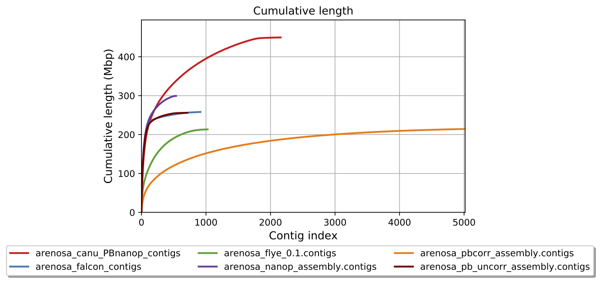
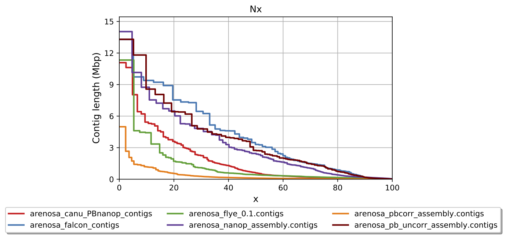
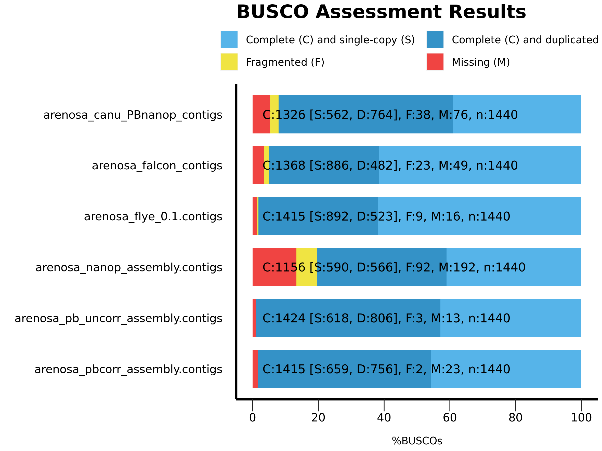
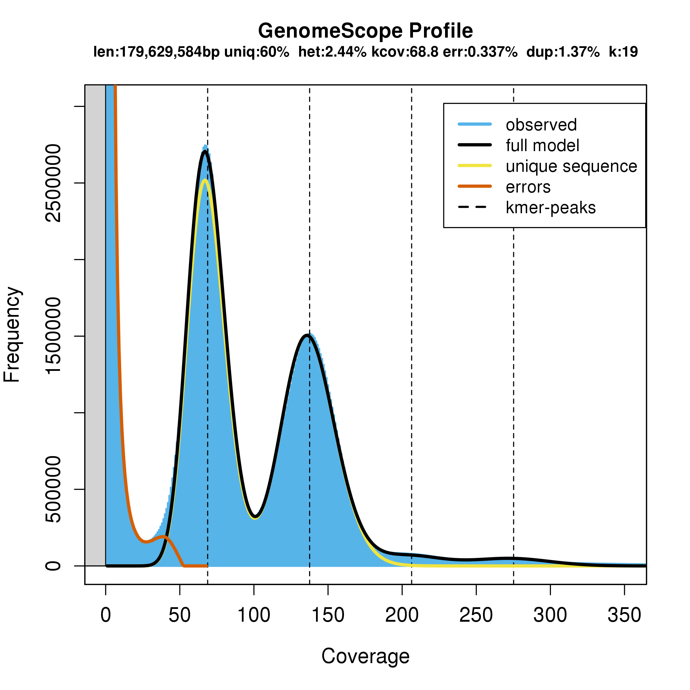

## 02_assembly

-   01_canu_assembly

    -   [canu.slurm](01_canu_assembly/canu.slurm)
    -   [arenosa_pb_uncorr_assembly.contigs.fasta.gz](01_canu_assembly/arenosa_pb_uncorr_assembly.contigs.fasta.gz)

-   02_masurca_assembly

    -   [arenosa_masurca_pb_final.genome.scf.fasta.gz](02_masurca_assembly/arenosa_masurca_pb_final.genome.scf.fasta.gz)

-   03_falcon_assembly

    -   [arenosa_falcon_p\_h_ctg.fasta.gz](03_falcon_assembly/arenosa_falcon_p_h_ctg.fasta.gz)

-   04_flye_assembly

    -   [arenosa_flye_pb_assembly.fasta.gz](04_flye_assembly/arenosa_flye_pb_assembly.fasta.gz)

-   05_getorganelle

    -   [getorganelle_v1.md](05_getorganelle/getorganelle_v1.md)

|  |           |
|--------------------------|---------------------------|
|     |  |
