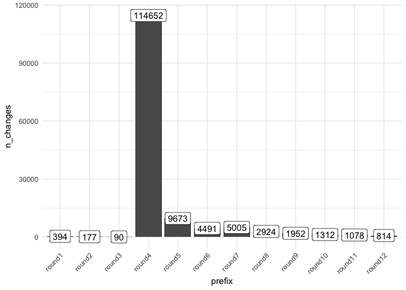
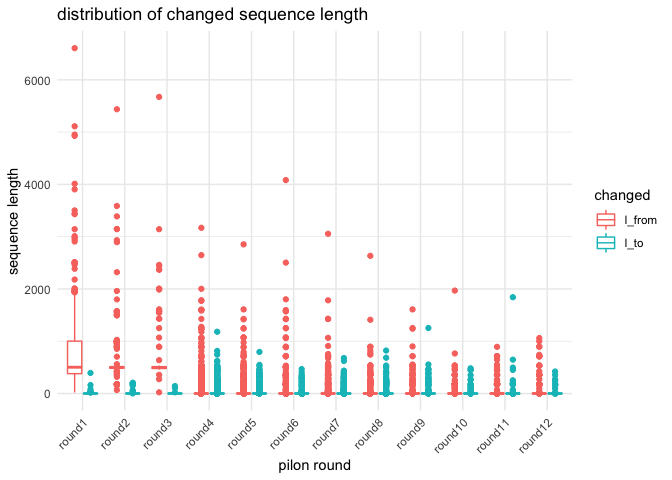

# pilon summary

2020-09-01

-   [commands for pilon check](#commands-for-pilon-check)
-   [read .changes](#read-.changes)

``` r
library(tidyverse)
library(fs)
```

## commands for pilon check {#commands-for-pilon-check}

``` bash
wc -l */*.changes

grep "overall alignment rate" slurm*
```

## read .changes {#read-.changes}

``` r
files <- dir_ls(here::here("03_polishing_assembly/changes"), glob = "*.changes")
#read_table2("summary/petrea.contigs_pilon_round1.changes", col_names = FALSE)
changes_list <- map(files, read_table2, col_names = FALSE)
changes <- changes_list %>% 
  bind_rows(.id = "prefix") %>% 
  mutate(prefix = factor(str_extract(prefix,"round[:digit:]+"), 
                         levels = c("round1", "round2", "round3",
                                    "round4", "round5","round6",
                                    "round7", "round8", "round9",
                                    "round10", "round11", "round12" ))) %>% 
  select(prefix, pos_1 = X1, pos_2 = X2, from_assembly = X3, to_corrected = X4)
```

``` r
changes %>% 
  group_by(prefix) %>% 
  summarise(n_changes = n()) %>% 
  ggplot(aes(x=prefix, y=n_changes, label = n_changes))+
    geom_col()+
    geom_label()+
    theme_minimal()+
    theme(axis.text.x = element_text(angle = 45, vjust = 1, hjust=1))

changes %>% 
  mutate(l_from = str_length(from_assembly),
         l_to = str_length(to_corrected)) %>% 
  select(prefix, l_from, l_to) %>% 
  pivot_longer(-prefix) %>% 
  ggplot(aes(x = prefix, y = value, color = name)) +
    geom_boxplot() +
    #scale_y_log10() +
    theme_minimal()+
    theme(axis.text.x = element_text(angle = 45, vjust = 1, hjust=1))+
    labs(x = "pilon round", y = "sequence length", 
         title = "distribution of changed sequence length", color = "changed")
```


