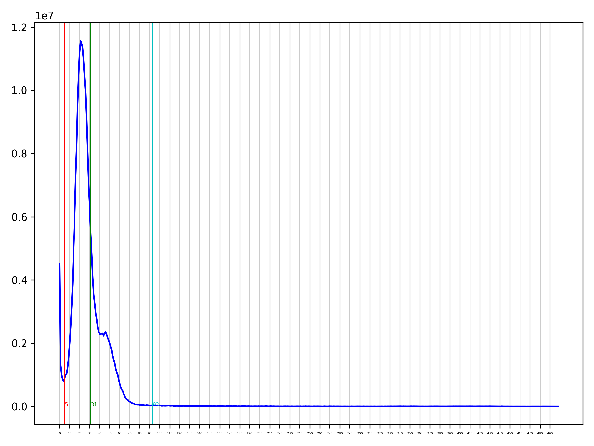
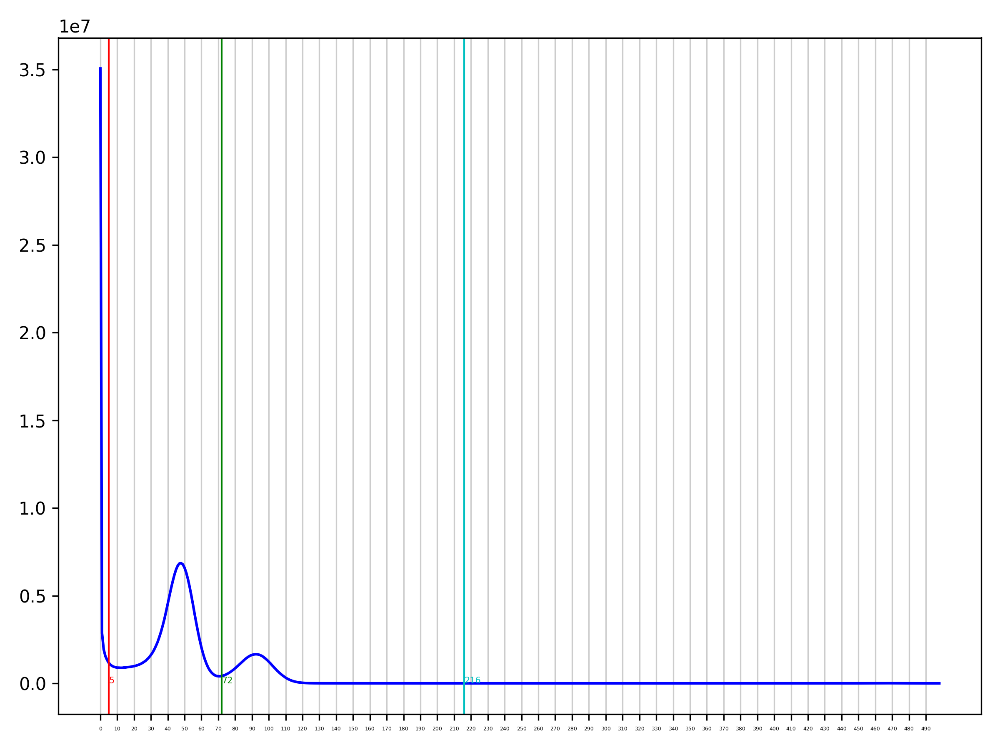
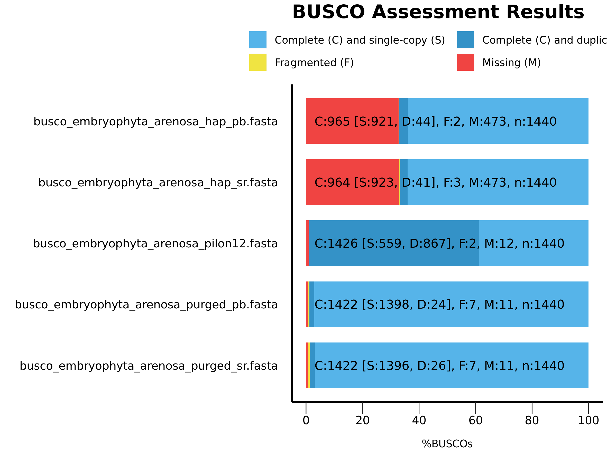

purge\_dups arenosa
================
2020-06-09

## Setup

``` bash
cd /cluster/work/users/jonathbr/arenosa_assembly

mkdir -p 04_phasing/purge_dups

zcat 03_polishing_assembly/arenosa_pilon12.fasta.gz > 04_phasing/purge_dups/arenosa_pilon12.fasta

cp /cluster/projects/nn9525k/arenosa_genome_pb_uncorr/canu_out/arenosa_pp_uncorr_assembly.correctedReads.fasta.gz 04_phasing/purge_dups

cd 04_phasing/purge_dups
```

## Check

``` bash
module load minimap2/2.17-GCC-8.2.0-2.31.1
module load Python/3.7.2-GCCcore-8.2.0

/cluster/projects/nn9525k/Programs/purge_dups/scripts/pd_config.py -h
```

## Generate a configuration file

``` bash
/cluster/projects/nn9525k/Programs/purge_dups/scripts/pd_config.py -l arenosa_pilon12 -n arenosa.config.json arenosa_pilon12.fasta arenosa_pp_uncorr_assembly.correctedReads.fasta.gz
```

## Run sbatch

``` bash
sbatch purge_dups.slurm #job 1209898 00:30:16   00:03:47 2692356K
```



## same with illumina reads

### Setup

``` bash
cd /cluster/work/users/jonathbr/arenosa_assembly

mkdir -p 04_phasing/purge_illumina

zcat 03_polishing_assembly/arenosa_pilon12.fasta.gz > 04_phasing/purge_illumina/arenosa_pilon12.fasta

zcat /cluster/projects/nn9525k/arenosa_genome/Illumina_data/Sample_06-F-2Az1-9_R1_rep.fastq.gz 04_phasing/purge_illumina/Sample_06-F-2Az1-9_R1_rep.fastq

zcat /cluster/projects/nn9525k/arenosa_genome/Illumina_data/Sample_06-F-2Az1-9_R2_rep.fastq.gz 04_phasing/purge_illumina/Sample_06-F-2Az1-9_R2_rep.fastq

cd 04_phasing/purge_illumina
```
### Run sbatch

``` bash
sbatch purge_illumina.slurm #job 1212749 1-12:43:55   03:43:04
```




## compare with busco

``` bash
mkdir purge_results
cd purge_results/

cp ../purge_dups/arenosa_pilon12.fasta .

cp ../purge_dups/purge_work/purged.fa arenosa_purged_pb.fasta
cp ../purge_dups/purge_work/hap.fa arenosa_hap_pb.fasta

cp ../purge_illumina/purge_work/hap.fa arenosa_hap_sr.fasta
cp ../purge_illumina/purge_work/purged.fa arenosa_purged_sr.fasta

cp ../purge_*/purge_work/*png .

cd ..

sbatch busco.slurm #job 
```


## clean, tar and save

``` bash
rm purge_dups/*.fasta
rm purge_dups/*.gz
rm -r purge_dups/arenosa_pilon12/
tar -czvf purge_dups.tar.gz purge_dups/
rm -r purge_dups/


rm purge_illumina/*.fasta
rm purge_illumina/*.fastq
rm purge_illumina/arenosa_pilon12.fasta.*
tar -czvf purge_illumina.tar.gz purge_illumina/
rm -r purge_illumina/

cd purge_results
rm arenosa_pilon12.fasta
gzip *.fasta
```
## continue with 
``` bash
wc /cluster/work/users/jonathbr/arenosa_assembly/04_phasing/purge_results/arenosa_purged_sr.fasta.gz
#158150   859944 41067017 /cluster/work/users/jonathbr/arenosa_assembly/04_phasing/purge_results/arenosa_purged_sr.fasta.gz
```
