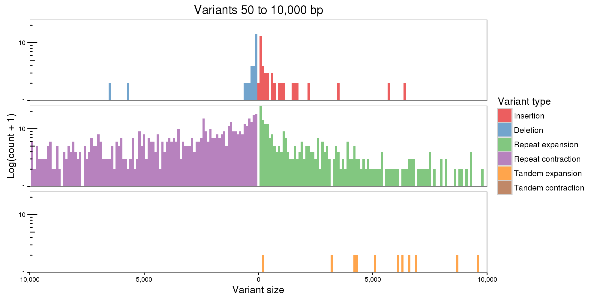

RagTag on arenosa pilon12
================
2020-09-08

https://github.com/malonge/RagTag

#conda activate ragtag

## setup dir

```{bash, eval=FALSE}
cd /cluster/work/users/jonathbr/arenosa_assembly
mkdir -p 05_scaffolding/ragtag
cd 05_scaffolding/ragtag

```

## links

```{bash, eval=FALSE}
## Reference
mkdir -p links

ln -s /cluster/projects/nn9525k/lyrata_genome_phytomzome/Alyrata_384_v1.fa links/Alyrata_384_v1.fasta

## Reads 
ln -s /cluster/projects/nn9525k/arenosa_genome_pb_uncorr/canu_out/arenosa_pp_uncorr_assembly.correctedReads.fasta.gz links

ln -s /cluster/projects/nn9525k/arenosa_genome/Illumina_data/Sample_06-F-2Az1-9_R?_rep.fastq.gz links

## Assembly
zcat /cluster/work/users/jonathbr/arenosa_assembly/04_phasing/purge_results/arenosa_purged_sr.fasta.gz > links/arenosa_purged_sr.fasta

```

## RagTag
```{bash, eval=FALSE}

sbatch ragtag.slurm #job 1226506  11:22:45   02:02:09

```

# find SV with paftools

```{bash, eval=FALSE}
minimap2 -cx asm10 -t8 --cs ../links/Alyrata_384_v1.fasta ragtag.scaffolds.fasta > asm.paf

sort -k6,6 -k8,8n asm.paf > asm.srt.paf
paftools.js call -L 2000 asm.srt.paf > asm.var.txt
```

```
56532 reference bases covered by exactly one contig
1772 substitutions; ts/tv = 1.034
48 1bp deletions
61 1bp insertions
20 2bp deletions
14 2bp insertions
69 [3,50) deletions
73 [3,50) insertions
4 [50,1000) deletions
1 [50,1000) insertions
0 >=1000 deletions
1 >=1000 insertions
```


# Assemblytics

## nucmer
```{bash, eval=FALSE}
cd /cluster/work/users/jonathbr/arenosa_assembly/05_scaffolding/ragtag

cp -r /cluster/projects/nn9525k/Programs/Assemblytics/scripts assemblytics

#cat links/Alyrata_384_v1.fasta | sed 's/|/_/' > links/Alyrata_v1.fasta
#sbatch nucmer.slurm links/Alyrata_v1.fasta ragtag_output/ragtag.scaffolds.fasta

mkdir -p nucmer 
cd nucmer 

sbatch nucmer.slurm ../links/Alyrata_384_v1.fasta ../ragtag_output/ragtag.scaffolds.fasta
```

## srun Assemblytics

```{bash, eval=FALSE}
#scripts/Assemblytics <delta_file> <output_prefix> <unique_anchor_length> <min_variant_size> <max_variant_size>

srun --cpus-per-task=2 --mem-per-cpu=2G --time=01:00:00 --account=nn9525k --x11 --pty bash -i

conda activate ragtag
module load R/3.6.2-foss-2019b

cd /cluster/work/users/jonathbr/arenosa_assembly/05_scaffolding/ragtag/assemblytics

./Assemblytics ../nucmer/ragtag.scaffolds.delta ragtag.scaffolds_v1 10000 10000 50

```



## tar copy and save

```{bash, eval=FALSE}
rm ragtag_output/*.sam
rm ragtag_output/*.bam
cp ragtag_output/ragtag.scaffolds.fasta arenosa_ragtag.fasta
tar -czvf ragtag_output.tar.gz ragtag_output/
rm -r ragtag_output

rm -r links/

cd nucmer/
tar --remove-files -czvf ragtag.scaffolds.tgz ragtag.scaffolds*
cd ..

cd assemblytics/
rm Assemblytics_*
rm Assemblytics
tar --remove-files -czvf ragtag.scaffolds_v1.tar.gz ragtag.scaffolds_v1
cd ..

gzip arenosa_ragtag.fasta

cd ..

```

```{bash, eval=FALSE}
cd ragoo/

rm -r links/
rm *.fasta
rm *.fasta.gz
cp ragoo_output/ragoo.fasta arenosa_ragoo.fasta
gzip arenosa_ragoo.fasta
tar --remove-files -czvf ragoo_output.tar.gz ragoo_output/
cd ..
```
## save tars on hybrids
```{bash, eval=FALSE}
cp -rv /cluster/work/users/jonathbr/arenosa_assembly/05_scaffolding /cluster/projects/nn9525k/jonathan/arenosa_assembly
```

## continue with

```{bash, eval=FALSE}
wc /cluster/projects/nn9525k/jonathan/arenosa_assembly/05_scaffolding/ragtag/arenosa_ragtag.fasta.gz

#158845   861693 41090790 /cluster/projects/nn9525k/jonathan/arenosa_assembly/05_scaffolding/ragtag/arenosa_ragtag.fasta.gz
```

