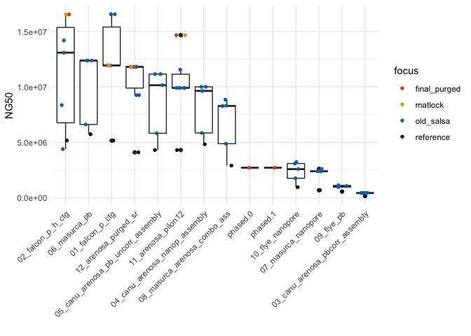
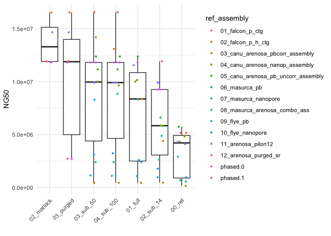

compare Hi-C in R v2
================
2020-11-09

  - [read quast results](#read-quast-results)
  - [scatterplots](#scatterplots)
  - [boxplots](#boxplots)
      - [compare subsets](#compare-subsets)

``` r
library(tidyverse)
library(ggrepel)
library(knitr)
theme_set(theme_minimal())
```

## read quast results

see also [README\_comp\_hic\_v2.md](README_comp_hic_v2.md)

``` r
#quast <- read_tsv("quast_results/results_2020_10_10_22_44_47/transposed_report.tsv")
#quast_v2 <- read_tsv("quast_results/results_2020_11_02_09_15_53/transposed_report.tsv")

quast <- read_tsv("quast_results/results_2020_11_09_13_52_36/transposed_report.tsv")

quast_v2 <- read_tsv("quast_results/results_2020_11_09_13_48_09/transposed_report.tsv")
```

``` r
quast <- quast %>% 
  separate(Assembly, c("subset", "ref_assembly"), 
           sep = "_map_|_mill_", remove = FALSE) %>% 
  mutate(ref_assembly = if_else(is.na(ref_assembly), subset, ref_assembly),
         subset = if_else(subset == ref_assembly, "00_ref", subset)) %>% 
  mutate(it = str_extract(ref_assembly, "_5it"),
         ref_assembly = str_remove(ref_assembly, "_scaffolds.*")
         )
```

    ## Warning: Expected 2 pieces. Missing pieces filled with `NA` in 12 rows [1, 13,
    ## 28, 43, 58, 59, 60, 61, 62, 63, 64, 65].

``` r
quast_v2 <- quast_v2 %>% 
  separate(Assembly, c("subset", "ref_assembly"), 
           sep = "_map_|_mill_", remove = FALSE) %>%
  mutate(ref_assembly = if_else(is.na(ref_assembly), subset, ref_assembly),
         subset = if_else(str_detect(ref_assembly, "salsa"), "02_matlock", "03_purged")) %>% 
  mutate(it = str_extract(ref_assembly, "_5it"),
         ref_assembly = str_remove(ref_assembly, "_salsa.*")
         )
```

    ## Warning: Expected 2 pieces. Missing pieces filled with `NA` in 10 rows [1, 2, 3,
    ## 4, 5, 6, 7, 8, 9, 10].

``` r
quast_all <- bind_rows(quast, quast_v2, .id = "version") %>% 
  mutate(focus = case_when(subset == "02_matlock" ~ "matlock",
                           subset == "03_purged" ~ "final_purged",
                           subset == "00_ref" ~ "reference",
                           TRUE ~ "old_salsa"))

quast_all %>% 
  select(ref_assembly, subset, version, "# contigs", "Total length",
                 "NG50", "LG50", "# N's per 100 kbp") %>% 
  arrange(desc(NG50)) %>% head(n = 10) %>% 
  kable()
```

| ref\_assembly         | subset       | version | \# contigs | Total length |     NG50 | LG50 | \# N’s per 100 kbp |
| :-------------------- | :----------- | :------ | ---------: | -----------: | -------: | ---: | -----------------: |
| 01\_falcon\_p\_ctg    | 04\_sub\_100 | 1       |        330 |    225859782 | 16551650 |    5 |              35.86 |
| 01\_falcon\_p\_ctg    | 03\_sub\_50  | 1       |        330 |    225859282 | 16550532 |    5 |              35.64 |
| 02\_falcon\_p\_h\_ctg | 02\_matlock  | 2       |        407 |    249545600 | 16527681 |    4 |              16.43 |
| 02\_falcon\_p\_h\_ctg | 03\_purged   | 2       |        228 |    162896298 | 16527129 |    4 |              14.90 |
| 11\_arenosa\_pilon12  | 02\_matlock  | 2       |        630 |    255360568 | 14665077 |    4 |              19.19 |
| 11\_arenosa\_pilon12  | 03\_purged   | 2       |        431 |    183419991 | 14664562 |    4 |              16.51 |
| 02\_falcon\_p\_h\_ctg | 03\_sub\_50  | 1       |        326 |    249581600 | 14191839 |    5 |              30.85 |
| 02\_falcon\_p\_h\_ctg | 04\_sub\_100 | 1       |        326 |    249581100 | 13085821 |    6 |              30.65 |
| 06\_masurca\_pb       | 03\_sub\_50  | 1       |        949 |    214623309 | 12371866 |    4 |              82.05 |
| 06\_masurca\_pb       | 01\_full     | 1       |        926 |    214813866 | 12371053 |    5 |             102.23 |

# scatterplots

``` r
quast_all %>% 
ggplot(aes(x = `Total length`, y = `# contigs`, 
                size = `NG50`, color = ref_assembly,
                shape = subset)) +
  geom_point() +
  geom_text_repel(aes(label = if_else(subset == "00_ref", ref_assembly, "")), size = 2) +
  geom_text_repel(aes(label = if_else(subset == "03_purged", ref_assembly, "")), size = 2, color ="black") +
  #scale_x_log10() +
  scale_y_log10() +
  guides(color = FALSE)
  #theme(legend.position = "bottom")

quast_all %>%
ggplot(aes(x = `LG50`, y = `NG50`,
                color = focus, shape = subset,
                label = if_else(subset == "03_purged", ref_assembly, ""))) +
  geom_point() +
  #scale_x_log10()+
  geom_text_repel(size = 2)+
  #guides(color = FALSE)+
  scale_color_discrete(type = c("#D65108", "#EFA00B","#0075C4","#00171F")) +
  xlim(0,90)
```


# boxplots

``` r
quast_all %>% 
ggplot(aes(x = fct_reorder(ref_assembly,
                                  .x = `NG50`, .fun = median, .desc = TRUE), 
                  y = `NG50`)) +
  geom_boxplot() +
  geom_jitter(aes(color = subset), size = 0.8, height = 0, width = 0.2) + 
  theme(axis.text.x = element_text(angle = 45, vjust = 1, hjust=1))+
  labs(x = "")

quast_all %>% 
ggplot(aes(x = fct_reorder(ref_assembly,
                                  .x = `LG50`, .fun = median, .desc = FALSE), 
                  y = `LG50`)) +
  geom_boxplot() +
  geom_jitter(aes(color = subset), size = 0.8, height = 0, width = 0.2) + 
  theme(axis.text.x = element_text(angle = 45, vjust = 1, hjust=1))+
  labs(x = "")+
  ylim(0,50)

quast_all %>% 
ggplot(aes(x = fct_reorder(ref_assembly,
                                  .x = `NG50`, .fun = median, .desc = TRUE), 
                  y = `NG50`)) +
  geom_boxplot() +
  geom_jitter(aes(color = focus), size = 1.2, height = 0, width = 0.2) + 
  theme(axis.text.x = element_text(angle = 45, vjust = 1, hjust=1))+
  labs(x = "")+
  scale_color_discrete(type = c("#D65108", "#EFA00B","#0075C4","#00171F"))

quast_all %>% 
ggplot(aes(x = fct_reorder(ref_assembly,
                                  .x = `LG50`, .fun = median, .desc = FALSE), 
                  y = `LG50`)) +
  geom_boxplot() +
  geom_jitter(aes(color = focus), size = 0.8, height = 0, width = 0.2) + 
  theme(axis.text.x = element_text(angle = 45, vjust = 1, hjust=1))+
  labs(x = "")+
  ylim(0,50)+
  scale_color_discrete(type = c("#D65108", "#EFA00B","#0075C4","#00171F"))
```



## compare subsets

``` r
ggplot(quast_all, aes(x = fct_reorder(subset,
                                  .x = `NG50`, .fun = median, .desc = TRUE), 
                  y = `NG50`)) +
  geom_boxplot() +
  geom_jitter(aes(color = ref_assembly), size = 0.8, height = 0, width = 0.2) + 
  #geom_jitter(aes(color = if_else(ref_assembly == "12_arenosa_purged_sr","12_arenosa_purged_sr", "others")), size = 0.8, height = 0, width = 0.2) + 
  #guides(color = FALSE)+
  theme(axis.text.x = element_text(angle = 45, vjust = 1, hjust=1))+
  labs(x = "")
  


ggplot(quast_all, aes(x = fct_reorder(subset,
                                  .x = `LG50`, .fun = median, .desc = FALSE), 
                  y = `LG50`)) +
  geom_boxplot() +
  geom_jitter(aes(color = ref_assembly), size = 0.8, height = 0, width = 0.2) + 
  theme(axis.text.x = element_text(angle = 45, vjust = 1, hjust=1))+
  labs(x = "")+
  ylim(0,50)
```


