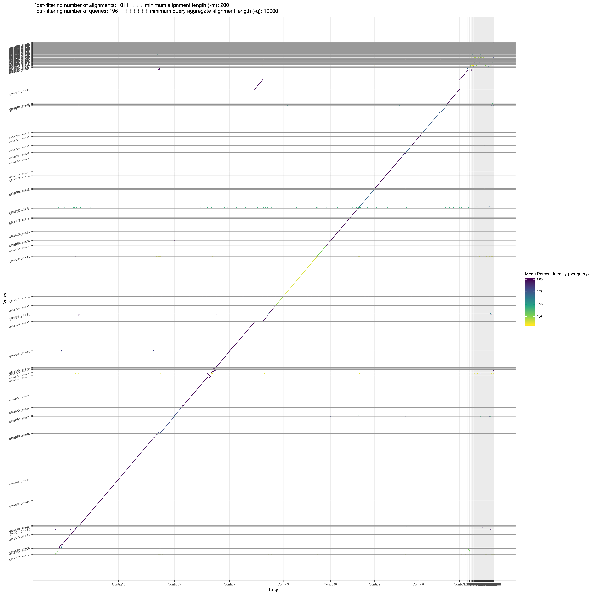

hi-c assessment
================
2020-11-10

  - [select best assemblies after Hi-c
    scaffolding](#select-best-assemblies-after-hi-c-scaffolding)
      - [setup working directory](#setup-working-directory)
      - [create illumina alignments](#create-illumina-alignments)
  - [FRCurve](#frcurve)
  - [QUAST](#quast)
      - [table](#table)
  - [BUSCO](#busco)
  - [merqury](#merqury)
      - [create arenosa.illumina.merly
        database](#create-arenosa.illumina.merly-database)
      - [srun merqury -x11](#srun-merqury--x11)
      - [QV](#qv)
          - [completeness](#completeness)
      - [spectra-cn plots](#spectra-cn-plots)
  - [minidotplot.srun](#minidotplot.srun)
  - [minidotplot.srun final](#minidotplot.srun-final)

``` r
library(tidyverse)
library(knitr)
library(ggrepel)
```

# select best assemblies after Hi-c scaffolding

## setup working directory

``` bash
cd /cluster/work/users/jonathbr/compare_hic
mkdir assessment
cd assessment/
mkdir assemblies
mkdir scaffolds
mkdir scaffolds_purged
mkdir reads

# falcon and canu assemblies 
cp ../01_falcon_p_ctg.fasta assemblies/
cp ../02_falcon_p_h_ctg.fasta assemblies/
cp ../11_arenosa_pilon12.fasta assemblies/
cp ../12_arenosa_purged_sr.fasta assemblies/

# scaffolds with matlock
cp ../compare_purged/01_falcon_p_ctg_salsa_filtered.fasta scaffolds/
cp ../compare_purged/02_falcon_p_h_ctg_salsa_filtered.fasta scaffolds/
cp ../compare_purged/11_arenosa_pilon12_salsa_filtered.fasta scaffolds/
cp ../compare_purged/12_arenosa_purged_sr_salsa.fasta scaffolds/

# purged and pilon on scaffolds 
cp ../compare_purged/01_falcon_p_ctg.fasta scaffolds_purged/01_falcon_p_ctg_final.fasta
cp ../compare_purged/02_falcon_p_h_ctg.fasta scaffolds_purged/02_falcon_p_h_ctg_final.fasta
cp ../compare_purged/11_arenosa_pilon12.fasta scaffolds_purged/11_arenosa_pilon12_final.fasta
cp ../compare_purged/12_arenosa_purged_sr.fasta scaffolds_purged/12_arenosa_purged_sr_final.fasta

# reference based scaffold
zcat /cluster/projects/nn9525k/jonathan/arenosa_assembly/06_gap_filling/PBJelly_v3/arenosa_jelly.fasta.gz > scaffolds_purged/arenosa_jelly.fasta

#reads illunmina from plant used for PacBio 
cp /cluster/projects/nn9525k/arenosa_genome/Illumina_data/Sample_06-F-2Az1-9_R?_rep.fastq.gz reads/

# PacBio trimmed reads 
cp /cluster/projects/nn9525k/arenosa_genome_pb_uncorr/canu_out/arenosa_pp_uncorr_assembly.trimmedReads.fasta.gz reads/

```

For the comparison of assemblies see
<https://github.com/Jnthnoaa/arenosa_assembly#02_assembly>

## create illumina alignments

``` bash
./submit_BWA.sh #for loop: sbatch BWA_align.sh
```

# FRCurve

``` bash
./submit_FRC.sh #array for FRCurve.sh and FRC_plot.sh
```


# QUAST

``` bash
sbatch quast-lg.slurm
```

``` r
quast <- read_tsv("results_2020_11_09_15_24_05/transposed_report.tsv")
```

    ## 
    ## ── Column specification ────────────────────────────────────────────────────────
    ## cols(
    ##   .default = col_double(),
    ##   Assembly = col_character()
    ## )
    ## ℹ Use `spec()` for the full column specifications.

``` r
quast <- quast %>% 
  mutate(ref_assembly = str_remove(Assembly, "_salsa.*|_final"),
         version = str_extract(Assembly, "salsa|final")) %>% 
  mutate(version = replace_na(version, "reference"))
```

## table

``` r
quast %>% 
  select(ref_assembly ,version , "# contigs", "Total length",
                 "NG50", "LG50", "# N's per 100 kbp") %>% 
  arrange(desc(NG50)) %>% 
  kable()
```

| ref\_assembly           | version   | \# contigs | Total length |     NG50 | LG50 | \# N’s per 100 kbp |
| :---------------------- | :-------- | ---------: | -----------: | -------: | ---: | -----------------: |
| 02\_falcon\_p\_h\_ctg   | salsa     |        407 |    249545600 | 16527681 |    4 |              16.43 |
| 02\_falcon\_p\_h\_ctg   | final     |        228 |    162896298 | 16527129 |    4 |              14.90 |
| arenosa\_jelly          | reference |        352 |    154239195 | 16418538 |    5 |               8.04 |
| 11\_arenosa\_pilon12    | salsa     |        630 |    255360568 | 14665077 |    4 |              19.19 |
| 11\_arenosa\_pilon12    | final     |        431 |    183419991 | 14664562 |    4 |              16.51 |
| 01\_falcon\_p\_ctg      | final     |        237 |    189894782 | 11942530 |    6 |              32.78 |
| 01\_falcon\_p\_ctg      | salsa     |        336 |    225856282 | 11918542 |    6 |              34.31 |
| 12\_arenosa\_purged\_sr | salsa     |        238 |    151709819 | 11809244 |    4 |              23.10 |
| 12\_arenosa\_purged\_sr | final     |        195 |    150573280 | 11809204 |    4 |              21.88 |
| 02\_falcon\_p\_h\_ctg   | reference |        470 |    249504600 |  5164143 |   11 |               0.00 |
| 01\_falcon\_p\_ctg      | reference |        483 |    225778782 |  5156912 |   11 |               0.00 |
| 11\_arenosa\_pilon12    | reference |        713 |    255311568 |  4305214 |   13 |               0.00 |
| 12\_arenosa\_purged\_sr | reference |        306 |    151675319 |  4095823 |   13 |               0.36 |

``` r
quast %>% 
  ggplot(aes(x = LG50, y = NG50, 
             color = ref_assembly,
             shape = version)) +
  geom_point(size = 2)+
  geom_text_repel(aes(label = if_else(version == "reference", ref_assembly, "")), size = 3)
```

<!-- -->


# BUSCO

``` bash
./submit_BUSCO.sh #array busco.sh followed by busco_summary.sh
```


# merqury

## create arenosa.illumina.merly database

``` bash
./submit_merqury_build.sh #using _submit_build_2h.sh

cat arenosa_illumina.k19.hist | sed 's/\t/ /' > arenosa_illumina.k19_space.hist
rm arenosa_illumina.k19.hist
```

## srun merqury -x11

``` bash
ssh -Y $USER@saga.sigma2.no
#login-3
#login-1
screen -S merqury

srun --cpus-per-task=16 --mem-per-cpu=2G --time=02:00:00 --account=nn9525k --x11 --pty bash -i
srun --cpus-per-task=4 --mem-per-cpu=2G --time=02:00:00 --account=nn9525k --x11 --pty bash -i

cd /cluster/work/users/jonathbr/compare_hic/assessment/MERQURY/

module purge
module load Java/11.0.2
module load BEDTools/2.28.0-GCC-8.2.0-2.31.1
module swap GCCcore/8.2.0 GCCcore/8.3.0
module swap zlib/1.2.11-GCCcore-8.2.0 zlib/1.2.11-GCCcore-8.3.0
module swap binutils/2.31.1-GCCcore-8.2.0 binutils/2.32-GCCcore-8.3.0
module swap GCC/8.2.0-2.31.1 GCC/8.3.0
module swap bzip2/1.0.6-GCCcore-8.2.0 bzip2/1.0.8-GCCcore-8.3.0
module swap XZ/5.2.4-GCCcore-8.2.0 XZ/5.2.4-GCCcore-8.3.0
module load SAMtools/1.10-GCC-8.3.0
module load R/3.6.2-fosscuda-2019b
export PATH=$PATH:/cluster/projects/nn9525k/Programs/IGV_2.8.2
export PATH=$PATH:/cluster/projects/nn9525k/Programs/meryl-1.0/Linux-amd64/bin
export MERQURY=/cluster/projects/nn9525k/Programs/merqury
module list
ls ../*/*.fasta > merqury_fasta.fofn

while read f; do 
  echo "$f"
  PREFIX=$(basename $f .fasta)
  mkdir -p $PREFIX
  echo -e "\
  cp $f ${PREFIX}/${PREFIX}.fasta"
  cp $f ${PREFIX}/${PREFIX}.fasta
  cd $PREFIX 
  echo -e "\
  $MERQURY/merqury.sh ../../arenosa_illumina.k19.meryl ${PREFIX}.fasta ${PREFIX}"
  $MERQURY/merqury.sh ../../arenosa_illumina.k19.meryl ${PREFIX}.fasta ${PREFIX}
  cd ..
done < ./merqury_fasta.fofn

cat */completeness.stats > sum_completeness.tsv
cat */*.qv > sum_QV.tsv

mkdir spectra_cnln_pngs
cp */*spectra-cn.ln.png spectra_cnln_pngs/
mv *.tsv spectra_cnln_pngs/
```

## QV

``` r
QV <- read_tsv("spectra_cnln_pngs/sum_QV.tsv", 
         col_names = c("assembly","unique", "shared", "QV", "error_rate" )) %>% 
  mutate(assembly = fct_relevel(assembly, c("01_falcon_p_ctg",
                                            "01_falcon_p_ctg_salsa_filtered",
                                            "01_falcon_p_ctg_final",
                                            "02_falcon_p_h_ctg",
                                            "02_falcon_p_h_ctg_salsa_filtered",
                                            "02_falcon_p_h_ctg_final",
                                            "11_arenosa_pilon12",
                                            "11_arenosa_pilon12_salsa_filtered",
                                            "11_arenosa_pilon12_final",
                                            "12_arenosa_purged_sr",
                                            "12_arenosa_purged_sr_salsa",
                                            "12_arenosa_purged_sr_final",
                                            "arenosa_jelly")))
```

    ## 
    ## ── Column specification ────────────────────────────────────────────────────────
    ## cols(
    ##   assembly = col_character(),
    ##   unique = col_double(),
    ##   shared = col_double(),
    ##   QV = col_double(),
    ##   error_rate = col_double()
    ## )

``` r
QV %>% arrange(assembly) %>% kable()
```

| assembly                               |  unique |    shared |      QV | error\_rate |
| :------------------------------------- | ------: | --------: | ------: | ----------: |
| 01\_falcon\_p\_ctg                     | 5910163 | 225772583 | 28.5538 |   0.0013951 |
| 01\_falcon\_p\_ctg\_salsa\_filtered    | 5910163 | 225772439 | 28.5538 |   0.0013951 |
| 01\_falcon\_p\_ctg\_final              |  765405 | 189825826 | 36.7239 |   0.0002126 |
| 02\_falcon\_p\_h\_ctg                  |  217480 | 249496140 | 43.3822 |   0.0000459 |
| 02\_falcon\_p\_h\_ctg\_salsa\_filtered |  217479 | 249495798 | 43.3822 |   0.0000459 |
| 02\_falcon\_p\_h\_ctg\_final           |   80394 | 162866929 | 45.8526 |   0.0000260 |
| 11\_arenosa\_pilon12                   | 1636289 | 255592578 | 34.7112 |   0.0003380 |
| 11\_arenosa\_pilon12\_salsa\_filtered  | 1636289 | 255592308 | 34.7112 |   0.0003380 |
| 11\_arenosa\_pilon12\_final            | 1260909 | 183647561 | 34.4064 |   0.0003625 |
| 12\_arenosa\_purged\_sr                |  947862 | 151872950 | 34.8220 |   0.0003295 |
| 12\_arenosa\_purged\_sr\_salsa         |  947862 | 151872932 | 34.8220 |   0.0003295 |
| 12\_arenosa\_purged\_sr\_final         |  680337 | 150712114 | 36.2325 |   0.0002381 |
| arenosa\_jelly                         | 1061402 | 154432625 | 34.4019 |   0.0003629 |

``` r
QV %>%
  mutate(assembly = fct_rev(assembly)) %>% 
  ggplot(aes(x = assembly, y = QV))+
  geom_point()+
  theme_minimal()+
  coord_flip()
```

<!-- -->

Consensus QV scores are Phred-scaled where QV = -10 log10 E for a
probability of error E at each base in the assembly. (Q30 corresponds to
99.9% accuracy, Q40 to 99.99%, etc.)

<https://github.com/marbl/merqury/wiki/2.-Overall-k-mer-evaluation>

### completeness

``` r
COV <- read_tsv("spectra_cnln_pngs/sum_completeness.tsv", 
         col_names = c("assembly","set", "solid_assembly", "solid_reads", "completeness")) %>%
  mutate(assembly = fct_relevel(assembly, c("01_falcon_p_ctg",
                                            "01_falcon_p_ctg_salsa_filtered",
                                            "01_falcon_p_ctg_final",
                                            "02_falcon_p_h_ctg",
                                            "02_falcon_p_h_ctg_salsa_filtered",
                                            "02_falcon_p_h_ctg_final",
                                            "11_arenosa_pilon12",
                                            "11_arenosa_pilon12_salsa_filtered",
                                            "11_arenosa_pilon12_final",
                                            "12_arenosa_purged_sr",
                                            "12_arenosa_purged_sr_salsa",
                                            "12_arenosa_purged_sr_final",
                                            "arenosa_jelly")))
```

    ## 
    ## ── Column specification ────────────────────────────────────────────────────────
    ## cols(
    ##   assembly = col_character(),
    ##   set = col_character(),
    ##   solid_assembly = col_double(),
    ##   solid_reads = col_double(),
    ##   completeness = col_double()
    ## )

``` r
COV %>% arrange(assembly) %>% kable()
```

| assembly                               | set | solid\_assembly | solid\_reads | completeness |
| :------------------------------------- | :-- | --------------: | -----------: | -----------: |
| 01\_falcon\_p\_ctg                     | all |       137162384 |    151427026 |      90.5799 |
| 01\_falcon\_p\_ctg\_salsa\_filtered    | all |       137162366 |    151427026 |      90.5798 |
| 01\_falcon\_p\_ctg\_final              | all |       132002100 |    151427026 |      87.1721 |
| 02\_falcon\_p\_h\_ctg                  | all |       148857467 |    151427026 |      98.3031 |
| 02\_falcon\_p\_h\_ctg\_salsa\_filtered | all |       148857467 |    151427026 |      98.3031 |
| 02\_falcon\_p\_h\_ctg\_final           | all |       123881827 |    151427026 |      81.8096 |
| 11\_arenosa\_pilon12                   | all |       149291343 |    151427026 |      98.5896 |
| 11\_arenosa\_pilon12\_salsa\_filtered  | all |       149291315 |    151427026 |      98.5896 |
| 11\_arenosa\_pilon12\_final            | all |       128311972 |    151427026 |      84.7352 |
| 12\_arenosa\_purged\_sr                | all |       120711257 |    151427026 |      79.7158 |
| 12\_arenosa\_purged\_sr\_salsa         | all |       120711239 |    151427026 |      79.7158 |
| 12\_arenosa\_purged\_sr\_final         | all |       120399459 |    151427026 |      79.5099 |
| arenosa\_jelly                         | all |       120836163 |    151427026 |      79.7983 |

``` r
COV %>% mutate(assembly = fct_rev(assembly)) %>%
  ggplot(aes(x = assembly, y = completeness))+
  geom_point()+
  theme_minimal()+
  coord_flip()
```

<!-- -->

The k-mer completeness can be measured by the fraction of recovered
solid k-mer. Solid k-mers are distinct k-mers filtered for erroneous low
copy k-mers.

k-mer completeness = found solid k-mers in an assembly / solid k-mers in
a read set

<https://github.com/marbl/merqury/wiki/2.-Overall-k-mer-evaluation>

## spectra-cn plots

| 01\_falcon\_p\_ctg                                                                                         | 01\_falcon\_p\_ctg\_salsa                                                                                    |
| ---------------------------------------------------------------------------------------------------------- | ------------------------------------------------------------------------------------------------------------ |
|                                    |        |
| 01\_falcon\_p\_ctg\_final                                                                                  | 02\_falcon\_p\_h\_ctg                                                                                        |
|                        |                                  |
| 02\_falcon\_p\_h\_ctg\_salsa                                                                               | 02\_falcon\_p\_h\_ctg\_final                                                                                 |
|  |                      |
| 11\_arenosa\_pilon12                                                                                       | 11\_arenosa\_pilon12\_salsa                                                                                  |
|                              |  |
| 11\_arenosa\_pilon12\_final                                                                                | 12\_arenosa\_purged\_sr                                                                                      |
|                  |                            |
| 12\_arenosa\_purged\_sr\_salsa                                                                             | 12\_arenosa\_purged\_sr\_final                                                                               |
|              |                |

The copy number spectrum plot, known as “spectra-cn” plot tracks the
multiplicity of each k-mer found in the Illumina read set and colors it
by the number of times it is found in a given assembly. The result is a
set of histograms relating k-mer counts in the read set to their
associated counts in the assembly. <https://github.com/marbl/merqury>

# minidotplot.srun

``` bash
ssh -Y $USER@saga.sigma2.no
#login-3
screen -S miniplot

#srun --cpus-per-task=2 --mem-per-cpu=4G --qos=devel --time=00:30:00 --account=nn9525k --x11 --pty bash -i
srun --cpus-per-task=2 --mem-per-cpu=4G --time=03:00:00 --account=nn9525k --x11 --pty bash -i

cd /cluster/work/users/jonathbr/compare_hic/assessment/

module purge
module load minimap2/2.17-GCC-8.2.0-2.31.1
module swap GCCcore/8.2.0 GCCcore/8.3.0
module swap zlib/1.2.11-GCCcore-8.2.0 zlib/1.2.11-GCCcore-8.3.0
module swap binutils/2.31.1-GCCcore-8.2.0 binutils/2.32-GCCcore-8.3.0
module swap GCC/8.2.0-2.31.1 GCC/8.3.0
module load R/3.6.2-foss-2019b

mkdir -p dotplots

chmod u+x pafCoordsDotPlotly.R
mv pafCoordsDotPlotly.R dotplots/pafCoordsDotPlotly.R

REFERENCE=scaffolds_purged/arenosa_jelly.fasta

for CONTIGS in $(ls */*.fasta)
do
    echo "$CONTIGS"
    PREFIX=$(basename "$CONTIGS" .fasta)
    OUTPUT=dotplots/$PREFIX
    #minimap2 -cx asm5 asm1.fa asm2.fa > aln.paf
    echo -e "\
    minimap2 -x asm5 -t $SLURM_CPUS_PER_TASK $REFERENCE $CONTIGS > ${OUTPUT}.paf"
    minimap2 -x asm5 -t $SLURM_CPUS_PER_TASK $REFERENCE $CONTIGS > ${OUTPUT}.paf
    dotplots/pafCoordsDotPlotly.R -l -x -i ${OUTPUT}.paf  -o $OUTPUT
    dotplots/pafCoordsDotPlotly.R -l -x -s -m 200 -q 10000 -i ${OUTPUT}.paf -o ${OUTPUT}_2
done

mv *.png dotplots/
```

| arenosa\_jelly                                        | 01\_falcon\_p\_ctg                                   |
| ----------------------------------------------------- | ---------------------------------------------------- |
|                      |                   |
| 01\_falcon\_p\_ctg\_salsa                             | 01\_falcon\_p\_ctg\_final                            |
|     |             |
| 02\_falcon\_p\_h\_ctg                                 | 02\_falcon\_p\_h\_ctg\_salsa                         |
|                  |  |
| 02\_falcon\_p\_h\_ctg\_final                          | 11\_arenosa\_pilon12\_2.png                          |
|            |                |
| 11\_arenosa\_pilon12\_salsa                           | 11\_arenosa\_pilon12\_final                          |
|  |          |
| 12\_arenosa\_purged\_sr                               | 12\_arenosa\_purged\_sr\_salsa                       |
|               |        |
| 12\_arenosa\_purged\_sr\_final                        |                                                      |
|         |                                                      |

# minidotplot.srun final

``` bash
ssh -Y $USER@saga.sigma2.no
#login-3
screen -S miniplot

#srun --cpus-per-task=2 --mem-per-cpu=4G --qos=devel --time=00:30:00 --account=nn9525k --x11 --pty bash -i
srun --cpus-per-task=2 --mem-per-cpu=4G --time=03:00:00 --account=nn9525k --x11 --pty bash -i

cd /cluster/work/users/jonathbr/compare_hic/assessment/

module purge
module load minimap2/2.17-GCC-8.2.0-2.31.1
module swap GCCcore/8.2.0 GCCcore/8.3.0
module swap zlib/1.2.11-GCCcore-8.2.0 zlib/1.2.11-GCCcore-8.3.0
module swap binutils/2.31.1-GCCcore-8.2.0 binutils/2.32-GCCcore-8.3.0
module swap GCC/8.2.0-2.31.1 GCC/8.3.0
module load R/3.6.2-foss-2019b

mkdir -p dotplots_final

#chmod u+x pafCoordsDotPlotly.R
cp dotplots/pafCoordsDotPlotly.R .

#REFERENCE=scaffolds_purged/arenosa_jelly.fasta

for CONTIGS in $(ls scaffolds_purged/*_final.fasta)
do
    echo "$CONTIGS"
    OUTDIR="dotplots_final/$(basename "$CONTIGS" .fasta)"
    echo "\
    mkdir -p $OUTDIR"
    mkdir -p $OUTDIR
    echo "\
    cp pafCoordsDotPlotly.R ${OUTDIR}/pafCoordsDotPlotly.R"
    cp pafCoordsDotPlotly.R ${OUTDIR}/pafCoordsDotPlotly.R
    for QUERY in $(ls scaffolds_purged/*_final.fasta)
    do 
      PREFIX=$(basename "$QUERY" .fasta)
      OUTPUT="${OUTDIR}/$(basename "$CONTIGS" .fasta)_${PREFIX}"
      echo $OUTPUT
      #minimap2 -cx asm5 asm1.fa asm2.fa > aln.paf
      echo "\
      minimap2 -x asm5 -t $SLURM_CPUS_PER_TASK $CONTIGS $QUERY > ${OUTPUT}.paf"
      minimap2 -x asm5 -t $SLURM_CPUS_PER_TASK $CONTIGS $QUERY > ${OUTPUT}.paf
      echo "\
      ${OUTDIR}/pafCoordsDotPlotly.R -l -x -i ${OUTPUT}.paf  -o ${OUTPUT}"
      ${OUTDIR}/pafCoordsDotPlotly.R -l -x -i ${OUTPUT}.paf  -o ${OUTPUT}
      ${OUTDIR}/pafCoordsDotPlotly.R -l -x -s -m 200 -q 10000 -i ${OUTPUT}.paf -o ${OUTPUT}_2
    done
done

mv *.png dotplots_final/
```

| 01\_falcon\_p\_ctg\_final\_02\_falcon\_p\_h\_ctg\_final                      | 01\_falcon\_p\_ctg\_final\_11\_arenosa\_pilon12\_final                        |
| ---------------------------------------------------------------------------- | ----------------------------------------------------------------------------- |
|       |       |
| 01\_falcon\_p\_ctg\_final\_12\_arenosa\_purged\_sr\_final                    | 02\_falcon\_p\_h\_ctg\_final\_11\_arenosa\_pilon12\_final                     |
|    |     |
| 02\_falcon\_p\_h\_ctg\_final\_12\_arenosa\_purged\_sr\_final                 | 11\_arenosa\_pilon12\_final\_12\_arenosa\_purged\_sr\_final                   |
|  |  |
