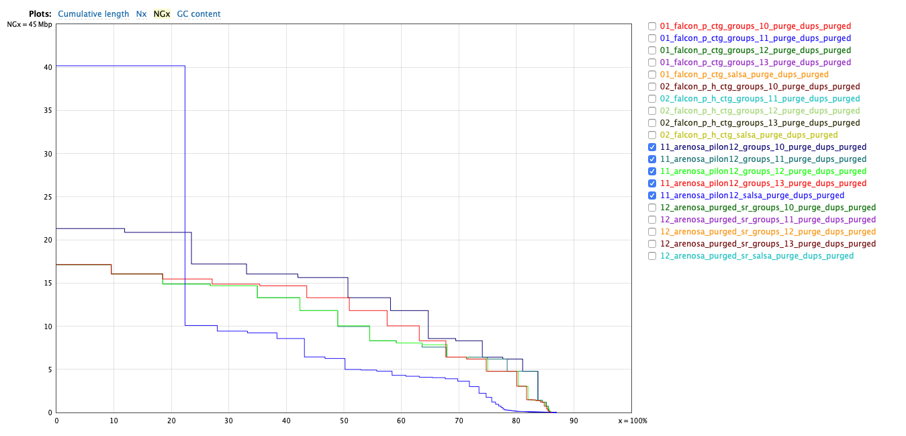
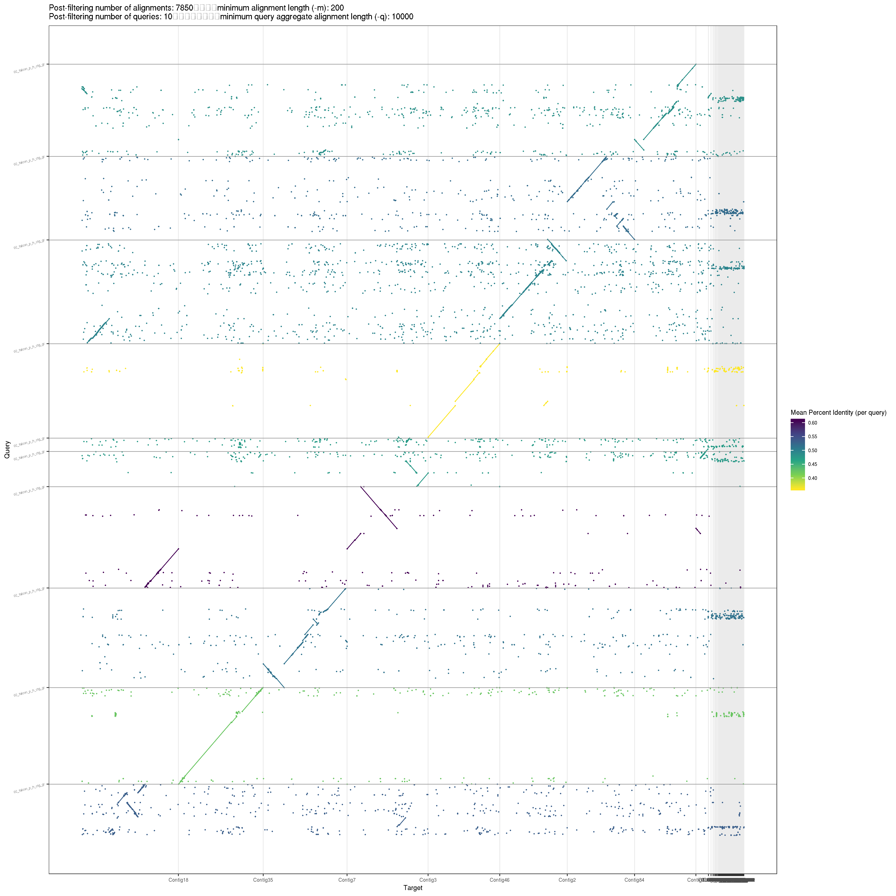
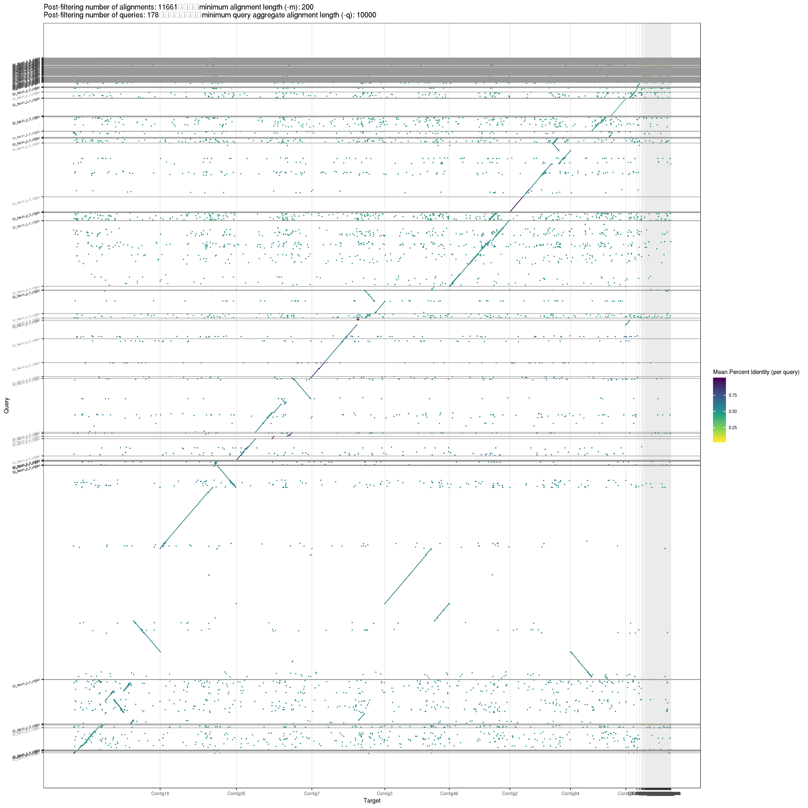

compare allhic and salsa
================
2020-11-13

  - [setup working directory](#setup-working-directory)
  - [QUAST](#quast)
      - [quast table](#quast-table)
      - [quast plots](#quast-plots)
  - [BUSCO](#busco)
  - [merqury](#merqury)
      - [srun merqury -x11](#srun-merqury--x11)
      - [QV](#qv)
      - [completeness](#completeness)
      - [spectra-cn plots](#spectra-cn-plots)
  - [minidotplot.srun](#minidotplot.srun)
      - [01\_falcon](#falcon)
      - [02\_falcon](#falcon-1)
      - [11\_arenosa\_pilon12](#arenosa_pilon12)
      - [12\_arenosa\_purged\_sr](#arenosa_purged_sr)

``` r
library(tidyverse)
library(knitr)
library(ggrepel)
library(fs)
theme_set(theme_minimal())
```

## setup working directory

``` bash
cd /cluster/work/users/jonathbr/compare_hic
mkdir allhic
cp -v /cluster/projects/nn9525k/arenosa_genome/02_scaffolds/04_scaffolds_purge_dups/* allhic/ 
cd allhic/
```

# QUAST

``` bash
sbatch quast-lg.slurm
```

``` r
quast <- read_tsv("results_2020_11_11_06_53_38/transposed_report.tsv")

quast <- quast %>% 
  separate(Assembly, c("ref_assembly", "version"), sep = "_groups_") %>% 
  mutate(version = str_remove(version,"_purge_dups_purged")) %>% 
  mutate(ref_assembly = str_remove(ref_assembly,"_salsa_purge_dups_purged")) %>% 
  replace_na(list(version = "salsa"))
```

    ## Warning: Expected 2 pieces. Missing pieces filled with `NA` in 4 rows [5, 10,
    ## 15, 20].

``` r
quast %>% 
  ggplot(aes(x = LG50, y = NG50, 
             color = ref_assembly,
             shape = version)) +
  geom_point(size = 2)+
  geom_text_repel(aes(label = if_else(version == "salsa", ref_assembly, "")), size = 3)
```

<!-- -->

## quast table

``` r
quast %>% 
  select(ref_assembly ,version , "# contigs", "Total length",
                 "NG50", "LG50", "# N's per 100 kbp") %>% 
  arrange(desc(NG50)) %>% 
  kable()
```

| ref\_assembly           | version | \# contigs | Total length |     NG50 | LG50 | \# N’s per 100 kbp |
| :---------------------- | :------ | ---------: | -----------: | -------: | ---: | -----------------: |
| 01\_falcon\_p\_ctg      | 10      |         15 |    151489568 | 20524353 |    4 |              21.66 |
| 01\_falcon\_p\_ctg      | 12      |         18 |    152091173 | 20507676 |    4 |              21.24 |
| 01\_falcon\_p\_ctg      | 11      |         16 |    150149377 | 19882372 |    4 |              20.80 |
| 01\_falcon\_p\_ctg      | 13      |         19 |    150732824 | 19007577 |    4 |              21.69 |
| 02\_falcon\_p\_h\_ctg   | 10      |         10 |    152363329 | 18486803 |    5 |              19.60 |
| 02\_falcon\_p\_h\_ctg   | 11      |         12 |    152357714 | 18473273 |    5 |              20.26 |
| 02\_falcon\_p\_h\_ctg   | 12      |         13 |    152200355 | 18235615 |    5 |              20.16 |
| 12\_arenosa\_purged\_sr | 11      |        148 |    149194888 | 17384180 |    4 |               9.83 |
| 12\_arenosa\_purged\_sr | 10      |        147 |    149079103 | 17384160 |    4 |               9.35 |
| 02\_falcon\_p\_h\_ctg   | 13      |         18 |    151770198 | 17052205 |    5 |              18.75 |
| 12\_arenosa\_purged\_sr | 12      |        149 |    149130710 | 16387767 |    5 |              10.19 |
| 12\_arenosa\_purged\_sr | 13      |        154 |    149098440 | 16378264 |    5 |               9.27 |
| 11\_arenosa\_pilon12    | 10      |        182 |    155415254 | 15636002 |    5 |              22.02 |
| 11\_arenosa\_pilon12    | 13      |        190 |    155360227 | 13302660 |    6 |              20.21 |
| 12\_arenosa\_purged\_sr | salsa   |        224 |    149002257 | 11809204 |    4 |              21.09 |
| 11\_arenosa\_pilon12    | 12      |        186 |    155545777 | 10054277 |    7 |              21.22 |
| 11\_arenosa\_pilon12    | 11      |        185 |    155410865 |  9964856 |    7 |              20.94 |
| 02\_falcon\_p\_h\_ctg   | salsa   |        179 |    152072172 |  9682640 |    5 |              16.47 |
| 01\_falcon\_p\_ctg      | salsa   |        168 |    150203787 |  6448009 |    9 |              36.65 |
| 11\_arenosa\_pilon12    | salsa   |        394 |    156179120 |  6258395 |    7 |              17.13 |

## quast plots

``` r
include_graphics("results_2020_11_11_06_53_38/basic_stats/cumulative_plot.pdf")
```

<!-- -->

``` r
file_names <- c("falcon_allhic_cummulative.png", "arenosa_allhic_cumulative.png",
                "01_falcon_NGx.png", "02_falcon_NGx.png",
                "11_arenosa_allhic_NGx.png", "12_arenosa_allhic_NGx.png",
                "icarus_allhic.png")

quast_plots <- paste0("results_2020_11_11_06_53_38/basic_stats/", file_names)

include_graphics(quast_plots)
```



# BUSCO

``` bash
./submit_BUSCO.sh #array busco.sh followed by busco_summary.sh
```

``` r
include_graphics("busco_summary/busco_allhic_figure.png")
```


# merqury

``` bash
#./submit_merqury_build.sh #using _submit_build_2h.sh
#cat arenosa_illumina.k19.hist | sed 's/\t/ /' > arenosa_illumina.k19_space.hist
cp -r ../assessment/arenosa_illumina.k19.meryl/ .
cp ../assessment/arenosa_illumina.k19_space.hist .
mkdir -p MERQURY
```

## srun merqury -x11

``` bash
ssh -Y $USER@saga.sigma2.no
#login-3
screen -S merqury

srun --cpus-per-task=8 --mem-per-cpu=2G --time=02:00:00 --account=nn9525k --x11 --pty bash -i

cd /cluster/work/users/jonathbr/compare_hic/allhic/MERQURY/

module purge
module load Java/11.0.2
module load BEDTools/2.28.0-GCC-8.2.0-2.31.1
module swap GCCcore/8.2.0 GCCcore/8.3.0
module swap zlib/1.2.11-GCCcore-8.2.0 zlib/1.2.11-GCCcore-8.3.0
module swap binutils/2.31.1-GCCcore-8.2.0 binutils/2.32-GCCcore-8.3.0
module swap GCC/8.2.0-2.31.1 GCC/8.3.0
module swap bzip2/1.0.6-GCCcore-8.2.0 bzip2/1.0.8-GCCcore-8.3.0
module swap XZ/5.2.4-GCCcore-8.2.0 XZ/5.2.4-GCCcore-8.3.0
module load SAMtools/1.10-GCC-8.3.0
module load R/3.6.2-fosscuda-2019b
export PATH=$PATH:/cluster/projects/nn9525k/Programs/IGV_2.8.2
export PATH=$PATH:/cluster/projects/nn9525k/Programs/meryl-1.0/Linux-amd64/bin
export MERQURY=/cluster/projects/nn9525k/Programs/merqury
module list
ls ../*.fasta > merqury_fasta.fofn

while read f; do 
  echo "$f"
  PREFIX=$(basename $f .fasta)
  mkdir -p $PREFIX
  echo -e "\
  cp $f ${PREFIX}/${PREFIX}.fasta"
  cp $f ${PREFIX}/${PREFIX}.fasta
  cd $PREFIX 
  echo -e "\
  $MERQURY/merqury.sh ../../arenosa_illumina.k19.meryl ${PREFIX}.fasta ${PREFIX}"
  $MERQURY/merqury.sh ../../arenosa_illumina.k19.meryl ${PREFIX}.fasta ${PREFIX}
  cd ..
done < ./merqury_fasta.fofn

cat */completeness.stats > sum_allhic_completeness.tsv
cat */*.qv > sum_allhic_QV.tsv

mkdir spectra_cnln_allhic_pngs
cp */*spectra-cn.ln.png spectra_cnln_allhic_pngs/
mv *.tsv spectra_cnln_allhic_pngs/
```

## QV

``` r
QV <- read_tsv("spectra_cnln_allhic_pngs/sum_allhic_QV.tsv", 
         col_names = c("assembly","unique", "shared", "QV", "error_rate" )) %>% 
  separate(assembly, c("ref_assembly", "version"), sep = "_groups_", remove = F) %>% 
  mutate(version = str_remove(version,"_purge_dups_purged")) %>% 
  mutate(ref_assembly = str_remove(ref_assembly,"_salsa_purge_dups_purged")) %>% 
  replace_na(list(version = "salsa"))
```

    ## Warning: Expected 2 pieces. Missing pieces filled with `NA` in 4 rows [5, 10,
    ## 15, 20].

``` r
QV %>%
  mutate(assembly = fct_rev(assembly)) %>% 
  ggplot(aes(x = assembly, y = QV))+
  geom_point()+
  theme_minimal()+
  coord_flip()
```

<!-- -->

Consensus QV scores are Phred-scaled where QV = -10 log10 E for a
probability of error E at each base in the assembly. (Q30 corresponds to
99.9% accuracy, Q40 to 99.99%, etc.)

<https://github.com/marbl/merqury/wiki/2.-Overall-k-mer-evaluation>

## completeness

``` r
COV <- read_tsv("spectra_cnln_allhic_pngs/sum_allhic_completeness.tsv", 
         col_names = c("assembly","set", "solid_assembly", "solid_reads", "completeness")) %>% 
  separate(assembly, c("ref_assembly", "version"), sep = "_groups_", remove = F) %>% 
  mutate(version = str_remove(version,"_purge_dups_purged")) %>% 
  mutate(ref_assembly = str_remove(ref_assembly,"_salsa_purge_dups_purged")) %>% 
  replace_na(list(version = "salsa"))
```

    ## Warning: Expected 2 pieces. Missing pieces filled with `NA` in 4 rows [5, 10,
    ## 15, 20].

``` r
COV %>% mutate(assembly = fct_rev(assembly)) %>%
  ggplot(aes(x = assembly, y = completeness))+
  geom_point()+
  theme_minimal()+
  coord_flip()
```

<!-- -->

The k-mer completeness can be measured by the fraction of recovered
solid k-mer. Solid k-mers are distinct k-mers filtered for erroneous low
copy k-mers.

k-mer completeness = found solid k-mers in an assembly / solid k-mers in
a read set

<https://github.com/marbl/merqury/wiki/2.-Overall-k-mer-evaluation>

## spectra-cn plots

``` r
dir_ls("spectra_cnln_allhic_pngs") %>% subset(str_detect(., "_groups_10_")) %>% 
  include_graphics()
```


The copy number spectrum plot, known as “spectra-cn” plot tracks the
multiplicity of each k-mer found in the Illumina read set and colors it
by the number of times it is found in a given assembly. The result is a
set of histograms relating k-mer counts in the read set to their
associated counts in the assembly. <https://github.com/marbl/merqury>

# minidotplot.srun

``` bash
ssh -Y $USER@saga.sigma2.no
#login-3
screen -S miniplot

#srun --cpus-per-task=2 --mem-per-cpu=4G --qos=devel --time=00:30:00 --account=nn9525k --x11 --pty bash -i
srun --cpus-per-task=2 --mem-per-cpu=4G --time=03:00:00 --account=nn9525k --x11 --pty bash -i

cd /cluster/work/users/jonathbr/compare_hic/allhic/

module purge
module load minimap2/2.17-GCC-8.2.0-2.31.1
module swap GCCcore/8.2.0 GCCcore/8.3.0
module swap zlib/1.2.11-GCCcore-8.2.0 zlib/1.2.11-GCCcore-8.3.0
module swap binutils/2.31.1-GCCcore-8.2.0 binutils/2.32-GCCcore-8.3.0
module swap GCC/8.2.0-2.31.1 GCC/8.3.0
module load R/3.6.2-foss-2019b

mkdir -p dotplots

cp ../assessment/pafCoordsDotPlotly.R dotplots/

REFERENCE=../assessment/scaffolds_purged/arenosa_jelly.fasta

for CONTIGS in $(ls *.fasta)
do
    echo "$CONTIGS"
    PREFIX=$(basename "$CONTIGS" .fasta)
    OUTPUT=dotplots/$PREFIX
    #minimap2 -cx asm5 asm1.fa asm2.fa > aln.paf
    echo -e "\
    minimap2 -x asm5 -t $SLURM_CPUS_PER_TASK $REFERENCE $CONTIGS > ${OUTPUT}.paf"
    minimap2 -x asm5 -t $SLURM_CPUS_PER_TASK $REFERENCE $CONTIGS > ${OUTPUT}.paf
    dotplots/pafCoordsDotPlotly.R -l -x -i ${OUTPUT}.paf  -o $OUTPUT
    dotplots/pafCoordsDotPlotly.R -l -x -s -m 200 -q 10000 -i ${OUTPUT}.paf -o ${OUTPUT}_2
done

mv *.png dotplots/
```

### 01\_falcon

``` r
dot_plots <- dir_ls("dotplots_allhic/", glob = "*.png")

dot_plots[str_detect(dot_plots, "01_falcon.*_2.png")] %>% 
  include_graphics()
```


``` r
dot_plots[str_detect(dot_plots, "01_falcon.*_2.png")] %>% 
  str_remove_all("dotplots_allhic/|_2.png")
```

    ## [1] "01_falcon_p_ctg_groups_10_purge_dups_purged"
    ## [2] "01_falcon_p_ctg_groups_11_purge_dups_purged"
    ## [3] "01_falcon_p_ctg_groups_12_purge_dups_purged"
    ## [4] "01_falcon_p_ctg_groups_13_purge_dups_purged"
    ## [5] "01_falcon_p_ctg_salsa_purge_dups_purged"

### 02\_falcon

``` r
dot_plots <- dir_ls("dotplots_allhic/", glob = "*.png")

dot_plots[str_detect(dot_plots, "02_falcon.*_2.png")] %>% 
  include_graphics()
```



``` r
dot_plots[str_detect(dot_plots, "02_falcon.*_2.png")] %>% 
  str_remove_all("dotplots_allhic/|_2.png")
```

    ## [1] "02_falcon_p_h_ctg_groups_10_purge_dups_purged"
    ## [2] "02_falcon_p_h_ctg_groups_11_purge_dups_purged"
    ## [3] "02_falcon_p_h_ctg_groups_12_purge_dups_purged"
    ## [4] "02_falcon_p_h_ctg_groups_13_purge_dups_purged"
    ## [5] "02_falcon_p_h_ctg_salsa_purge_dups_purged"

### 11\_arenosa\_pilon12

``` r
dot_plots <- dir_ls("dotplots_allhic/", glob = "*.png")

dot_plots[str_detect(dot_plots, "11_arenosa.*_2.png")] %>% 
  include_graphics()
```


``` r
dot_plots[str_detect(dot_plots, "11_arenosa.*_2.png")] %>% 
  str_remove_all("dotplots_allhic/|_2.png")
```

    ## [1] "11_arenosa_pilon12_groups_10_purge_dups_purged"
    ## [2] "11_arenosa_pilon12_groups_11_purge_dups_purged"
    ## [3] "11_arenosa_pilon12_groups_12_purge_dups_purged"
    ## [4] "11_arenosa_pilon12_groups_13_purge_dups_purged"
    ## [5] "11_arenosa_pilon12_salsa_purge_dups_purged"

### 12\_arenosa\_purged\_sr

``` r
dot_plots <- dir_ls("dotplots_allhic/", glob = "*.png")

dot_plots[str_detect(dot_plots, "12_arenosa.*_2.png")] %>% 
  include_graphics()
```


``` r
dot_plots[str_detect(dot_plots, "12_arenosa.*_2.png")] %>% 
  str_remove_all("dotplots_allhic/|_2.png")
```

    ## [1] "12_arenosa_purged_sr_groups_10_purge_dups_purged"
    ## [2] "12_arenosa_purged_sr_groups_11_purge_dups_purged"
    ## [3] "12_arenosa_purged_sr_groups_12_purge_dups_purged"
    ## [4] "12_arenosa_purged_sr_groups_13_purge_dups_purged"
    ## [5] "12_arenosa_purged_sr_salsa_purge_dups_purged"
