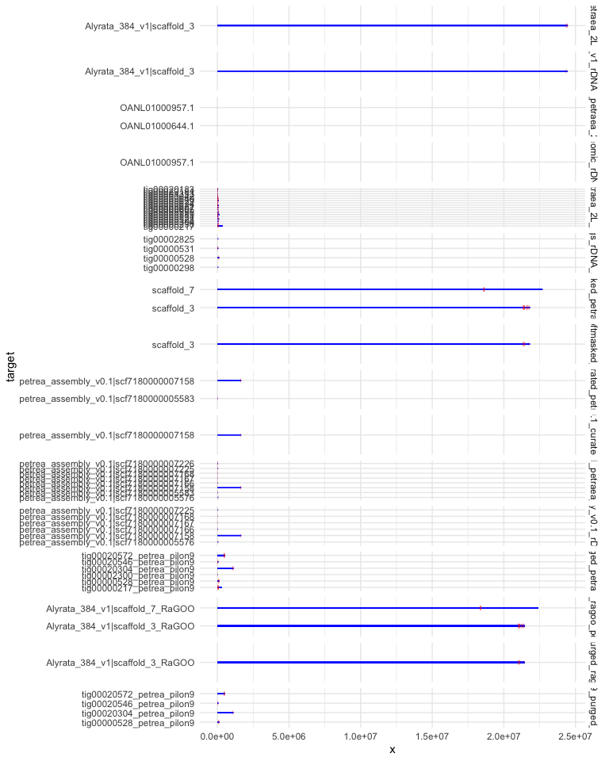
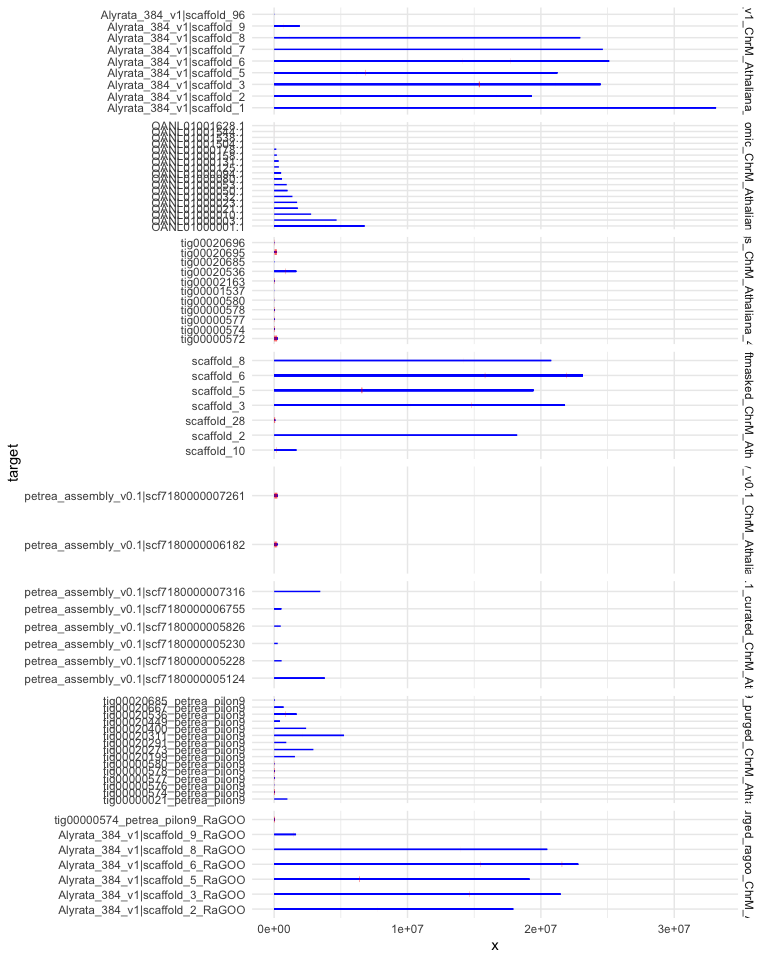
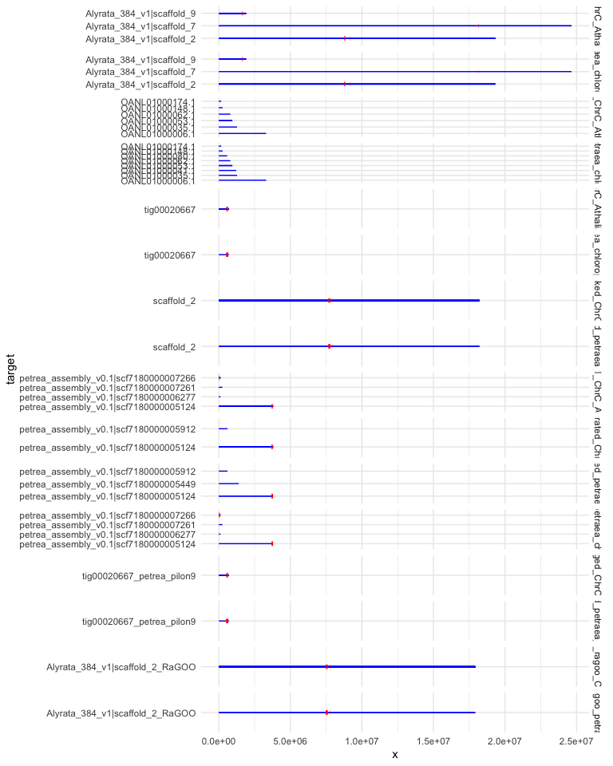

getOrganelle petraea
================
2021-01-26

-   [setup directory](#setup-directory)
-   [run getorganelle scripts](#run-getorganelle-scripts)
-   [2nd round for better rDNA Sample\_02 nr as
    seed](#nd-round-for-better-rdna-sample_02-nr-as-seed)
-   [3rd round for better rDNA Sample\_01 nr as
    seed](#rd-round-for-better-rdna-sample_01-nr-as-seed)
-   [minimap2 some assemblies](#minimap2-some-assemblies)
-   [minimap2 rDNA](#minimap2-rdna)
-   [minimap2 chloroplast](#minimap2-chloroplast)
-   [minimap2 mitochondrium](#minimap2-mitochondrium)
-   [count and plot pafs](#count-and-plot-pafs)
    -   [read paf function](#read-paf-function)
    -   [count\_paf function](#count_paf-function)
    -   [plot paf function](#plot-paf-function)
-   [count nr](#count-nr)
-   [count mitochondria](#count-mitochondria)
-   [count chloroplast](#count-chloroplast)


``` r
library(tidyverse)
library(fs)
library(here)
theme_set(theme_minimal())
```

## Links

https://github.com/Kinggerm/GetOrganelle

for more info see also
<https://github.com/Jnthnoaa/arenosa_assembly/blob/master/01_Data/getorganelle_v1.md>

## setup directory

``` bash
#https://github.com/Kinggerm/GetOrganelle
#module availe GetOrganelle

cd $USERWORK/
mkdir -p getorganelle_petraea/reads
cd getorganelle_petraea/reads 
mkdir -p illumina_2Lz3_4 illumina_2Lz2_2 pacbio_2Lz3_4

#plant used for PacBio 
cp /cluster/projects/nn9525k/hybrids/molbar_illumina_DNA/trimmed_reads/Sample_02-B-2Lz3-4/*R?_rep.fastq.gz illumina_2Lz3_4/

cp /cluster/projects/nn9525k/hybrids/molbar_illumina_DNA/trimmed_reads/Sample_01-A-2Lz2-2/*R?_rep.fastq.gz illumina_2Lz2_2/

#pacbio_2Lz3_4
#cp /cluster/projects/nn9525k/lyrata_genome/01_data/lyrata_pacbio.fastq.gz pacbio_2Lz3_4/
cp /cluster/projects/nn9525k/hybrids/jasonrm/GenomeAsssembly/A.lyrata.ver1/lyrata.correctedReads.fasta pacbio_2Lz3_4/
cd ..
```

``` bash
mkdir -p seeds
cp ../getorganelle_arenosa/seeds/* seeds/

cp ../getorganelle_arenosa/get*.slurm .
```

# run getorganelle scripts

``` bash
R1=/cluster/work/users/jonathbr/getorganelle_petraea/reads/illumina_2Lz3_4/Sample_02-B-2Lz3-4_R1_rep.fastq.gz
R2=/cluster/work/users/jonathbr/getorganelle_petraea/reads/illumina_2Lz3_4/Sample_02-B-2Lz3-4_R2_rep.fastq.gz

sbatch getrDNA.slurm $R1 $R2 #00:09:31   00:04:06 2100576K
sbatch getChloro.slurm $R1 $R2 #00:53:49   00:27:23   4 416 368K
sbatch getMito_v2.slurm $R1 $R2 #07:15:52   03:07:03    18 493 088K

R1=/cluster/work/users/jonathbr/getorganelle_petraea/reads/illumina_2Lz2_2/Sample_01-A-2Lz2-2_R1_rep.fastq.gz
R2=/cluster/work/users/jonathbr/getorganelle_petraea/reads/illumina_2Lz2_2/Sample_01-A-2Lz2-2_R2_rep.fastq.gz

sbatch getrDNA.slurm $R1 $R2 #00:12:23   00:03:56 1754764K
sbatch getChloro.slurm $R1 $R2 
sbatch getMito_v2.slurm $R1 $R2 
```

# 2nd round for better rDNA Sample\_02 nr as seed

``` bash
module load GetOrganelle/1.7.1-foss-2019b-Python-3.7.4
module load pigz/2.4-GCCcore-8.3.0 

R1=/cluster/work/users/jonathbr/getorganelle_petraea/reads/illumina_2Lz2_2/Sample_01-A-2Lz2-2_R1_rep.fastq.gz
R2=/cluster/work/users/jonathbr/getorganelle_petraea/reads/illumina_2Lz2_2/Sample_01-A-2Lz2-2_R2_rep.fastq.gz
SEED=/cluster/work/users/jonathbr/getorganelle_petraea/Sample_02-B-2Lz3-4_nr_output/embplant_nr.K115.scaffolds.graph1.1.path_sequence.fasta
PREFIX=$(basename $R1 _R1_rep.fastq.gz)
OUT=${PREFIX}_nr_output_round2

get_organelle_from_reads.py -1 $R1 -2 $R2 -o $OUT -s $SEED -R 7 -k 35,85,115 -F embplant_nr
```

# 3rd round for better rDNA Sample\_01 nr as seed

``` bash
SEED=/cluster/work/users/jonathbr/getorganelle_petraea/Sample_01-A-2Lz2-2_nr_output/embplant_nr.K115.scaffolds.graph1.1.path_sequence.fasta

PREFIX=$(basename $R1 _R1_rep.fastq.gz)
OUT=${PREFIX}_nr_output_round3

get_organelle_from_reads.py -1 $R1 -2 $R2 -o $OUT -s $SEED -R 7 -k 35,85,115 -F embplant_nr
```

# minimap2 some assemblies

``` bash
srun --cpus-per-task=2 --mem-per-cpu=4G --time=02:00:00 --account=nn9525k --pty bash -i

cd getorganelle_petraea/

mkdir -p assemblies

cp /cluster/projects/nn9525k/lyrata_genome/02_masurca_assembly/petrea_assembly_v0.1.fasta.gz assemblies/

cp /cluster/projects/nn9525k/hybrids/jasonrm/GenomeAsssembly/A.lyrata.ver1/lyrata.contigs.fasta assemblies/

cp /cluster/projects/nn9525k/lyrata_genome_phytomzome/Alyrata_384_v1.fa assemblies/Alyrata_384_v1.fasta

cp /cluster/projects/nn9525k/mads_paper/01_genomes/01_included/GCA_900205625.1_Alyrpet2.2/GCA_900205625.1_Alyrpet2.2_genomic.fna.gz assemblies/Alyrpet2.2_genomic.fasta.gz

cp /cluster/projects/nn9525k/lyrata_genome/02_masurca_assembly/petrea_assembly_v0.1_curated.fasta.gz assemblies/

cp /cluster/projects/nn9525k/jonathan/purge_dups_petrea_pilon9/petrea_canu_pilon9_purged.fasta assemblies/

cp /cluster/projects/nn9525k/jonathan/ragoo_petrea_pilon9/petrea_canu_pilon9_purged_ragoo.fasta.gz assemblies/

cp /cluster/projects/nn9525k/jonathan/repeat_filter_petraea/softmasked_petraea_ordered/petraea_ordered.fasta.softmasked.gz assemblies/petraea_ordered.softmasked.fasta.gz

gunzip assemblies/*.gz
```

# minimap2 rDNA

``` bash
mkdir -p minimap_nr

ml minimap2/2.17-GCC-8.3.0
cd minimap_nr/

#./minimap2 -cx asm5 asm1.fa asm2.fa > aln.paf             # intra-species asm-to-asm alignment

SAMPLE=../seeds/rDNA_Arabidopsis.fasta
END=$(basename $SAMPLE .fasta)
for FASTA in ../assemblies/*.fasta;
do
 PREFIX=$(basename $FASTA .fasta)
 echo $PREFIX
 mkdir -p $PREFIX
 echo "minimap2 -cx asm5 $FASTA $SAMPLE > ${PREFIX}/${PREFIX}_${END}.paf"
 minimap2 -cx asm5 $FASTA $SAMPLE > ${PREFIX}/${PREFIX}_${END}.paf
done

SAMPLE=../seeds/petraea_2L_rDNA_consensus.fasta
END=$(basename $SAMPLE .fasta)
for FASTA in ../assemblies/*.fasta;
do
 PREFIX=$(basename $FASTA .fasta)
 echo $PREFIX
 mkdir -p $PREFIX
 echo "minimap2 -cx asm5 $FASTA $SAMPLE > ${PREFIX}/${PREFIX}_${END}.paf"
 minimap2 -cx asm5 $FASTA $SAMPLE > ${PREFIX}/${PREFIX}_${END}.paf
done

cd ..
```

# minimap2 chloroplast

``` bash
mkdir -p minimap_plastome

#ml minimap2/2.17-GCC-8.3.0
cd minimap_plastome/

#./minimap2 -cx asm5 asm1.fa asm2.fa > aln.paf             # intra-species asm-to-asm alignment

SAMPLE=../seeds/ChrC_Athaliana_447_TAIR10.fasta
END=$(basename $SAMPLE .fasta)
for FASTA in ../assemblies/*.fasta;
do
 PREFIX=$(basename $FASTA .fasta)
 echo $PREFIX
 mkdir -p $PREFIX
 echo "minimap2 -cx asm5 $FASTA $SAMPLE > ${PREFIX}/${PREFIX}_${END}.paf"
 minimap2 -cx asm5 $FASTA $SAMPLE > ${PREFIX}/${PREFIX}_${END}.paf
done

SAMPLE=../seeds/petraea_chloroplast_sample_01_v1.fasta
END=$(basename $SAMPLE .fasta)
for FASTA in ../assemblies/*.fasta;
do
 PREFIX=$(basename $FASTA .fasta)
 echo $PREFIX
 mkdir -p $PREFIX
 echo "minimap2 -cx asm5 $FASTA $SAMPLE > ${PREFIX}/${PREFIX}_${END}.paf"
 minimap2 -cx asm5 $FASTA $SAMPLE > ${PREFIX}/${PREFIX}_${END}.paf
done

cd ..
```

# minimap2 mitochondrium

``` bash
mkdir -p minimap_mitochondria

#ml minimap2/2.17-GCC-8.3.0
cd minimap_mitochondria/

#./minimap2 -cx asm5 asm1.fa asm2.fa > aln.paf             # intra-species asm-to-asm alignment

SAMPLE=../seeds/ChrM_Athaliana_447_TAIR10.fasta
END=$(basename $SAMPLE .fasta)
for FASTA in ../assemblies/*.fasta;
do
 PREFIX=$(basename $FASTA .fasta)
 echo $PREFIX
 mkdir -p $PREFIX
 echo "minimap2 -cx asm5 $FASTA $SAMPLE > ${PREFIX}/${PREFIX}_${END}.paf"
 minimap2 -cx asm5 $FASTA $SAMPLE > ${PREFIX}/${PREFIX}_${END}.paf
done

cd ..
```

# count and plot pafs

## read paf function

``` r
read_paf <- function(dir_name) {
  filenames <- dir_ls(here(paste0("02_assembly/getOrganelle/", dir_name)), recurse = TRUE, glob = "*.paf")
  paf <- map_dfr(filenames, read_tsv,
         col_names = c("query", "q_length", "q_start", "q_end", "strand",
                       "target", "t_length", "t_start", "t_end",
                       "matches", "alignment_length", "map_quality",
                       "NM", "ms", "AS", "nn", "tp", "cm", "s1", "s2","de", "rl", "cg"),
         .id = "filenames") %>% 
        unite(13:24, col = "sam_like") %>% 
        mutate(query = str_remove(dir_name, "minimap_"),
               names = str_remove_all(filenames,".*/|.paf"), .before = 1)
}
```

## count\_paf function

``` r
count_alinment <- function(data, ...) {
  data %>% select(query, target, alignment_length) %>% 
  group_by(query, target) %>% 
  summarise(n = n(),
            sum_length = sum(alignment_length)) %>% 
  arrange(desc(sum_length))
}

count_paf  <- function(paf_df, ...) {
  paf_df %>% 
  group_by(names) %>% 
  group_map(count_alinment)  %>% 
  set_names(unique(paf_df$names))
}
```

## plot paf function

``` r
plot_paf <- function(paf_df, fltr = ".") {
  paf_df %>% 
    filter(str_detect(names, fltr)) %>%
    ggplot() +
      geom_segment(aes(x=0, xend=t_length, y=target, yend=target), color = "blue")+
      geom_segment(aes(x=t_start, xend=t_end, y=target, yend=target), color = "red", size = 2)+
    facet_grid(rows = vars(names), scales = "free")
}
```

# count nr

``` r
paf_nr <- read_paf("minimap_nr")
count_paf(paf_nr)
```

    ## $Alyrata_384_v1_petraea_2L_rDNA_consensus
    ## # A tibble: 1 x 4
    ## # Groups:   query [1]
    ##   query target                        n sum_length
    ##   <chr> <chr>                     <int>      <dbl>
    ## 1 nr    Alyrata_384_v1|scaffold_3     9      41986
    ## 
    ## $Alyrata_384_v1_rDNA_Arabidopsis
    ## # A tibble: 1 x 4
    ## # Groups:   query [1]
    ##   query target                        n sum_length
    ##   <chr> <chr>                     <int>      <dbl>
    ## 1 nr    Alyrata_384_v1|scaffold_3     3      17648
    ## 
    ## $Alyrpet2.2_genomic_petraea_2L_rDNA_consensus
    ## # A tibble: 2 x 4
    ## # Groups:   query [1]
    ##   query target             n sum_length
    ##   <chr> <chr>          <int>      <dbl>
    ## 1 nr    OANL01000957.1     1       1937
    ## 2 nr    OANL01000644.1     1        404
    ## 
    ## $Alyrpet2.2_genomic_rDNA_Arabidopsis
    ## # A tibble: 1 x 4
    ## # Groups:   query [1]
    ##   query target             n sum_length
    ##   <chr> <chr>          <int>      <dbl>
    ## 1 nr    OANL01000957.1     1       1262
    ## 
    ## $lyrata.contigs_petraea_2L_rDNA_consensus
    ## # A tibble: 17 x 4
    ## # Groups:   query [1]
    ##    query target          n sum_length
    ##    <chr> <chr>       <int>      <dbl>
    ##  1 nr    tig00000217     8      72189
    ##  2 nr    tig00000640     5      45671
    ##  3 nr    tig00000629     5      44878
    ##  4 nr    tig00000585     4      36542
    ##  5 nr    tig00000607     4      36531
    ##  6 nr    tig00000621     4      36132
    ##  7 nr    tig00000531     3      27252
    ##  8 nr    tig00020183     3      27113
    ##  9 nr    tig00000595     3      27100
    ## 10 nr    tig00000304     2      18214
    ## 11 nr    tig00000528     2      18167
    ## 12 nr    tig00000642     2      18066
    ## 13 nr    tig00000605     1       9135
    ## 14 nr    tig00020181     1       9095
    ## 15 nr    tig00000298     1       9033
    ## 16 nr    tig00001353     1       9014
    ## 17 nr    tig00000624     1       8896
    ## 
    ## $lyrata.contigs_rDNA_Arabidopsis
    ## # A tibble: 4 x 4
    ## # Groups:   query [1]
    ##   query target          n sum_length
    ##   <chr> <chr>       <int>      <dbl>
    ## 1 nr    tig00000528     4      24324
    ## 2 nr    tig00000531     4      24324
    ## 3 nr    tig00000298     1       6177
    ## 4 nr    tig00002825     1       5840
    ## 
    ## $petraea_ordered.softmasked_petraea_2L_rDNA_consensus
    ## # A tibble: 2 x 4
    ## # Groups:   query [1]
    ##   query target         n sum_length
    ##   <chr> <chr>      <int>      <dbl>
    ## 1 nr    scaffold_3    25     223598
    ## 2 nr    scaffold_7     9      76515
    ## 
    ## $petraea_ordered.softmasked_rDNA_Arabidopsis
    ## # A tibble: 1 x 4
    ## # Groups:   query [1]
    ##   query target         n sum_length
    ##   <chr> <chr>      <int>      <dbl>
    ## 1 nr    scaffold_3    16      97428
    ## 
    ## $petrea_assembly_v0.1_petraea_2L_rDNA_consensus
    ## # A tibble: 2 x 4
    ## # Groups:   query [1]
    ##   query target                                    n sum_length
    ##   <chr> <chr>                                 <int>      <dbl>
    ## 1 nr    petrea_assembly_v0.1|scf7180000007158     2      16849
    ## 2 nr    petrea_assembly_v0.1|scf7180000005583     1       8870
    ## 
    ## $petrea_assembly_v0.1_rDNA_Arabidopsis
    ## # A tibble: 1 x 4
    ## # Groups:   query [1]
    ##   query target                                    n sum_length
    ##   <chr> <chr>                                 <int>      <dbl>
    ## 1 nr    petrea_assembly_v0.1|scf7180000007158     2      12162
    ## 
    ## $petrea_assembly_v0.1_curated_petraea_2L_rDNA_consensus
    ## # A tibble: 8 x 4
    ## # Groups:   query [1]
    ##   query target                                    n sum_length
    ##   <chr> <chr>                                 <int>      <dbl>
    ## 1 nr    petrea_assembly_v0.1|scf7180000007226     2      17065
    ## 2 nr    petrea_assembly_v0.1|scf7180000007158     2      16849
    ## 3 nr    petrea_assembly_v0.1|scf7180000005576     1       9077
    ## 4 nr    petrea_assembly_v0.1|scf7180000007166     1       9033
    ## 5 nr    petrea_assembly_v0.1|scf7180000007167     1       9033
    ## 6 nr    petrea_assembly_v0.1|scf7180000007225     1       8972
    ## 7 nr    petrea_assembly_v0.1|scf7180000005583     1       8870
    ## 8 nr    petrea_assembly_v0.1|scf7180000007168     1       8210
    ## 
    ## $petrea_assembly_v0.1_curated_rDNA_Arabidopsis
    ## # A tibble: 6 x 4
    ## # Groups:   query [1]
    ##   query target                                    n sum_length
    ##   <chr> <chr>                                 <int>      <dbl>
    ## 1 nr    petrea_assembly_v0.1|scf7180000007158     2      12162
    ## 2 nr    petrea_assembly_v0.1|scf7180000005576     1       6081
    ## 3 nr    petrea_assembly_v0.1|scf7180000007166     1       6081
    ## 4 nr    petrea_assembly_v0.1|scf7180000007167     1       6081
    ## 5 nr    petrea_assembly_v0.1|scf7180000007168     1       6081
    ## 6 nr    petrea_assembly_v0.1|scf7180000007225     1       5840
    ## 
    ## $petrea_canu_pilon9_purged_petraea_2L_rDNA_consensus
    ## # A tibble: 6 x 4
    ## # Groups:   query [1]
    ##   query target                        n sum_length
    ##   <chr> <chr>                     <int>      <dbl>
    ## 1 nr    tig00000217_petrea_pilon9    10      89802
    ## 2 nr    tig00020572_petrea_pilon9     9      76515
    ## 3 nr    tig00000528_petrea_pilon9     6      54049
    ## 4 nr    tig00020304_petrea_pilon9     4      35068
    ## 5 nr    tig00020546_petrea_pilon9     3      27369
    ## 6 nr    tig00002300_petrea_pilon9     1       8144
    ## 
    ## $petrea_canu_pilon9_purged_rDNA_Arabidopsis
    ## # A tibble: 2 x 4
    ## # Groups:   query [1]
    ##   query target                              n sum_length
    ##   <chr> <chr>                           <int>      <dbl>
    ## 1 nr    Alyrata_384_v1|scaffold_3_RaGOO    24     215118
    ## 2 nr    Alyrata_384_v1|scaffold_7_RaGOO     9      76515
    ## 
    ## $petrea_canu_pilon9_purged_ragoo_petraea_2L_rDNA_consensus
    ## # A tibble: 1 x 4
    ## # Groups:   query [1]
    ##   query target                              n sum_length
    ##   <chr> <chr>                           <int>      <dbl>
    ## 1 nr    Alyrata_384_v1|scaffold_3_RaGOO    16      97428
    ## 
    ## $petrea_canu_pilon9_purged_ragoo_rDNA_Arabidopsis
    ## # A tibble: 4 x 4
    ## # Groups:   query [1]
    ##   query target                        n sum_length
    ##   <chr> <chr>                     <int>      <dbl>
    ## 1 nr    tig00020572_petrea_pilon9     9      54694
    ## 2 nr    tig00000528_petrea_pilon9     6      36490
    ## 3 nr    tig00020546_petrea_pilon9     3      18243
    ## 4 nr    tig00020304_petrea_pilon9     3      18238

``` r
plot_paf(paf_nr)
```

<!-- -->

# count mitochondria

``` r
paf_mt <- read_paf("minimap_mitochondria")
count_paf(paf_mt)
```

    ## $Alyrata_384_v1_ChrM_Athaliana_447_TAIR10
    ## # A tibble: 9 x 4
    ## # Groups:   query [1]
    ##   query        target                         n sum_length
    ##   <chr>        <chr>                      <int>      <dbl>
    ## 1 mitochondria Alyrata_384_v1|scaffold_3      9      62998
    ## 2 mitochondria Alyrata_384_v1|scaffold_5     11      24687
    ## 3 mitochondria Alyrata_384_v1|scaffold_6      6      11723
    ## 4 mitochondria Alyrata_384_v1|scaffold_9      5       5900
    ## 5 mitochondria Alyrata_384_v1|scaffold_2      4       2264
    ## 6 mitochondria Alyrata_384_v1|scaffold_8      2       1759
    ## 7 mitochondria Alyrata_384_v1|scaffold_1      4       1394
    ## 8 mitochondria Alyrata_384_v1|scaffold_96     1        496
    ## 9 mitochondria Alyrata_384_v1|scaffold_7      1        344
    ## 
    ## $Alyrpet2.2_genomic_ChrM_Athaliana_447_TAIR10
    ## # A tibble: 18 x 4
    ## # Groups:   query [1]
    ##    query        target             n sum_length
    ##    <chr>        <chr>          <int>      <dbl>
    ##  1 mitochondria OANL01000001.1     4       1450
    ##  2 mitochondria OANL01000080.1     3       1359
    ##  3 mitochondria OANL01001504.1     1       1301
    ##  4 mitochondria OANL01000094.1     4       1216
    ##  5 mitochondria OANL01001544.1     1       1204
    ##  6 mitochondria OANL01000178.1     1        672
    ##  7 mitochondria OANL01000032.1     1        665
    ##  8 mitochondria OANL01000050.1     2        645
    ##  9 mitochondria OANL01001628.1     1        578
    ## 10 mitochondria OANL01000053.1     1        495
    ## 11 mitochondria OANL01000021.1     2        491
    ## 12 mitochondria OANL01000131.1     2        468
    ## 13 mitochondria OANL01000010.1     1        410
    ## 14 mitochondria OANL01001538.1     1        402
    ## 15 mitochondria OANL01000158.1     1        344
    ## 16 mitochondria OANL01000125.1     1        319
    ## 17 mitochondria OANL01000003.1     1        252
    ## 18 mitochondria OANL01000023.1     1        250
    ## 
    ## $lyrata.contigs_ChrM_Athaliana_447_TAIR10
    ## # A tibble: 11 x 4
    ## # Groups:   query [1]
    ##    query        target          n sum_length
    ##    <chr>        <chr>       <int>      <dbl>
    ##  1 mitochondria tig00000572    34     173117
    ##  2 mitochondria tig00020695    25     144219
    ##  3 mitochondria tig00000574    10      30118
    ##  4 mitochondria tig00000578     9      23746
    ##  5 mitochondria tig00002163     5      22914
    ##  6 mitochondria tig00020536     7      18479
    ##  7 mitochondria tig00000577     5      16405
    ##  8 mitochondria tig00020696     1      15288
    ##  9 mitochondria tig00000580     2       5958
    ## 10 mitochondria tig00001537     1       1690
    ## 11 mitochondria tig00020685     1        502
    ## 
    ## $petraea_ordered.softmasked_ChrM_Athaliana_447_TAIR10
    ## # A tibble: 7 x 4
    ## # Groups:   query [1]
    ##   query        target          n sum_length
    ##   <chr>        <chr>       <int>      <dbl>
    ## 1 mitochondria scaffold_28    13      65744
    ## 2 mitochondria scaffold_5     20      56282
    ## 3 mitochondria scaffold_6     20      40428
    ## 4 mitochondria scaffold_3     12      19078
    ## 5 mitochondria scaffold_10     3      18149
    ## 6 mitochondria scaffold_8      2       2672
    ## 7 mitochondria scaffold_2      2       1020
    ## 
    ## $petrea_assembly_v0.1_ChrM_Athaliana_447_TAIR10
    ## # A tibble: 2 x 4
    ## # Groups:   query [1]
    ##   query        target                                    n sum_length
    ##   <chr>        <chr>                                 <int>      <dbl>
    ## 1 mitochondria petrea_assembly_v0.1|scf7180000007261    37     195308
    ## 2 mitochondria petrea_assembly_v0.1|scf7180000006182    39     166755
    ## 
    ## $petrea_assembly_v0.1_curated_ChrM_Athaliana_447_TAIR10
    ## # A tibble: 6 x 4
    ## # Groups:   query [1]
    ##   query        target                                    n sum_length
    ##   <chr>        <chr>                                 <int>      <dbl>
    ## 1 mitochondria petrea_assembly_v0.1|scf7180000005826     1       2360
    ## 2 mitochondria petrea_assembly_v0.1|scf7180000005124     3       1304
    ## 3 mitochondria petrea_assembly_v0.1|scf7180000006755     4       1152
    ## 4 mitochondria petrea_assembly_v0.1|scf7180000007316     1        457
    ## 5 mitochondria petrea_assembly_v0.1|scf7180000005230     1        426
    ## 6 mitochondria petrea_assembly_v0.1|scf7180000005228     1        312
    ## 
    ## $petrea_canu_pilon9_purged_ChrM_Athaliana_447_TAIR10
    ## # A tibble: 15 x 4
    ## # Groups:   query [1]
    ##    query        target                        n sum_length
    ##    <chr>        <chr>                     <int>      <dbl>
    ##  1 mitochondria tig00000574_petrea_pilon9    13      44858
    ##  2 mitochondria tig00000578_petrea_pilon9    12      31593
    ##  3 mitochondria tig00020536_petrea_pilon9    11      20133
    ##  4 mitochondria tig00000577_petrea_pilon9     7      16945
    ##  5 mitochondria tig00000580_petrea_pilon9     4      12542
    ##  6 mitochondria tig00000576_petrea_pilon9     2       5780
    ##  7 mitochondria tig00020685_petrea_pilon9     3       2744
    ##  8 mitochondria tig00020291_petrea_pilon9     1       2360
    ##  9 mitochondria tig00020311_petrea_pilon9     2       1286
    ## 10 mitochondria tig00020667_petrea_pilon9     2       1020
    ## 11 mitochondria tig00020449_petrea_pilon9     3        847
    ## 12 mitochondria tig00000021_petrea_pilon9     1        510
    ## 13 mitochondria tig00020273_petrea_pilon9     1        426
    ## 14 mitochondria tig00020400_petrea_pilon9     1        312
    ## 15 mitochondria tig00020199_petrea_pilon9     1        206
    ## 
    ## $petrea_canu_pilon9_purged_ragoo_ChrM_Athaliana_447_TAIR10
    ## # A tibble: 7 x 4
    ## # Groups:   query [1]
    ##   query        target                              n sum_length
    ##   <chr>        <chr>                           <int>      <dbl>
    ## 1 mitochondria tig00000574_petrea_pilon9_RaGOO    13      44858
    ## 2 mitochondria Alyrata_384_v1|scaffold_6_RaGOO    16      33148
    ## 3 mitochondria Alyrata_384_v1|scaffold_5_RaGOO    13      31799
    ## 4 mitochondria Alyrata_384_v1|scaffold_3_RaGOO    12      19078
    ## 5 mitochondria Alyrata_384_v1|scaffold_9_RaGOO     3       6206
    ## 6 mitochondria Alyrata_384_v1|scaffold_2_RaGOO     5       3764
    ## 7 mitochondria Alyrata_384_v1|scaffold_8_RaGOO     2       2672

``` r
plot_paf(paf_mt)
```

<!-- -->

# count chloroplast

``` r
paf_ch <- read_paf("minimap_plastome")
count_paf(paf_ch)
```

    ## $Alyrata_384_v1_ChrC_Athaliana_447_TAIR10
    ## # A tibble: 3 x 4
    ## # Groups:   query [1]
    ##   query    target                        n sum_length
    ##   <chr>    <chr>                     <int>      <dbl>
    ## 1 plastome Alyrata_384_v1|scaffold_2    17     104649
    ## 2 plastome Alyrata_384_v1|scaffold_9     7      48758
    ## 3 plastome Alyrata_384_v1|scaffold_7     2      19840
    ## 
    ## $Alyrata_384_v1_petraea_chloroplast_sample_01_v1
    ## # A tibble: 3 x 4
    ## # Groups:   query [1]
    ##   query    target                        n sum_length
    ##   <chr>    <chr>                     <int>      <dbl>
    ## 1 plastome Alyrata_384_v1|scaffold_2     5     107042
    ## 2 plastome Alyrata_384_v1|scaffold_9     5      49162
    ## 3 plastome Alyrata_384_v1|scaffold_7     1       9893
    ## 
    ## $Alyrpet2.2_genomic_ChrC_Athaliana_447_TAIR10
    ## # A tibble: 6 x 4
    ## # Groups:   query [1]
    ##   query    target             n sum_length
    ##   <chr>    <chr>          <int>      <dbl>
    ## 1 plastome OANL01000053.1     2       2608
    ## 2 plastome OANL01000148.1     1        950
    ## 3 plastome OANL01000006.1     1        538
    ## 4 plastome OANL01000062.1     1        393
    ## 5 plastome OANL01000174.1     1        272
    ## 6 plastome OANL01000035.1     1        247
    ## 
    ## $Alyrpet2.2_genomic_petraea_chloroplast_sample_01_v1
    ## # A tibble: 8 x 4
    ## # Groups:   query [1]
    ##   query    target             n sum_length
    ##   <chr>    <chr>          <int>      <dbl>
    ## 1 plastome OANL01000053.1     2       2608
    ## 2 plastome OANL01000148.1     1        938
    ## 3 plastome OANL01000006.1     1        587
    ## 4 plastome OANL01000062.1     1        390
    ## 5 plastome OANL01000080.1     1        285
    ## 6 plastome OANL01000174.1     1        272
    ## 7 plastome OANL01000035.1     1        262
    ## 8 plastome OANL01000041.1     1        245
    ## 
    ## $lyrata.contigs_ChrC_Athaliana_447_TAIR10
    ## # A tibble: 1 x 4
    ## # Groups:   query [1]
    ##   query    target          n sum_length
    ##   <chr>    <chr>       <int>      <dbl>
    ## 1 plastome tig00020667    15     153211
    ## 
    ## $lyrata.contigs_petraea_chloroplast_sample_01_v1
    ## # A tibble: 1 x 4
    ## # Groups:   query [1]
    ##   query    target          n sum_length
    ##   <chr>    <chr>       <int>      <dbl>
    ## 1 plastome tig00020667     1     154888
    ## 
    ## $petraea_ordered.softmasked_ChrC_Athaliana_447_TAIR10
    ## # A tibble: 1 x 4
    ## # Groups:   query [1]
    ##   query    target         n sum_length
    ##   <chr>    <chr>      <int>      <dbl>
    ## 1 plastome scaffold_2    16     163076
    ## 
    ## $petraea_ordered.softmasked_petraea_chloroplast_sample_01_v1
    ## # A tibble: 1 x 4
    ## # Groups:   query [1]
    ##   query    target         n sum_length
    ##   <chr>    <chr>      <int>      <dbl>
    ## 1 plastome scaffold_2     2     165546
    ## 
    ## $petrea_assembly_v0.1_ChrC_Athaliana_447_TAIR10
    ## # A tibble: 4 x 4
    ## # Groups:   query [1]
    ##   query    target                                    n sum_length
    ##   <chr>    <chr>                                 <int>      <dbl>
    ## 1 plastome petrea_assembly_v0.1|scf7180000005124    13     103971
    ## 2 plastome petrea_assembly_v0.1|scf7180000007266     2      41113
    ## 3 plastome petrea_assembly_v0.1|scf7180000006277     1        499
    ## 4 plastome petrea_assembly_v0.1|scf7180000007261     1        499
    ## 
    ## $petrea_assembly_v0.1_petraea_chloroplast_sample_01_v1
    ## # A tibble: 2 x 4
    ## # Groups:   query [1]
    ##   query    target                                    n sum_length
    ##   <chr>    <chr>                                 <int>      <dbl>
    ## 1 plastome petrea_assembly_v0.1|scf7180000005124    14     128814
    ## 2 plastome petrea_assembly_v0.1|scf7180000005912     1        306
    ## 
    ## $petrea_assembly_v0.1_curated_ChrC_Athaliana_447_TAIR10
    ## # A tibble: 3 x 4
    ## # Groups:   query [1]
    ##   query    target                                    n sum_length
    ##   <chr>    <chr>                                 <int>      <dbl>
    ## 1 plastome petrea_assembly_v0.1|scf7180000005124     2     130805
    ## 2 plastome petrea_assembly_v0.1|scf7180000005912     1        306
    ## 3 plastome petrea_assembly_v0.1|scf7180000005449     1        293
    ## 
    ## $petrea_assembly_v0.1_curated_petraea_chloroplast_sample_01_v1
    ## # A tibble: 4 x 4
    ## # Groups:   query [1]
    ##   query    target                                    n sum_length
    ##   <chr>    <chr>                                 <int>      <dbl>
    ## 1 plastome petrea_assembly_v0.1|scf7180000005124     1     105999
    ## 2 plastome petrea_assembly_v0.1|scf7180000007266     1      70378
    ## 3 plastome petrea_assembly_v0.1|scf7180000006277     1        499
    ## 4 plastome petrea_assembly_v0.1|scf7180000007261     1        499
    ## 
    ## $petrea_canu_pilon9_purged_ChrC_Athaliana_447_TAIR10
    ## # A tibble: 1 x 4
    ## # Groups:   query [1]
    ##   query    target                        n sum_length
    ##   <chr>    <chr>                     <int>      <dbl>
    ## 1 plastome tig00020667_petrea_pilon9    15     153211
    ## 
    ## $petrea_canu_pilon9_purged_petraea_chloroplast_sample_01_v1
    ## # A tibble: 1 x 4
    ## # Groups:   query [1]
    ##   query    target                        n sum_length
    ##   <chr>    <chr>                     <int>      <dbl>
    ## 1 plastome tig00020667_petrea_pilon9     1     154888
    ## 
    ## $petrea_canu_pilon9_purged_ragoo_ChrC_Athaliana_447_TAIR10
    ## # A tibble: 1 x 4
    ## # Groups:   query [1]
    ##   query    target                              n sum_length
    ##   <chr>    <chr>                           <int>      <dbl>
    ## 1 plastome Alyrata_384_v1|scaffold_2_RaGOO    16     161887
    ## 
    ## $petrea_canu_pilon9_purged_ragoo_petraea_chloroplast_sample_01_v1
    ## # A tibble: 1 x 4
    ## # Groups:   query [1]
    ##   query    target                              n sum_length
    ##   <chr>    <chr>                           <int>      <dbl>
    ## 1 plastome Alyrata_384_v1|scaffold_2_RaGOO     2     164368

``` r
plot_paf(paf_ch)
```

<!-- -->

