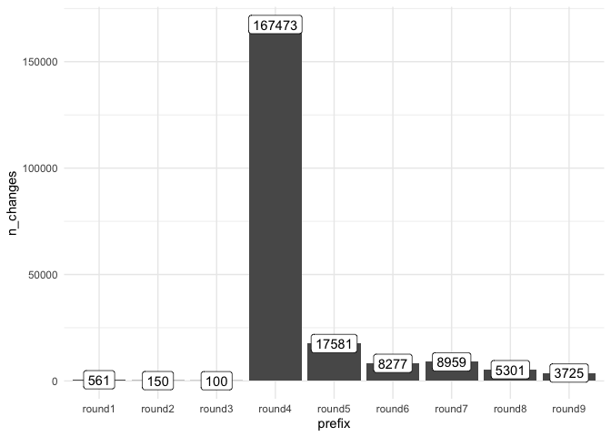
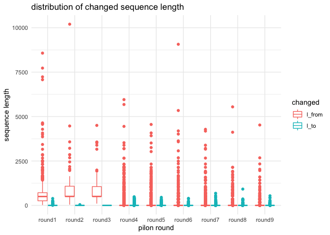

Pilon
================
2020-06-01

  - [read .flagstats](#read-.flagstats)
  - [read .stats.SN](#read-.stats.sn)
  - [read .changes](#read-.changes)

``` r
library(tidyverse)
library(fs)
```

## read .flagstats

``` r
files <- dir_ls("summary", glob = "*.flagstat")

bam_list <- map(files, read_delim, delim = " ", col_names = FALSE)

bam_stats <- bam_list %>% 
  map(unite, col = "flag", X4:X10, sep = " ", na.rm = TRUE) %>% 
  bind_rows(.id = "prefix") %>% 
  mutate(prefix = str_extract(prefix,"round.")) %>% 
  select(prefix, n_reads =X1, flag) %>% 
  mutate(flag = str_replace(flag, " \\(.*\\)", ""))

bam_stats$flag %>% unique()
```

    ##  [1] "in total"                            "secondary"                          
    ##  [3] "supplementary"                       "duplicates"                         
    ##  [5] "mapped"                              "paired in sequencing"               
    ##  [7] "read1"                               "read2"                              
    ##  [9] "properly paired"                     "with itself and mate mapped"        
    ## [11] "singletons"                          "with mate mapped to a different chr"

``` r
bam_stats
```

    ## # A tibble: 117 x 3
    ##    prefix  n_reads flag                       
    ##    <chr>     <dbl> <chr>                      
    ##  1 round1 90355204 in total                   
    ##  2 round1        0 secondary                  
    ##  3 round1        0 supplementary              
    ##  4 round1        0 duplicates                 
    ##  5 round1 90355204 mapped                     
    ##  6 round1 90355204 paired in sequencing       
    ##  7 round1 45177602 read1                      
    ##  8 round1 45177602 read2                      
    ##  9 round1 90355204 properly paired            
    ## 10 round1 90355204 with itself and mate mapped
    ## # … with 107 more rows

``` r
bam_stats %>% 
  filter(flag == "in total")
```

    ## # A tibble: 9 x 3
    ##   prefix   n_reads flag    
    ##   <chr>      <dbl> <chr>   
    ## 1 round1  90355204 in total
    ## 2 round2  90346344 in total
    ## 3 round3  90344752 in total
    ## 4 round4 157072042 in total
    ## 5 round5 157131646 in total
    ## 6 round6 157139786 in total
    ## 7 round7 159698329 in total
    ## 8 round8 159699484 in total
    ## 9 round9 159699628 in total

``` r
bam_stats %>% 
  group_by(prefix) %>% 
  mutate(rate = n_reads/first(n_reads)) %>% 
  filter(flag == "properly paired")
```

    ## # A tibble: 9 x 4
    ## # Groups:   prefix [9]
    ##   prefix   n_reads flag             rate
    ##   <chr>      <dbl> <chr>           <dbl>
    ## 1 round1  90355204 properly paired 1    
    ## 2 round2  90346344 properly paired 1    
    ## 3 round3  90344752 properly paired 1    
    ## 4 round4 157072042 properly paired 1    
    ## 5 round5 157131646 properly paired 1    
    ## 6 round6 157139786 properly paired 1    
    ## 7 round7 158531504 properly paired 0.993
    ## 8 round8 158532034 properly paired 0.993
    ## 9 round9 158532120 properly paired 0.993

## read .stats.SN

``` r
files <- dir_ls("summary", glob = "*.stats.SN")

#bam_list <- map(files, read_delim, delim = ":", col_names = FALSE)
bam_list <- map(files, read_tsv, col_names = FALSE)


stats_SN <- bam_list %>% 
  bind_rows(.id = "prefix") %>% 
  mutate(prefix = str_extract(prefix,"round.")) %>% 
  select(prefix, n_reads =X2, flag = X1)
```

``` r
stats_SN %>% 
  filter(flag == "mismatches:")
```

    ## # A tibble: 9 x 3
    ##   prefix   n_reads flag       
    ##   <chr>      <dbl> <chr>      
    ## 1 round1         0 mismatches:
    ## 2 round2         0 mismatches:
    ## 3 round3         0 mismatches:
    ## 4 round4 149461008 mismatches:
    ## 5 round5 138285040 mismatches:
    ## 6 round6 136709490 mismatches:
    ## 7 round7 133467550 mismatches:
    ## 8 round8 132967770 mismatches:
    ## 9 round9 132703208 mismatches:

``` r
stats_SN %>% 
  filter(flag == "error rate:")
```

    ## # A tibble: 9 x 3
    ##   prefix n_reads flag       
    ##   <chr>    <dbl> <chr>      
    ## 1 round1 0       error rate:
    ## 2 round2 0       error rate:
    ## 3 round3 0       error rate:
    ## 4 round4 0.00641 error rate:
    ## 5 round5 0.00593 error rate:
    ## 6 round6 0.00586 error rate:
    ## 7 round7 0.00565 error rate:
    ## 8 round8 0.00562 error rate:
    ## 9 round9 0.00561 error rate:

``` r
stats_SN %>% 
  filter(flag == "percentage of properly paired reads (%):")
```

    ## # A tibble: 9 x 3
    ##   prefix n_reads flag                                    
    ##   <chr>    <dbl> <chr>                                   
    ## 1 round1   100   percentage of properly paired reads (%):
    ## 2 round2   100   percentage of properly paired reads (%):
    ## 3 round3   100   percentage of properly paired reads (%):
    ## 4 round4   100   percentage of properly paired reads (%):
    ## 5 round5   100   percentage of properly paired reads (%):
    ## 6 round6   100   percentage of properly paired reads (%):
    ## 7 round7    99.3 percentage of properly paired reads (%):
    ## 8 round8    99.3 percentage of properly paired reads (%):
    ## 9 round9    99.3 percentage of properly paired reads (%):

## read .changes

``` r
files <- dir_ls("summary", glob = "*.changes")

#read_table2("summary/petrea.contigs_pilon_round1.changes", col_names = FALSE)

changes_list <- map(files, read_table2, col_names = FALSE)

changes <- changes_list %>% 
  bind_rows(.id = "prefix") %>% 
  mutate(prefix = str_extract(prefix,"round.")) %>% 
  select(prefix, pos_1 = X1, pos_2 = X2, from_assembly = X3, to_corrected = X4)
```

``` r
changes %>% 
  group_by(prefix) %>% 
  summarise(n_changes = n()) %>% 
  ggplot(aes(x=prefix, y=n_changes, label = n_changes))+
    geom_col()+
    geom_label()+
    theme_minimal()
```

<!-- -->

``` r
changes %>% 
  mutate(l_from = str_length(from_assembly),
         l_to = str_length(to_corrected)) %>% 
  select(prefix, l_from, l_to) %>% 
  pivot_longer(-prefix) %>% 
  ggplot(aes(x = prefix, y = value, color = name)) +
    geom_boxplot() +
    #scale_y_log10() +
    theme_minimal()+
    labs(x = "pilon round", y = "sequence length", 
         title = "distribution of changed sequence length", color = "changed")
```

<!-- -->
