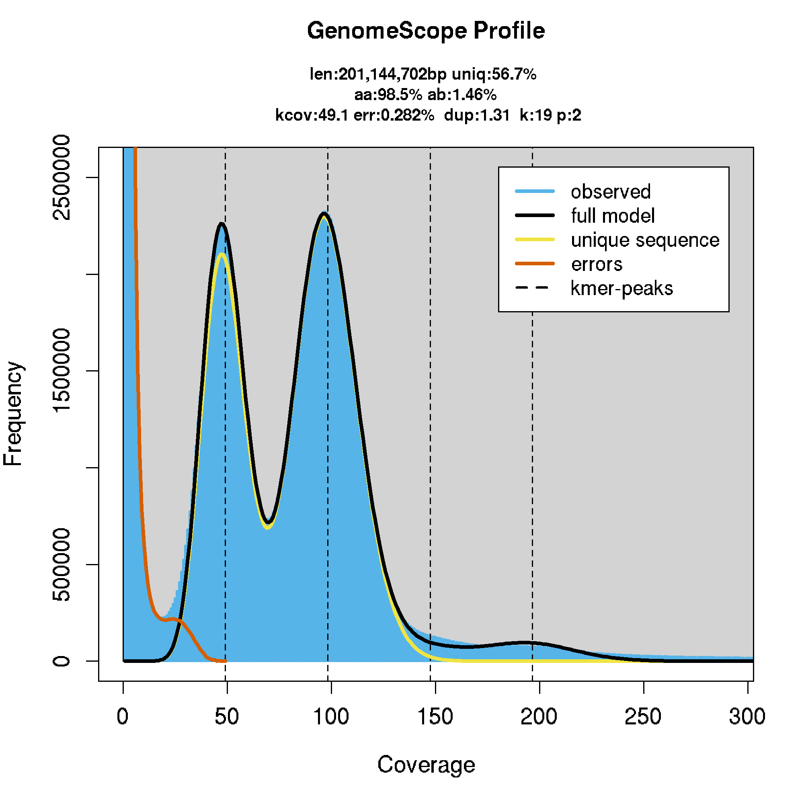
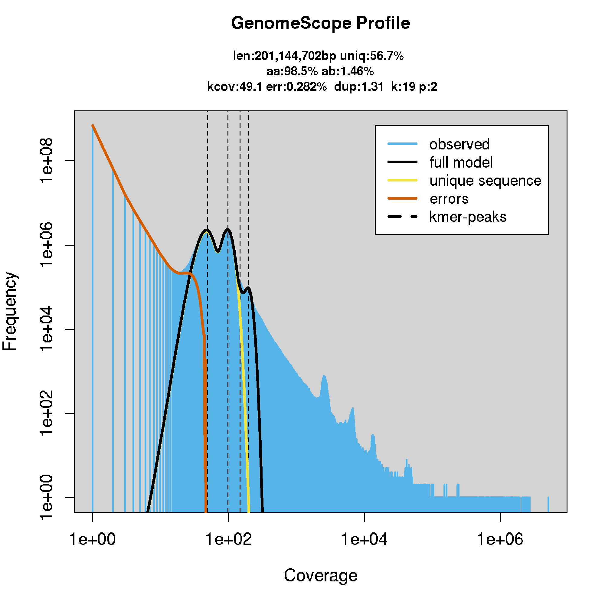
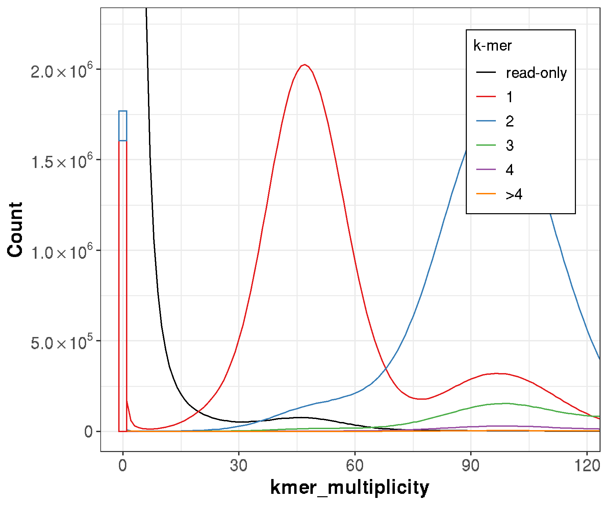
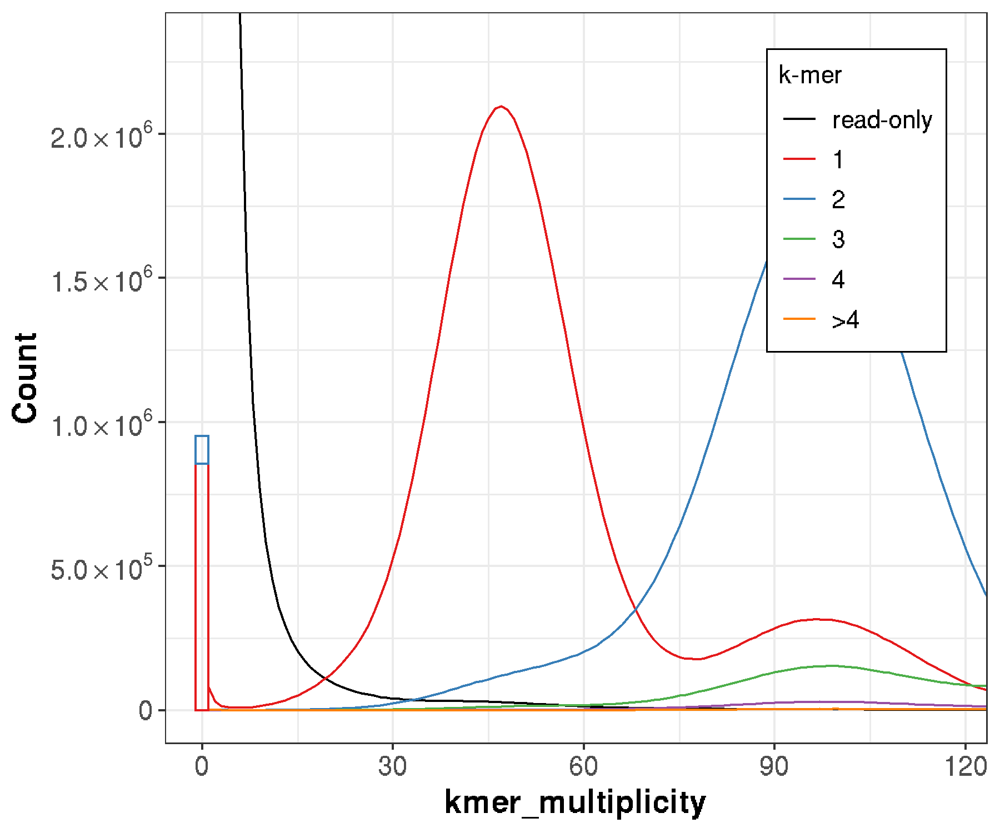
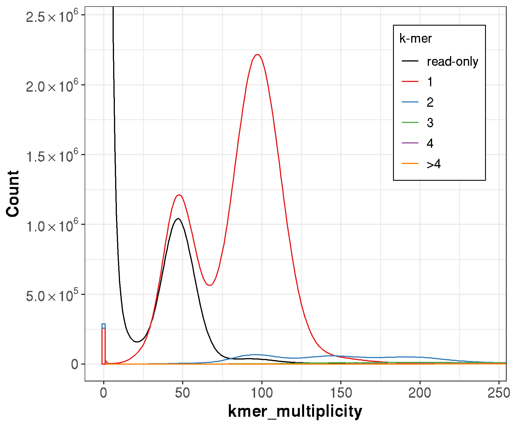

Merqury
================
2020-06-10

  - [Merqury](#merqury)
  - [Installation](#installation)
      - [<span>https://github.com/marbl/merqury</span>](#httpsgithub.commarblmerqury)
  - [Run](#run)
      - [Setup directory](#setup-directory)
      - [input.fofn](#input.fofn)
      - [Get the right k size](#get-the-right-k-size)
      - [Build k-mer dbs with meryl
        (alternative)](#build-k-mer-dbs-with-meryl-alternative)
      - [Build k-mer dbs with meryl](#build-k-mer-dbs-with-meryl)
  - [srun petraea](#srun-petraea)
  - [check petraea canu contigs](#check-petraea-canu-contigs)
  - [check petraea canu pilon9](#check-petraea-canu-pilon9)
  - [check petraea canu purged\_dups](#check-petraea-canu-purged_dups)
  - [check petraea canu ragoo](#check-petraea-canu-ragoo)
  - [chekout QV and
    completeness.stats](#chekout-qv-and-completeness.stats)
  - [copy and save](#copy-and-save)

``` r
library(here)
```

# Merqury

# Installation

## <https://github.com/marbl/merqury>

``` bash

#gcc 4.8 or higher

### meryl
#https://github.com/marbl/meryl/releases/tag/v1.0
#cd /cluster/projects/nn9525k/Programs/meryl/
#wget https://github.com/marbl/meryl/releases/download/v1.0/meryl-1.0.Linux-amd64.tar.xz
#tar -xvf meryl-1.0.Linux-amd64.tar.xz

export PATH=$PATH:/cluster/projects/nn9525k/Programs/meryl-1.0/Linux-amd64/bin

### Java run time environment (JRE)
module load Java/11.0.2

### R with argparse, ggplot2, and scales (tested on R 3.6.1)
module load R/3.6.2-fosscuda-2019b
R
install.packages("argparse")
q()

### bedtools
module load BEDTools/2.28.0-GCC-8.2.0-2.31.1

### samtools
module swap GCCcore/8.2.0 GCCcore/8.3.0
module swap zlib/1.2.11-GCCcore-8.2.0 zlib/1.2.11-GCCcore-8.3.0
module swap binutils/2.31.1-GCCcore-8.2.0 binutils/2.32-GCCcore-8.3.0
module swap GCC/8.2.0-2.31.1 GCC/8.3.0
module swap bzip2/1.0.6-GCCcore-8.2.0 bzip2/1.0.8-GCCcore-8.3.0
module swap XZ/5.2.4-GCCcore-8.2.0 XZ/5.2.4-GCCcore-8.3.0

module load SAMtools/1.10-GCC-8.3.0

### igvtools
export PATH=$PATH:/cluster/projects/nn9525k/Programs/IGV_2.8.2

### MERQURY
cd /cluster/projects/nn9525k/Programs/
git clone https://github.com/marbl/merqury.git
cd merqury

export MERQURY=/cluster/projects/nn9525k/Programs/merqury
```

``` bash
######## in short:
module purge
module load Java/11.0.2
module load BEDTools/2.28.0-GCC-8.2.0-2.31.1
module swap GCCcore/8.2.0 GCCcore/8.3.0
module swap zlib/1.2.11-GCCcore-8.2.0 zlib/1.2.11-GCCcore-8.3.0
module swap binutils/2.31.1-GCCcore-8.2.0 binutils/2.32-GCCcore-8.3.0
module swap GCC/8.2.0-2.31.1 GCC/8.3.0
module swap bzip2/1.0.6-GCCcore-8.2.0 bzip2/1.0.8-GCCcore-8.3.0
module swap XZ/5.2.4-GCCcore-8.2.0 XZ/5.2.4-GCCcore-8.3.0
module load SAMtools/1.10-GCC-8.3.0
module load R/3.6.2-fosscuda-2019b
export PATH=$PATH:/cluster/projects/nn9525k/Programs/IGV_2.8.2
export PATH=$PATH:/cluster/projects/nn9525k/Programs/meryl-1.0/Linux-amd64/bin
export MERQURY=/cluster/projects/nn9525k/Programs/merqury
########
```

# Run

## Setup directory

``` bash
cd /cluster/work/users/jonathbr/merqury
ln -s $MERQURY/merqury.sh . 

mkdir reads
cp /cluster/projects/nn9525k/hybrids/jasonrm/GenomeAsssembly/A.lyrata.ver1/lyrata.correctedReads.fasta reads/

cp /cluster/projects/nn9525k/hybrids/molbar_illumina_DNA/trimmed_reads/Sample_02-B-2Lz3-4/Sample_02-B-2Lz3-4_R?_rep.fastq.gz reads/
```

## input.fofn

``` bash
ls reads/*.fastq.gz > input.fofn

sh $MERQURY/best_k.sh 180000000
```

## Get the right k size

``` bash
sh $MERQURY/best_k.sh 180000000
#k=19
```

## Build k-mer dbs with meryl (alternative)

``` bash
k=19

for READ in $(ls reads/*.fastq.gz)
do
    PREFIX=$(basename $READ .fastq.gz)
    echo "$PREFIX"
    meryl k=$k count output $PREFIX.meryl $READ 
done

meryl union-sum output illumina_2Lz3-4.meryl Sample_*.meryl
```

/cluster/projects/nn9525k/Programs/merqury/\_submit\_build.sh has been
changed for use on saga

## Build k-mer dbs with meryl

``` bash
$MERQURY/_submit_build_2h.sh 19 input.fofn petraea_illumina
```

Use petraea\_illumina.k19.hist for genomescope.




# srun petraea

``` bash
login-3
screen -S merqury
srun --cpus-per-task=4 --mem-per-cpu=2G --time=02:00:00 --account=nn9525k --x11 --pty bash -i

cp /cluster/projects/nn9525k/hybrids/jasonrm/GenomeAsssembly/A.lyrata.ver1/lyrata.contigs.fasta petraea.contigs.fasta

cp /cluster/projects/nn9525k/jonathan/pilon_loop/pilon_round9/petraea.contigs_pilon_round9.fasta .

cp /cluster/projects/nn9525k/jonathan/purge_dups_petraea_pilon9/petraea_canu_pilon9_purged.fasta .

cp /cluster/projects/nn9525k/jonathan/ragoo_petraea_pilon9/petraea_canu_pilon9_purged_ragoo.fasta . 
```

``` bash
module purge
module load Java/11.0.2
module load BEDTools/2.28.0-GCC-8.2.0-2.31.1
module swap GCCcore/8.2.0 GCCcore/8.3.0
module swap zlib/1.2.11-GCCcore-8.2.0 zlib/1.2.11-GCCcore-8.3.0
module swap binutils/2.31.1-GCCcore-8.2.0 binutils/2.32-GCCcore-8.3.0
module swap GCC/8.2.0-2.31.1 GCC/8.3.0
module swap bzip2/1.0.6-GCCcore-8.2.0 bzip2/1.0.8-GCCcore-8.3.0
module swap XZ/5.2.4-GCCcore-8.2.0 XZ/5.2.4-GCCcore-8.3.0
module load SAMtools/1.10-GCC-8.3.0
module load R/3.6.2-fosscuda-2019b
export PATH=$PATH:/cluster/projects/nn9525k/Programs/IGV_2.8.2
export PATH=$PATH:/cluster/projects/nn9525k/Programs/meryl-1.0/Linux-amd64/bin
export MERQURY=/cluster/projects/nn9525k/Programs/merqury
module list
```

# check petraea canu contigs

``` bash
$MERQURY/merqury.sh petraea_illumina.k19.meryl petraea.contigs.fasta petraea.contigs

tail -f logs/petraea.contigs.spectra-cn.log

mkdir petraea.contigs_kmer
mv petraea.contigs.* petraea.contigs_kmer/
cp completeness.stats petraea.contigs_kmer/
mv petraea.contigs_only.* petraea.contigs_kmer/
```



# check petraea canu pilon9

``` bash
$MERQURY/merqury.sh petraea_illumina.k19.meryl petraea.contigs_pilon_round9.fasta petraea.contigs_pilon_round9

tail -f logs/petraea.contigs_pilon_round9.spectra-cn.log

mkdir petraea.contigs_pilon9_kmer
mv petraea.contigs_pilon_round9* petraea.contigs_pilon9_kmer/
cp completeness.stats petraea.contigs_pilon9_kmer/
```



# check petraea canu purged\_dups

``` bash
$MERQURY/merqury.sh petraea_illumina.k19.meryl petraea_canu_pilon9_purged.fasta petraea_canu_pilon9_purged &

tail -f logs/petraea_canu_pilon9_purged.spectra-cn.log

mkdir petraea_canu_purged_kmer
mv petraea_canu_pilon9_purged* petraea_canu_purged_kmer/
```



# check petraea canu ragoo

``` bash
$MERQURY/merqury.sh petraea_illumina.k19.meryl petraea_canu_pilon9_purged_ragoo.fasta petraea_canu_pilon9_purged_ragoo 

tail -f logs/petraea_canu_pilon9_purged_ragoo.spectra-cn.log

mkdir petraea_canu_ragoo_kmer
mv petraea_canu_pilon9_purged_ragoo* petraea_canu_ragoo_kmer/
```


# chekout QV and completeness.stats

(missing here)

``` r
read.delim(here::here("04_phasing","Merqury","sum_kmer-QV.tsv"))
```

    ##                          assembly uniquely      both      QV  Error_rate
    ## 1                  petraea.contigs  1768328 360127760 35.8664 2.59039e-04
    ## 2     petraea.contigs_pilon_round9   951673 358812994 38.5459 1.39769e-04
    ## 3       petraea_canu_pilon9_purged   287037 184431701 40.8633 8.19727e-05
    ## 4 petraea_canu_pilon9_purged_ragoo   287029 184427969 40.8633 8.19720e-05

# copy and save

``` bash
rm -r reads
cp -rv /cluster/work/users/jonathbr/merqury /cluster/projects/nn9525k/jonathan/merqury_petraea
```
