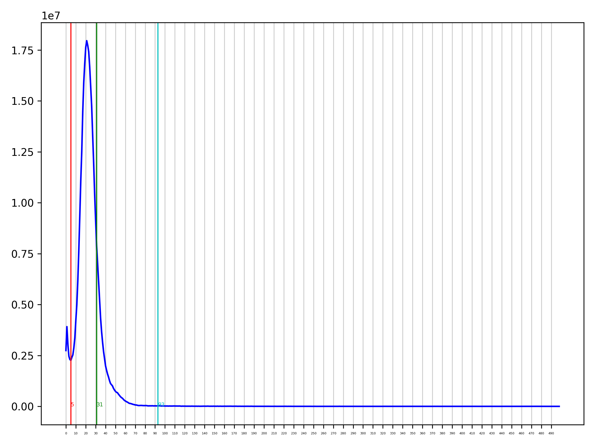
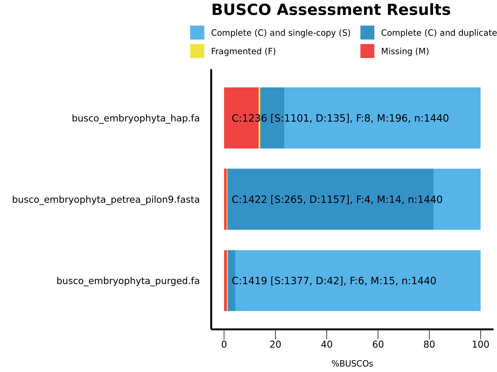

purge\_dups on pilon9
================
2020-06-10

  - [Setup](#setup)
  - [Rename pilon fasta](#rename-pilon-fasta)
  - [Check](#check)
  - [Generate a configuration file](#generate-a-configuration-file)
  - [Run sbatch](#run-sbatch)

## Setup

``` bash
cd /cluster/work/users/jonathbr/

mkdir purge_dups_petraea_pilon9
cd purge_dups_petraea_pilon9

ln -s /cluster/projects/nn9525k/jonathan/pilon_loop/pilon_round9/petraea.contigs_pilon_round9.fasta .

ln -s /cluster/projects/nn9525k/hybrids/jasonrm/GenomeAsssembly/A.lyrata.ver1/lyrata.correctedReads.fasta .
```

## Rename pilon fasta

``` bash
cat petraea.contigs_pilon_round9.fasta | sed 's/_pilon_pilon_pilon_pilon_pilon_pilon_pilon_pilon_pilon/_petraea_pilon9/' > petraea_pilon9.fasta
```

## Check

``` bash
module load minimap2/2.17-GCC-8.2.0-2.31.1
module load Python/3.7.2-GCCcore-8.2.0

/cluster/projects/nn9525k/Programs/purge_dups/scripts/pd_config.py -h
```

## Generate a configuration file

``` bash
/cluster/projects/nn9525k/Programs/purge_dups/scripts/pd_config.py -l petraea_pilon9 -n petraea.config.json petraea_pilon9.fasta lyrata.correctedReads.fasta
```

## Run sbatch

``` bash
sbatch purge_dups.slurm #job 857181 01:41:50   00:12:02 4 020 380K

sbatch busco.slurm #job 857187 1-06:59:35   04:25:21 6 956 044K
```



