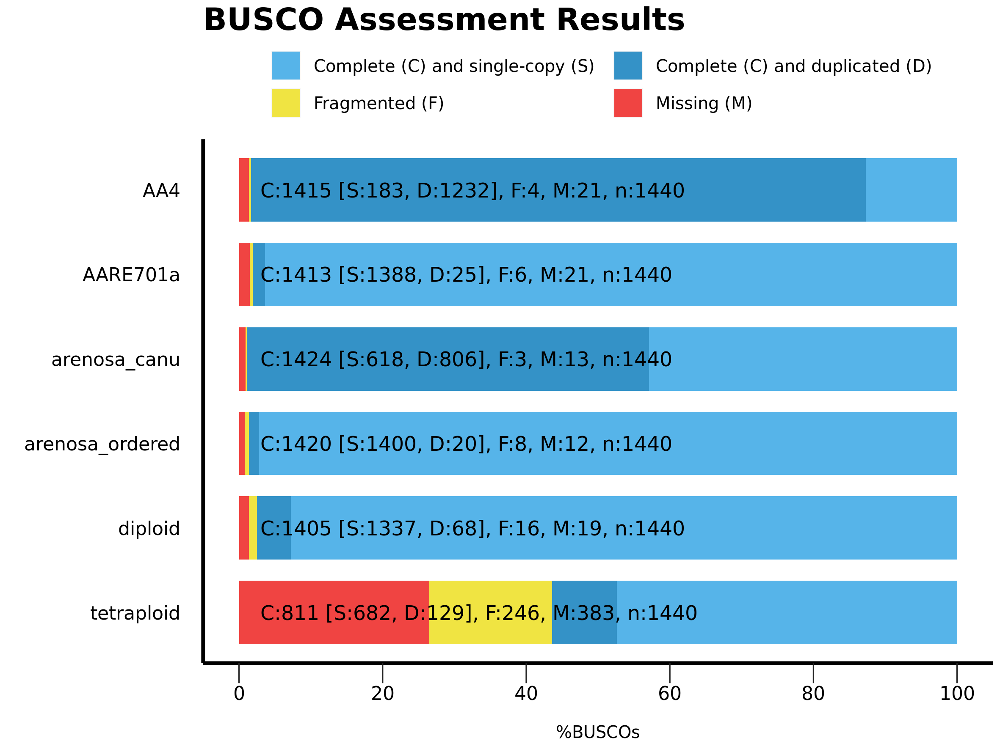
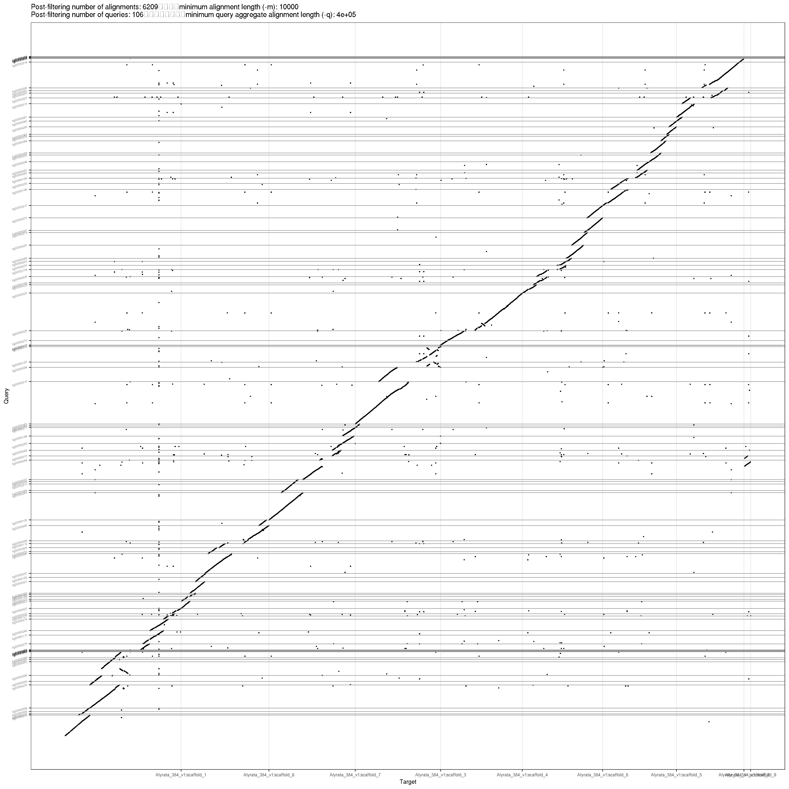
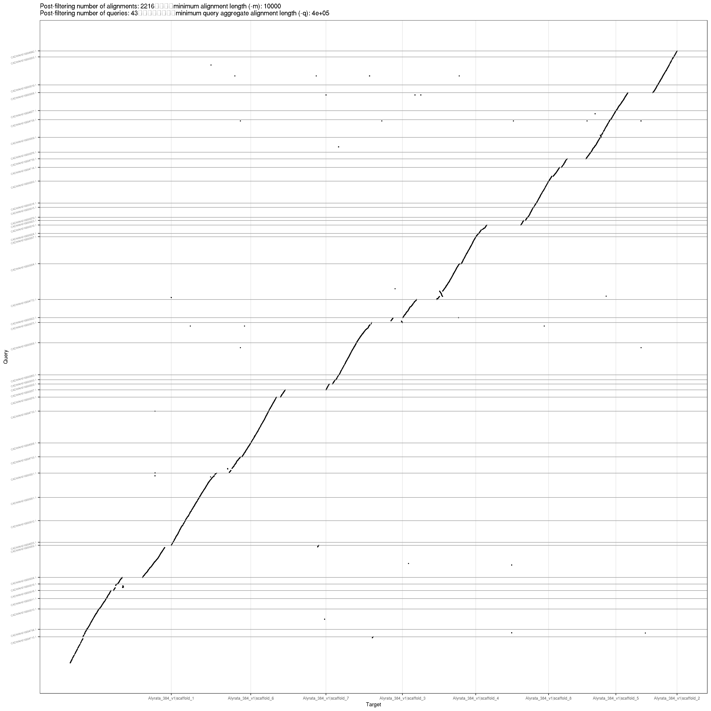

compare published arenosas
================
2022-04-24

-   [1 assessment](#1-assessment)
    -   [1.1 setup working directory](#11-setup-working-directory)
        -   [1.1.1 copy asssemblies](#111-copy-asssemblies)
        -   [1.1.2 download asssemblies](#112-download-asssemblies)
        -   [1.1.3 unzip](#113-unzip)
        -   [1.1.4 copy reference](#114-copy-reference)
    -   [1.2 copy scripts](#12-copy-scripts)
    -   [1.3 QUAST](#13-quast)
    -   [1.4 quast_report](#14-quast_report)
        -   [1.4.1 Table](#141-table)
    -   [1.5 BUSCO](#15-busco)
    -   [1.6 minidotplot.srun](#16-minidotplotsrun)
    -   [1.7 AARE701a.fasta vs arenosa_ordered.fasta](#17-aare701afasta-vs-arenosa_orderedfasta)

``` r
library(tidyverse)
```

# 1 assessment

-   arenosa 3/4
    <https://www.ncbi.nlm.nih.gov/assembly/organism/38785/all/>

    -   pseudohap_a\_tetraploid (Strecno) (JOHN INNES)
        -   (10.1038/s41467-020-19153-6 Liu 2020)
        -   (10.1093/molbev/msab001 Bohutinska 2021)
    -   pseudohap_a\_diploid (Strecno) (JOHN INNES)
        -   (10.1038/s41467-020-19153-6 Liu 2020)
        -   (10.1093/molbev/msab001 Bohutinska 2021)
    -   AA4 (reference) (from south Sweden) (MENDEL) (Tetraploid PacBio)
        -   (10.1038/s41559-021-01525-w Burns 2021)
    -   AARE701a (Strečno AARE_701a) (MPI)
        -   (10.1101/2021.01.24.427284 Barragan 2021) *probably best*

## 1.1 setup working directory

### 1.1.1 copy asssemblies

``` bash
cd /cluster/work/users/jonathbr/
mkdir -p arenosa_published_assessment/assemblies
cd arenosa_published_assessment/

## canu
cp /cluster/projects/nn9525k/arenosa_genome/arenosa_genome_pb_uncorr/canu_out/arenosa_pp_uncorr_assembly.contigs.fasta assemblies/arenosa_canu.fasta

## final arenosa
cp /cluster/projects/nn9525k/arenosa_genome/02_scaffolds/13_braker_arenosa_remasked/genome/arenosa_ordered.fasta.softmasked assemblies/arenosa_ordered.fasta
```

### 1.1.2 download asssemblies

``` bash
rsync --copy-links --recursive --times --verbose rsync://ftp.ncbi.nlm.nih.gov/genomes/all/GCA/902/850/255/GCA_902850255.1_pseudohap_a_tetraploid/ GCA_902850255.1_pseudohap_a_tetraploid/

rsync --copy-links --recursive --times --verbose rsync://ftp.ncbi.nlm.nih.gov/genomes/all/GCA/902/996/965/GCA_902996965.1_pseudohap_a_diploid/ GCA_902996965.1_pseudohap_a_diploid/

rsync --copy-links --recursive --times --verbose rsync://ftp.ncbi.nlm.nih.gov/genomes/all/GCA/905/175/405/GCA_905175405.1_AA4/ GCA_905175405.1_AA4/

rsync --copy-links --recursive --times --verbose rsync://ftp.ncbi.nlm.nih.gov/genomes/all/GCA/905/216/605/GCA_905216605.1_AARE701a/ GCA_905216605.1_AARE701a/
```

### 1.1.3 unzip

``` bash
zcat GCA_902850255.1_pseudohap_a_tetraploid/GCA_902850255.1_pseudohap_a_tetraploid_genomic.fna.gz > assemblies/tetraploid.fasta
zcat GCA_902996965.1_pseudohap_a_diploid/GCA_902996965.1_pseudohap_a_diploid_genomic.fna.gz > assemblies/diploid.fasta
zcat GCA_905175405.1_AA4/GCA_905175405.1_AA4_genomic.fna.gz > assemblies/AA4.fasta
zcat GCA_905216605.1_AARE701a/GCA_905216605.1_AARE701a_genomic.fna.gz > assemblies/AARE701a.fasta
```

### 1.1.4 copy reference

``` bash
mkdir -p reference
cp /cluster/projects/nn9525k/lyrata_genome/lyrata_genome_phytomzome/Alyrata_384_v1.fa reference/Alyrata_384_v1.fasta
```

## 1.2 copy scripts

``` bash
git clone https://github.com/Jnthnoaa/genomeassessment.git
cp genomeassessment/scripts/busco* .
cp genomeassessment/scripts/quast-lg.slurm .
chmod u+x *.sh
```

## 1.3 QUAST

``` bash
# change SIZE=179232250
sbatch quast-lg.slurm
```

## 1.4 quast_report


in R

``` r
quast <- read_tsv(here::here("published_quast_results/results_2022_04_24_16_36_21/transposed_report.tsv"))
```

### 1.4.1 Table

``` r
quast$Assembly
```

    ## [1] "AA4"             "AARE701a"        "arenosa_canu"    "arenosa_ordered"
    ## [5] "diploid"         "tetraploid"      "Alyrata_384_v1"

``` r
quast <- quast %>% 
  mutate(Assembly = fct_relevel(Assembly, c("arenosa_canu",
                                            "arenosa_ordered",
                                            "AARE701a",
                                            "AA4",
                                            "diploid",
                                            "tetraploid",
                                            "Alyrata_384_v1"
                                            )))

quast %>% 
  select(Assembly, "# contigs", "Total length",
                 "NG50", "LG50", "# N's per 100 kbp") %>% 
  arrange(Assembly) %>% 
  knitr::kable()
```

| Assembly        | # contigs | Total length | NG50     | LG50 | # N’s per 100 kbp |
|:----------------|----------:|-------------:|:---------|:-----|------------------:|
| arenosa_canu    |       713 |    255974246 | 4304049  | 13   |              0.00 |
| arenosa_ordered |       160 |    152750645 | 17586680 | 5    |              9.95 |
| AARE701a        |         8 |    149659193 | 17268480 | 5    |           2659.38 |
| AA4             |      3624 |    460947501 | 748051   | 84   |              0.00 |
| diploid         |      4099 |    156821447 | 999787   | 34   |           4464.92 |
| tetraploid      |     13580 |     88862969 | \-       | \-   |           5615.56 |
| Alyrata_384_v1  |       674 |    206638382 | 24464547 | 4    |          11077.21 |

## 1.5 BUSCO

``` bash
./busco_submit.sh #array busco.sh followed by busco_summary.sh
```



## 1.6 minidotplot.srun

``` bash
ssh -Y $USER@saga.sigma2.no
#login-2
screen -S miniplot

#srun --cpus-per-task=2 --mem-per-cpu=4G --qos=devel --time=00:30:00 --account=nn9525k --x11 --pty bash -i
srun --cpus-per-task=2 --mem-per-cpu=4G --time=03:00:00 --account=nn9525k --x11 --pty bash -i

cd /cluster/work/users/jonathbr/arenosa_published_assessment/

module purge
module load minimap2/2.17-GCC-8.2.0-2.31.1
module swap GCCcore/8.2.0 GCCcore/8.3.0
module swap zlib/1.2.11-GCCcore-8.2.0 zlib/1.2.11-GCCcore-8.3.0
module swap binutils/2.31.1-GCCcore-8.2.0 binutils/2.32-GCCcore-8.3.0
module swap GCC/8.2.0-2.31.1 GCC/8.3.0
module load R/3.6.2-foss-2019b

mkdir -p dotplots

cp /cluster/projects/nn9525k/jonathan/arenosa/arenosa_assembly/11_synteny/syri_thaliana_arenosa/pafCoordsDotPlotly.R . 
chmod u+x pafCoordsDotPlotly.R
mv pafCoordsDotPlotly.R dotplots/pafCoordsDotPlotly.R

REFERENCE=reference/Alyrata_384_v1.fasta

for CONTIGS in $(ls assemblies/*fasta)
do
    echo "$CONTIGS"
    PREFIX=$(basename "$CONTIGS" .fasta)
    OUTPUT=dotplots/$PREFIX
    #minimap2 -cx asm5 asm1.fa asm2.fa > aln.paf
    echo -e "\
    minimap2 -x asm5 -t $SLURM_CPUS_PER_TASK $REFERENCE $CONTIGS > ${OUTPUT}.paf"
    minimap2 -x asm5 -t $SLURM_CPUS_PER_TASK $REFERENCE $CONTIGS > ${OUTPUT}.paf
    dotplots/pafCoordsDotPlotly.R -l -x -i ${OUTPUT}.paf  -o $OUTPUT
    dotplots/pafCoordsDotPlotly.R -l -x -s -m 200 -q 10000 -i ${OUTPUT}.paf -o ${OUTPUT}_2
done

mv *.png dotplots/
```

| arenosa_canu                             | arenosa_ordered                             |
|:-----------------------------------------|:--------------------------------------------|
|  |  |
| AARE701a                                 | AA4                                         |
|      |              |
| diploid                                  | tetraploid                                  |
|       |       |

## 1.7 AARE701a.fasta vs arenosa_ordered.fasta

``` bash
REFERENCE=assemblies/AARE701a.fasta
CONTIGS=assemblies/arenosa_ordered.fasta
PREFIX=$(basename "$CONTIGS" .fasta)
OUTPUT=dotplots/AARE701a_$PREFIX
echo -e "\
minimap2 -x asm5 -t $SLURM_CPUS_PER_TASK $REFERENCE $CONTIGS > ${OUTPUT}.paf"
minimap2 -x asm5 -t $SLURM_CPUS_PER_TASK $REFERENCE $CONTIGS > ${OUTPUT}.paf
dotplots/pafCoordsDotPlotly.R -l -x -i ${OUTPUT}.paf  -o $OUTPUT
dotplots/pafCoordsDotPlotly.R -l -x -s -m 200 -q 10000 -i ${OUTPUT}.paf -o ${OUTPUT}_2

mv *.png dotplots/
```


