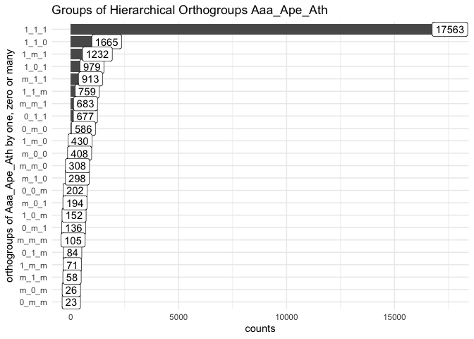
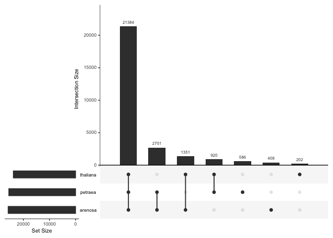

orthofinder results
================
2021-03-28

-   [re-run Orthofinder only with Aaa, Ape and
    Ath](#re-run-orthofinder-only-with-aaa-ape-and-ath)
    -   [read SpeciesTree with
        Gene\_Duplications](#read-speciestree-with-gene_duplications-1)
    -   [Read and plot
        Statistics\_Overall](#read-and-plot-statistics_overall-1)
    -   [read Hierarchical Orthogroup](#read-hierarchical-orthogroup-1)
        -   [Get one-to-one form
            Horth\_count](#get-one-to-one-form-horth_count-1)
    -   [euler](#euler)
    -   [venn](#venn)
    -   [UpSetR](#upsetr)

``` r
library(tidyverse)
library(ggtree)
library(patchwork)
library(ape)
theme_set(theme_minimal())
```

# re-run Orthofinder only with Aaa, Ape and Ath

``` bash
cd /cluster/work/users/jonathbr/orthofinder_brassicales
mkdir subset_Aaa_Ape_Ath
cd subset_Aaa_Ape_Ath
ln -s ../short_pep/longest_pep/Aaa.pep .
ln -s ../short_pep/longest_pep/Ape.pep .
ln -s ../short_pep/longest_pep/Ath.pep .
cd ..
cp orthofinder.slurm orthofinder_subset.slurm
#nano orthofinder_subset.slurm #change input to subset_Aaa_Ape_Ath directory
sbatch orthofinder_subset.slurm # 00:52:22   00:10:38 2497528K
```

## read SpeciesTree with Gene\_Duplications

``` r
dup_tree <- read.tree("results/subset_Aaa_Ape_Ath/Gene_Duplication_Events/SpeciesTree_Gene_Duplications_0.5_Support.txt")
gtree <- ggtree(dup_tree)+
  geom_tiplab(size = 3)+
  geom_nodelab(size = 2, color = "blue")+
  labs(title = "SpeciesTree_Gene_Duplications_0.5_Support")+
  xlim(0, 15)

gdup <- gtree$data %>%  
  separate(label, into = c("spe", "duplications"),
           sep = "_", convert = TRUE) %>% 
  mutate(spe = fct_reorder(spe, y)) %>% 
  ggplot(aes(x = spe, y = duplications,
             fill = isTip))+
    geom_col(show.legend = FALSE)+
    coord_flip()+
  labs(x = "")+
  #scale_y_log10()+
  scale_fill_manual(values = c("blue", "darkgrey"))

gtree + gdup
```

<!-- -->

## Read and plot Statistics\_Overall

``` r
Stat_all <- read_tsv(file.path("results/subset_Aaa_Ape_Ath/Comparative_Genomics_Statistics/Statistics_Overall.tsv"), col_names = FALSE)

Stat_all_one <- Stat_all[26:45,]
colnames(Stat_all_one) <- Stat_all[25,]
Stat_all_one$`Number of orthogroups` <- as.integer(Stat_all_one$`Number of orthogroups`)
Stat_all_one$`Average number of genes per-species in orthogroup` <- fct_inorder(Stat_all_one$`Average number of genes per-species in orthogroup`)
ggplot(Stat_all_one, aes(x = `Average number of genes per-species in orthogroup`, 
                         y = `Number of orthogroups`,
                         label = `Number of orthogroups`))+
  geom_col()+
  geom_label()
```

<!-- -->

``` r
  #scale_y_log10()

Stat_all_two <- Stat_all[47:49,]
colnames(Stat_all_two) <- Stat_all[46,]
Stat_all_two$`Number of orthogroups` <- as.integer(Stat_all_two$`Number of orthogroups`)
Stat_all_two$`Number of species in orthogroup` <- fct_inorder(Stat_all_two$`Number of species in orthogroup`)
ggplot(Stat_all_two, aes(x = `Number of species in orthogroup`,
                         y = `Number of orthogroups`,
                         label = `Number of orthogroups`))+
  geom_col()+
  geom_label()
```

<!-- -->

``` r
  #scale_y_log10()
```

## read Hierarchical Orthogroup

``` r
Horth <- read_tsv(file.path("results/subset_Aaa_Ape_Ath/Phylogenetic_Hierarchical_Orthogroups/N0.tsv"))
```

    ## 
    ## ── Column specification ────────────────────────────────────────────────────────
    ## cols(
    ##   HOG = col_character(),
    ##   OG = col_character(),
    ##   `Gene Tree Parent Clade` = col_character(),
    ##   Aaa = col_character(),
    ##   Ape = col_character(),
    ##   Ath = col_character()
    ## )

``` r
Horth_count <- bind_cols(
  select(Horth, c("HOG", "OG", "Gene Tree Parent Clade")),
  select(Horth, -c("HOG", "OG", "Gene Tree Parent Clade")) %>%
    map_df(str_count, "__")
)
```

### Get one-to-one form Horth\_count

``` r
Horth_count_g <- Horth_count %>%
  mutate_if(is.integer, replace_na, replace = 0) %>% 
  mutate(AA = case_when(Aaa == 0 ~ "0",
                       Aaa == 1 ~ "1",
                       Aaa > 1 ~ "m",
                       TRUE ~ NA_character_)) %>% 
  mutate(AP = case_when(Ape == 0 ~ "0",
                       Ape == 1 ~ "1",
                       Ape > 1 ~ "m",
                       TRUE ~ NA_character_)) %>% 
  mutate(AT = case_when(Ath == 0 ~ "0",
                        Ath == 1 ~ "1",
                        Ath > 1 ~ "m",
                        TRUE ~ NA_character_)) %>% 
  unite("og_groups", AA, AP, AT, sep = "_")

Horth_count_g %>%   
  select(og_groups) %>% 
  table(useNA = "ifany") %>%
  as_tibble() %>% 
  ggplot(aes(reorder(.,n),n,label=n))+
  geom_col()+
  geom_label()+
  coord_flip()+
  labs(x="orthogroups of Aaa_Ape_Ath by one, zero or many", y="counts", title="Groups of Hierarchical Orthogroups Aaa_Ape_Ath")
```

<!-- -->

``` r
venn_tabel <- Horth_count_g %>%
  mutate(ogg = str_replace_all(og_groups, "m", "1")) %>% 
  select(ogg) %>% 
  table(useNA = "ifany") %>%
  as_tibble() 

venn_tabel %>% 
  ggplot(aes(reorder(.,desc(n)),n,label=n))+
  geom_col(position = "stack")+
  geom_text(nudge_y = 0.2)+
  #coord_flip()+
  scale_y_log10() +
  labs(x="orthogroups of Aaa_Ape_Ath", y="counts", title="Groups of Hierarchical Orthogroups Aaa_Ape_Ath on/off" )
```

<!-- -->

## euler

``` r
venn_tabel <- venn_tabel %>% 
  mutate(type = str_replace_all(., "_1_", "_petraea_") %>% 
           str_replace_all("1_", "arenosa_") %>% 
           str_replace_all("_1", "_thaliana") %>% 
           str_remove_all("0_|_0") %>% 
           str_replace_all("_", "&"))

venn_vector <- venn_tabel$n
names(venn_vector) <- venn_tabel$type
plot(euler(venn_vector), quantities = TRUE)
```

<!-- -->

## venn

``` r
plot(venn(venn_vector), quantities = TRUE)
```

<!-- -->

## UpSetR

``` r
upset(fromExpression(venn_vector), order.by = "freq")
```

<!-- -->


