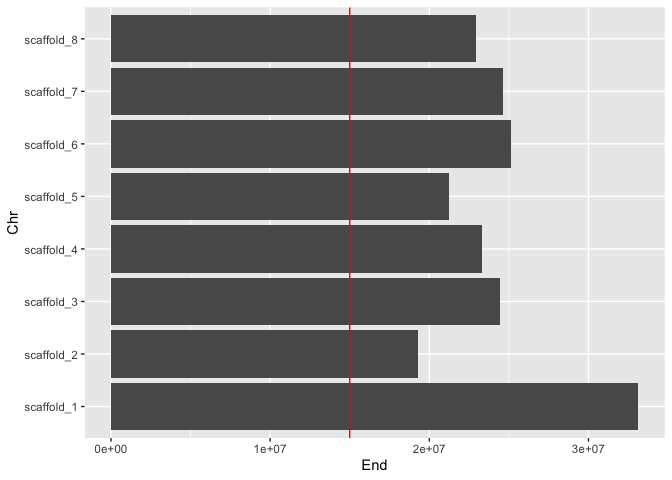
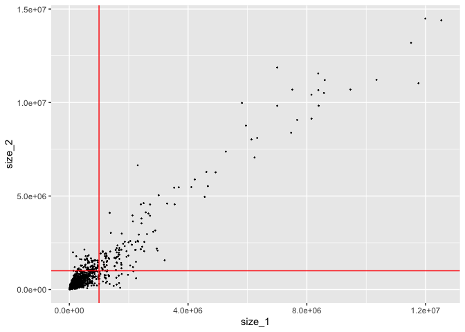
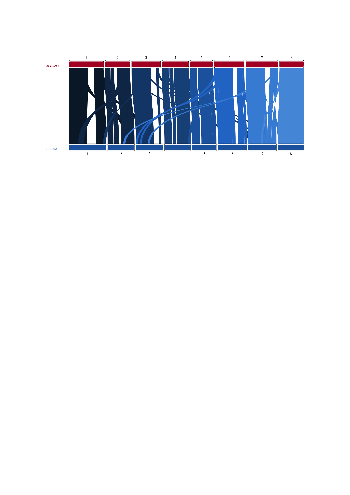
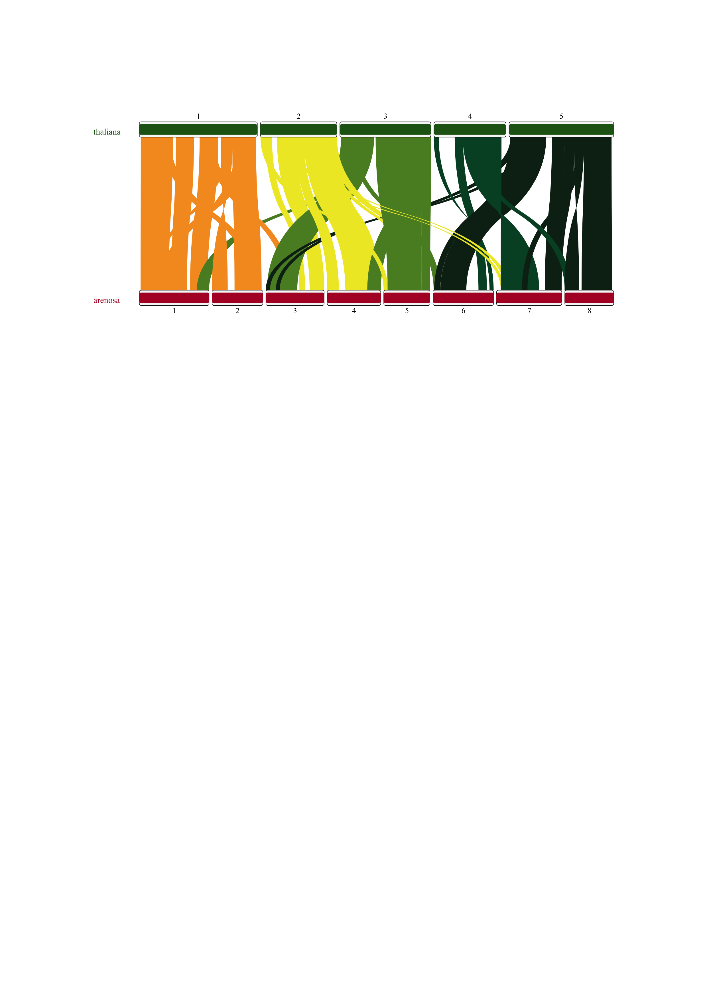
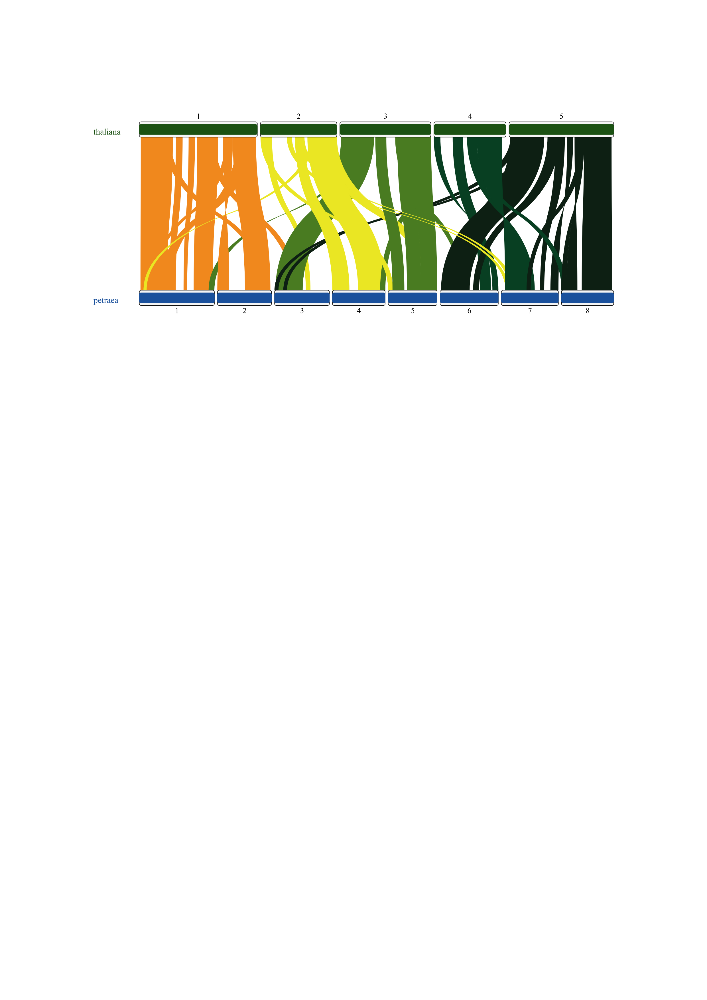
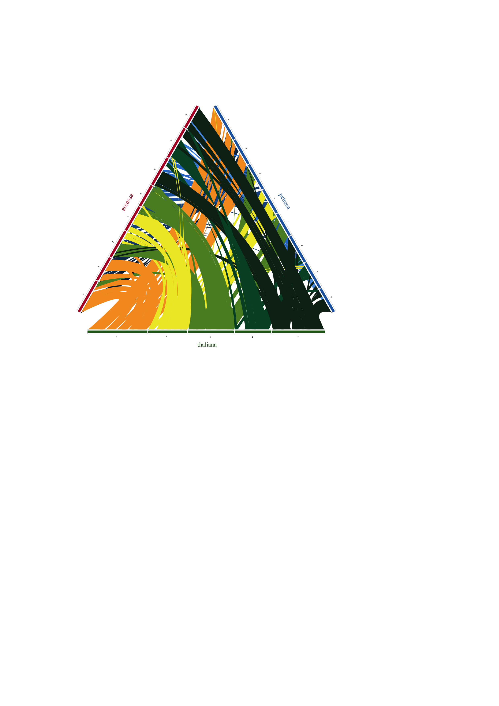
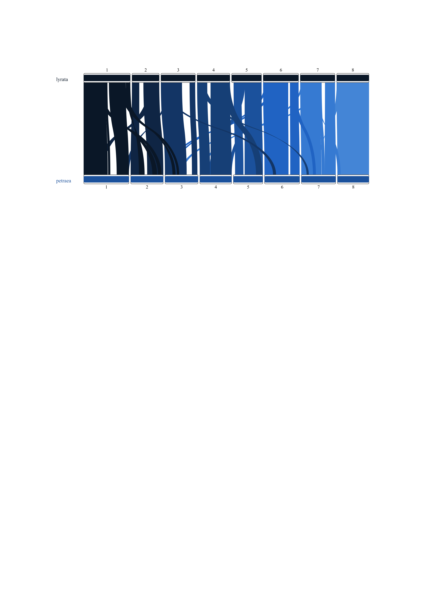
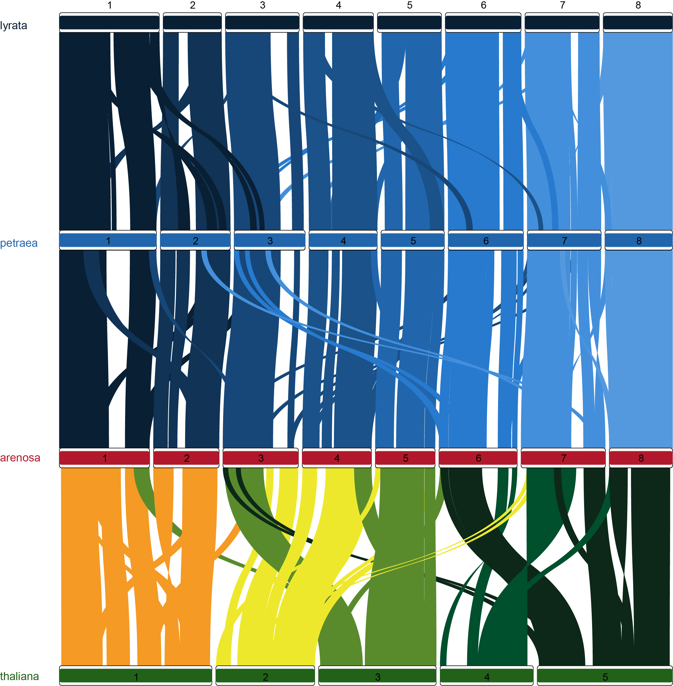

MCSanx-RIdeogram
================
2021-03-04

-   [karyotypes](#karyotypes)
    -   [filter karyotypes](#filter-karyotypes)
    -   [rename contigs to chromosomes](#rename-contigs-to-chromosomes)
-   [synteny](#synteny)
    -   [read gff and collinearity](#read-gff-and-collinearity)
    -   [filter & rename synteny](#filter-rename-synteny)
    -   [add color to arenosa petrea
        mb](#add-color-to-arenosa-petrea-mb)
    -   [add color to thaliana](#add-color-to-thaliana)
    -   [add color to lyrata petraea](#add-color-to-lyrata-petraea)
    -   [bring thaliana to the top](#bring-thaliana-to-the-top)
-   [add 1mb filter to synteny](#add-1mb-filter-to-synteny)
-   [plot arenosa petraea](#plot-arenosa-petraea)

``` r
library(tidyverse)
library(RIdeogram)
library(here)
#library(seqinr)
library(Biostrings)
```

based on 

<https://cran.r-project.org/web/packages/RIdeogram/vignettes/RIdeogram.html>

# karyotypes

### copy GFFs and proteins

``` bash
cd /cluster/work/users/jonathbr/mcscanx

# petraea 
cp /cluster/projects/nn9525k/jonathan/petraea_curated/petraea_ordered_curated.fasta.gz .

# arenosa
cp /cluster/projects/nn9525k/arenosa_genome/02_scaffolds/13_braker_arenosa_remasked/arenosa_ordered.fasta.softmasked .

# thaliana
cp /cluster/projects/nn9525k/mads_paper/01_genomes/Araport11/assembly/Athaliana_447_TAIR10.fa.gz .

# lyrata reference 
cp /cluster/projects/nn9525k/mads_paper/01_genomes/01_included/GCF_000004255.2_v.1.0_Alyrata/GCF_000004255.2_v.1.0_genomic.fna.gz .
```

``` r
petraea <- fasta.seqlengths(here("mcscanx/petraea_ordered_curated.fasta.gz"))

arenosa <- fasta.seqlengths(here("mcscanx/arenosa_ordered.fasta.softmasked"))

thaliana <- fasta.seqlengths(here("mcscanx/Athaliana_447_TAIR10.fa.gz"))

lyrata <- fasta.seqlengths(here("mcscanx/GCF_000004255.2_v.1.0_genomic.fna.gz"))
```

``` r
Ape_karyotype <- tibble(Chr = names(petraea), Start = 1, End = petraea,
                        fill = "2166AC", species = "petraea", size = 10, color = "2166AC")

Aaa_karyotype <- tibble(Chr = names(arenosa), Start = 1, End = arenosa,
                        fill = "B2182B",species = "arenosa", size = 10, color = "B2182B")

Ath_karyotype <- tibble(Chr = names(thaliana), Start = 1, End = thaliana,
                        fill = "216218",species = "thaliana", size = 10, color = "216218")

Aly_karyotype <- tibble(Chr = names(lyrata), Start = 1, End = lyrata,
                        fill = "091F34",species = "lyrata", size = 10, color = "091F34")
```

## filter karyotypes

``` r
Aly_karyotype_filter1 <- Aly_karyotype %>% 
  filter(End > 15000000) %>% 
  mutate(Chr_id = str_extract(Chr, "^NW_\\w*"),
         Chr = str_extract(Chr, "scaffold_\\d*"))
Aly_karyotype_filter1 %>% 
  ggplot(aes(x = Chr, y = End))+
  geom_col() +
 geom_hline(yintercept = 15000000, color = "red")+
  coord_flip()
```

<!-- -->

``` r
Aaa_contigs <- paste0("scaffold_", 1:8)
Ape_contigs <- paste0("scaffold_", 1:8)
Ath_contigs <- paste0("Chr", 1:5)
Aly_contigs <- paste0("scaffold_", 1:8)
```

## rename contigs to chromosomes

``` r
Aaa_kar <- Aaa_karyotype %>% 
  filter(Chr %in% Aaa_contigs) %>% 
  mutate(Chr = as.integer(str_remove(Chr, "scaffold_"))) %>% 
  arrange(Chr)
  
Ape_kar <- Ape_karyotype %>% 
  filter(Chr %in% Ape_contigs) %>% 
  mutate(Chr = as.integer(str_remove(Chr, "scaffold_"))) %>% 
  arrange(Chr)

Ath_kar <- Ath_karyotype %>% 
  mutate(Chr = str_extract(Chr, "^Chr\\w+")) %>%
  filter(Chr %in% Ath_contigs) %>% 
  mutate(Chr = as.integer(str_remove(Chr, "Chr")))

Aly_kar <- Aly_karyotype_filter1 %>% 
  filter(Chr %in% Ape_contigs) %>% 
  mutate(Chr = as.integer(str_remove(Chr, "scaffold_"))) %>% 
  arrange(Chr) %>% select(-"Chr_id")

Aly_Ape_kar <- data.frame(bind_rows(Aly_kar, Ape_kar))
Aaa_Ape_kar <- data.frame(bind_rows(Aaa_kar, Ape_kar))
Ath_Aaa_Ape_kar <- data.frame(bind_rows(Ath_kar, Aaa_Ape_kar))
```

# synteny

## read gff and collinearity

see and use: [col2syn.R](col2syn.R)

``` bash
for COL in *.collinearity
do
 PRE=$(basename $COL .collinearity)
 echo $PRE
 ./col2syn.R ${PRE}.gff $COL
done
```

``` r
collinearity <- read_tsv(here("mcscanx/Aaa_Ape.collinearity"), 
                         comment = "#",
                         col_names = c("link_id", "gene_a", "gene_b", "e_value")) %>%
                mutate(link_id = str_remove_all(link_id, " |:")) %>% 
                separate(link_id, c("block","gene"), sep = "-", remove = FALSE, convert = TRUE)  

gff <- read_tsv(here("mcscanx/Aaa_Ape.gff"),
                col_names = c("chr", "gene", "start", "end")) %>% 
       mutate(chr_n = str_extract(chr, "\\d+") %>% as.integer())
            
      
synteny <- collinearity %>% 
  group_by(block) %>% 
  summarise(n_genes = n(),
         first_gene_a = dplyr::first(gene_a),
         first_gene_b = dplyr::first(gene_b),
         last_gene_a = dplyr::last(gene_a),
         last_gene_b = dplyr::last(gene_b),
         #max_e = max(e_value),
         #median_e = median(e_value)
         ) %>% 
  left_join(select(gff, c("chr_n","start", "gene")), by = c("first_gene_a" = "gene")) %>% 
  left_join(select(gff, c("end", "gene")), by = c("last_gene_a" = "gene")) %>% 
  left_join(select(gff, c("chr_n","start", "gene")), by = c("first_gene_b" = "gene")) %>% 
  left_join(select(gff, c("end", "gene")), by = c("last_gene_b" = "gene")) %>% 
  transmute(Species_1 = chr_n.x,
         Start_1 = start.x,
         End_1 = end.x,
         Species_2 = chr_n.y,
         Start_2 = start.y,
         End_2 = end.y,
         fill = "cccccc")

write_tsv(synteny, path = here("mcscanx/Aaa_Ape.synteny"))
```

species karyotype information and being sorted in the order of species A
(thaliana), B (arenosa) and C (petraea). However, the synteny file is
different from that of dual genome syteny visualization. Because this
synteny file contains three comparisons, i.e., species A\_vs\_B, species
A\_vs\_C and species B\_vs\_C, we add one additional column with the
number “1” being representative of the species A\_vs\_B, “2” being
representative of the species A\_vs\_C and “3” being representative of
the species B\_vs\_C. Also, please sort the colourful lines to the last
as possiable as you can.
<https://cran.r-project.org/web/packages/RIdeogram/vignettes/RIdeogram.html>

``` r
Aaa_Ath_1_synteny <- read_tsv(here("mcscanx/Aaa_Ath.synteny")) %>% 
  add_column(type = 1)

Ape_Ath_2_synteny <- read_tsv(here("mcscanx/Ape_Ath.synteny")) %>% 
  add_column(type = 2)

Aaa_Ape_3_synteny <- read_tsv(here("mcscanx/Aaa_Ape.synteny")) %>% 
  add_column(type = 3)

Ape_Aly_0_synteny <- read_tsv(here("mcscanx/Ape_Aly.synteny")) %>% 
  add_column(type = 0) 
```

## filter & rename synteny

``` r
Ath_Aaa_1_syn <- Aaa_Ath_1_synteny %>% 
  mutate(Species_X = Species_2, Start_X = Start_2, End_X = End_2, 
         Species_2 = Species_1, Start_2 = Start_1, End_2 = End_1) %>% 
  select(Species_1 = Species_X, Start_1 = Start_X, 
         End_1 = End_X, Species_2, Start_2, End_2, fill, type) %>% 
  filter(Species_1 %in% 1:5, Species_2 %in% 1:8)

Ath_Ape_2_syn <- Ape_Ath_2_synteny %>% 
  mutate(Species_X = Species_2, Start_X = Start_2, End_X = End_2, 
         Species_2 = Species_1, Start_2 = Start_1, End_2 = End_1) %>% 
  select(Species_1 = Species_X, Start_1 = Start_X, 
         End_1 = End_X, Species_2, Start_2, End_2, fill, type) %>% 
  filter(Species_1 %in% 1:5, Species_2 %in% 1:8)

Aaa_Ape_3_syn <- Aaa_Ape_3_synteny %>% 
  filter(Species_1 %in% 1:8, Species_2 %in% 1:8)

Aly_chr <- 1:8 
names(Aly_chr) <- as.integer(str_remove(Aly_karyotype_filter1$Chr_id, "NW_"))

Aly_Ape_0_syn <- Ape_Aly_0_synteny %>% 
  # order switched in Ape_Aly.collinearity file probably do to alphabetical order 
  #mutate(Species_X = Species_2, Start_X = Start_2, End_X = End_2, 
  #       Species_2 = Species_1, Start_2 = Start_1, End_2 = End_1) %>% 
  #select(Species_1 = Species_X, Start_1 = Start_X, 
  #       End_1 = End_X, Species_2, Start_2, End_2, fill, type) %>% 
  filter(Species_1 %in% as.integer(names(Aly_chr)), Species_2 %in% 1:8) %>% 
  mutate(Species_1 = Aly_chr[as.character(Species_1)])

#head(synteny_ternary_comparison)

syn_Ath_Aaa_Ape <- bind_rows(Ath_Aaa_1_syn, Ath_Ape_2_syn) %>% 
  bind_rows(Aaa_Ape_3_syn) %>% data.frame()
```

## add color to arenosa petrea mb

``` r
col_syn_Ath_Aaa_Ape <- syn_Ath_Aaa_Ape %>% 
  mutate(fill = if_else(type == 3, "2166AC",fill))
```

## add color to thaliana

``` r
color_tha <- c("F59A24", "EEE82C", "598B2C", "004F2D", "0D2818")
color_lyr <- c("091F34", "103356", "174778", "1A5289", "2166AC",
               "277ACE", "438FDB", "5499DE") # "76ADE5", "98C2EB"
names(color_tha) <-(1:5)
names(color_lyr) <-(1:8)

col_syn <- col_syn_Ath_Aaa_Ape %>% 
    mutate(fill = case_when(type == 3 ~ color_lyr[Species_1],
                            type == 1 ~ color_tha[Species_1],
                            type == 2 ~ color_tha[Species_1],
                            TRUE ~ "cccccc"))
```

## add color to lyrata petraea

``` r
col_Aly_Ape_0_syn <- Aly_Ape_0_syn %>% 
    mutate(fill = color_lyr[Species_1])
```

## bring thaliana to the top

``` r
col_order_syn <- col_syn %>% 
  arrange(desc(type))
```

# add 1mb filter to synteny

``` r
col_order_syn %>% 
  mutate(size_1 = abs(End_1 - Start_1),
         size_2 = abs(End_2 - Start_2)) %>% 
  ggplot(aes(x = size_1, y = size_2))+
  geom_point(size = 0.2)+
  geom_hline(yintercept = 1000000, color = "red")+
  geom_vline(xintercept = 1000000, color = "red")
```

<!-- -->

``` r
col_1mb_syn <- col_order_syn %>% 
  mutate(size_1 = abs(End_1 - Start_1),
         size_2 = abs(End_2 - Start_2)) %>% 
  filter(size_1 >= 1000000, size_2 >= 1000000) %>% 
  select(-starts_with("size_")) %>% 
  data.frame()

col_1mb_Aly_Ape_0_syn <- col_Aly_Ape_0_syn %>% 
  mutate(size_1 = abs(End_1 - Start_1),
         size_2 = abs(End_2 - Start_2)) %>% 
  filter(size_1 >= 1000000, size_2 >= 1000000) %>% 
  select(-starts_with("size_")) %>% 
  data.frame()
```

``` r
outname <- here::here("mcscanx/Ath_Aaa_Ape_syn_1mb_col_v1.svg")
ideogram(karyotype = Ath_Aaa_Ape_kar, 
         synteny = col_1mb_syn, 
         output = outname)
convertSVG(outname, file = str_remove_all(outname, ".*compare_hic/|.svg$"), device = "png")
```

# plot arenosa petraea

``` r
outname <- here::here("mcscanx/Aaa_Ape_syn_1mb_col_v1.svg")
ideogram(karyotype = Ath_Aaa_Ape_kar %>% filter(species != "thaliana"), 
         synteny = col_1mb_syn %>% filter(type == 3), 
         output = outname)
convertSVG(outname, file = str_remove_all(outname, ".*compare_hic/|.svg$"), device = "png")
```

``` r
outname <- here::here("mcscanx/Ath_Aaa_syn_1mb_col_v1.svg")
ideogram(karyotype = Ath_Aaa_Ape_kar %>% filter(species != "petraea"), 
         synteny = col_1mb_syn %>% filter(type == 1), 
         output = outname)
convertSVG(outname, file = str_remove_all(outname, ".*compare_hic/|.svg$"), device = "png")
```

``` r
outname <- here::here("mcscanx/Ath_Ape_syn_1mb_col_v1.svg")
ideogram(karyotype = Ath_Aaa_Ape_kar %>% filter(species != "arenosa"), 
         synteny = col_1mb_syn %>% filter(type == 2), 
         output = outname)
convertSVG(outname, file = str_remove_all(outname, ".*compare_hic/|.svg$"), device = "png")
```

| Aaa\_Ape\_syn\_1mb\_v1          | Ath\_Aaa\_syn\_1mb\_v1              |
|---------------------------------|-------------------------------------|
|  |      |
|  |  |

``` r
outname <- here::here("mcscanx/Aly_Ape_syn_1mb_col_v1.svg")
ideogram(karyotype = Aly_Ape_kar, 
         synteny = col_1mb_Aly_Ape_0_syn, 
         output = outname)
convertSVG(outname, file = str_remove_all(outname, ".*compare_hic/|.svg$"), device = "png")
```




