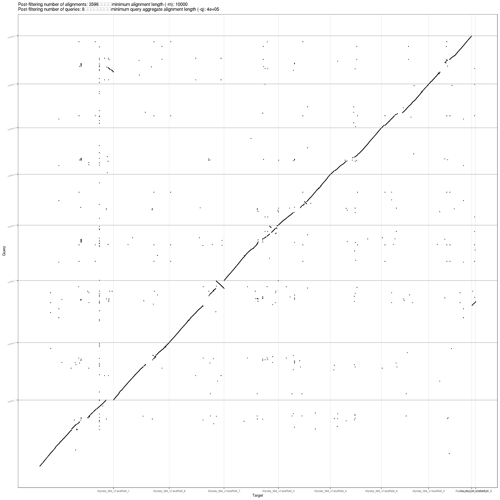

reorder scaffolds & syri lyrata
================
2021-09-25

-   [Installation](#Installation)
-   [setup working directory](#setup-working-directory)
-   [change chromosome ids](#change-chromosome-ids)
    -   [1st minidotplot.srun](#1st-minidotplotsrun)
    -   [R check genome order](#r-check-genome-order)
    -   [Perform whole genome alignment
        (2nd/3rd)](#perform-whole-genome-alignment-2nd3rd)
    -   [run\_syri function](#run_syri-function)
-   [syri lyrata\_petraea](#syri-lyrata_petraea)
    -   [v2 -Ribbon](#v2--ribbon)
-   [syri petraea\_arenosa](#syri-petraea_arenosa)
-   [syri lyrata\_arenosa](#syri-lyrata_arenosa)
-   [syri GCF\_lyrata\_petraea](#syri-gcf_lyrata_petraea)
    -   [v2 -Ribbon](#v2--ribbon-1)
-   [syri GCF\_lyrata\_arenosa](#syri-gcf_lyrata_arenosa)
-   [tar & save](#tar--save)
    -   [add grouping](#add-grouping)

``` r
library(tidyverse)
theme_set(theme_classic())
```

# Installation

https://schneebergerlab.github.io/syri/install.html

``` bash
conda create syri

conda activate syri

conda install python=3.5

conda install cython numpy scipy pandas biopython psutil
conda install -c conda-forge python-igraph
conda install -c bioconda pysam
conda install matplotlib=3.0.0

conda install mummer
conda install -c bioconda minimap2

git clone https://github.com/schneebergerlab/syri.git

cd syri

python3 setup.py install
chmod +x syri/bin/syri syri/bin/chroder	syri/bin/plotsr

cd $CONDA_PREFIX
mkdir -p ./etc/conda/activate.d
mkdir -p ./etc/conda/deactivate.d
touch ./etc/conda/activate.d/env_vars.sh
touch ./etc/conda/deactivate.d/env_vars.sh

nano ./etc/conda/activate.d/env_vars.sh

---
#!/bin/sh

export PATH=$PATH:/cluster/projects/nn9525k/Programs/conda_envs/syri/syri/syri/bin
echo $PATH

PATH_TO_SYRI="/cluster/projects/nn9525k/Programs/conda_envs/syri/syri/syri/bin/syri"
PATH_TO_PLOTSR="/cluster/projects/nn9525k/Programs/conda_envs/syri/syri/syri/bin/plotsr"
---

#https://schneebergerlab.github.io/syri/

conda activate /cluster/projects/nn9525k/Programs/conda_envs/syri
```

# setup working directory

``` bash
cd $USERWORK/
mkdir -p syri_curated
cd !$
mkdir -p assemblies

cp /cluster/projects/nn9525k/jonathan/petrea_assessment/reference/Alyrata_384_v1.fasta assemblies/

cp /cluster/projects/nn9525k/jonathan/petraea_curated/petraea_ordered_curated.fasta.gz assemblies/

cp /cluster/projects/nn9525k/arenosa_genome/02_scaffolds/12_repeatmasker_cds_filltered/softmasked_arenosa_ordered/arenosa_ordered.fasta.softmasked.gz assemblies/arenosa_ordered.fasta.gz

#zcat /cluster/projects/nn9525k/arenosa_genome/02_scaffolds/08_pbjelly/arenosa_jbat_jelly.fasta.gz > assemblies/arenosa_jbat_jelly.fasta

cp /cluster/projects/nn9525k/mads_paper/01_genomes/01_included/GCF_000004255.2_v.1.0_Alyrata/GCF_000004255.2_v.1.0_genomic.fna.gz assemblies/GCF_000004255_lyrata.fasta.gz

gunzip assemblies/*.gz
```

# change chromosome ids

Ideally, syri expects that the homologous chromosomes in the two genomes
would have exactly same chromosome id.
<https://schneebergerlab.github.io/syri/>

## 1st minidotplot.srun

``` bash
ssh -Y $USER@saga.sigma2.no
srun --cpus-per-task=2 --mem-per-cpu=4G --qos=devel --time=00:30:00 --account=nn9525k --x11 --pty bash -i
cd $USERWORK/syri_curated
module purge
module load minimap2/2.17-GCC-8.2.0-2.31.1
module swap GCCcore/8.2.0 GCCcore/8.3.0
module swap zlib/1.2.11-GCCcore-8.2.0 zlib/1.2.11-GCCcore-8.3.0
module swap binutils/2.31.1-GCCcore-8.2.0 binutils/2.32-GCCcore-8.3.0
module swap GCC/8.2.0-2.31.1 GCC/8.3.0
module load R/3.6.2-foss-2019b
wget https://github.com/tpoorten/dotPlotly/raw/master/pafCoordsDotPlotly.R
chmod u+x pafCoordsDotPlotly.R
REFERENCE=assemblies/Alyrata_384_v1.fasta
CONTIGS=assemblies/arenosa_ordered.fasta
PREFIX=$(basename "$CONTIGS" .fasta)
#minimap2 -cx asm5 asm1.fa asm2.fa > aln.paf
minimap2 -x asm5 -t $SLURM_CPUS_PER_TASK $REFERENCE $CONTIGS > ${PREFIX}.paf
./pafCoordsDotPlotly.R -l -x -k 9 -i ${PREFIX}.paf -o $PREFIX
#9 is mitochondrium 
```

REFERENCE=Alyrata_384_v1.fasta

CONTIGS=arenosa_ordered.fasta



``` bash
REFERENCE=assemblies/Alyrata_384_v1.fasta
CONTIGS=assemblies/petraea_ordered_curated.fasta
PREFIX=$(basename "$CONTIGS" .fasta)
#minimap2 -cx asm5 asm1.fa asm2.fa > aln.paf
minimap2 -x asm5 -t $SLURM_CPUS_PER_TASK $REFERENCE $CONTIGS > ${PREFIX}.paf
./pafCoordsDotPlotly.R -l -x -k 9 -i ${PREFIX}.paf -o $PREFIX
#9 is mitochondrium 
```

REFERENCE=Alyrata_384_v1.fasta

CONTIGS=petraea_ordered_curated.fasta


see transplacement form scaffold 1 to scaffold 2 - also supported by
arenosa plot

``` bash
REFERENCE=assemblies/Alyrata_384_v1.fasta
CONTIGS=assemblies/GCF_000004255_lyrata.fasta
PREFIX=$(basename "$CONTIGS" .fasta)
#minimap2 -cx asm5 asm1.fa asm2.fa > aln.paf
minimap2 -x asm5 -t $SLURM_CPUS_PER_TASK $REFERENCE $CONTIGS > ${PREFIX}.paf
./pafCoordsDotPlotly.R -l -x -k 9 -i ${PREFIX}.paf -o $PREFIX
#9 is mitochondrium 
```

## R check genome order

``` bash
module purge
module load R/3.6.2-foss-2019b
R
library("tidyverse")
library("Biostrings")
```

``` r
paf <- read_tsv("arenosa_ordered.paf", c("qname", "qlen", "qstart", "qend", "strand", "tname", "tlen", "tstart", "tend", "nmatch", "alen", "mapq"))
paf %>% group_by(qname, tname, strand) %>%
  summarise(n = n()) %>% 
  arrange(desc(n))
  
paf_new <- paf %>% group_by(qname, tname, strand) %>%
  summarise(n = n()) %>% 
  arrange(desc(n)) %>%
  ungroup() %>% 
  dplyr::slice(1:8) %>% 
  arrange(tname) %>% 
  mutate(chr_order = if_else(strand == "-",
                             paste0("reverseComplement(", "are$", qname, ")"), 
                             paste0("are$", qname )))

paf_new$chr_order

are <- readDNAStringSet("assemblies/arenosa_ordered.fasta")

are_tib <- tibble(name = names(are),
                  width = width(are)) %>%
  arrange(desc(width)) %>%
  filter(!name %in% paf_new$qname)

are_chr <- DNAStringSet(set_names(map(parse(text = paf_new$chr_order), eval), nm = paf_new$qname))
                        
are_ordered <- c(are_chr, are[are_tib$name])

are_ordered

names(are_ordered) <- c(paste0("scaffold_", 1:length(are_ordered)))
names(are_chr) <- c(paste0("scaffold_", 1:length(are_chr)))

writeXStringSet(are_ordered, "assemblies/arenosa_ordered_double_check.fasta")
writeXStringSet(are_chr, "assemblies/arenosa_ordered_8chr.fasta")
```

``` r
paf <- read_tsv("GCF_000004255_lyrata.paf", c("qname", "qlen", "qstart", "qend", "strand", "tname", "tlen", "tstart", "tend", "nmatch", "alen", "mapq"))

paf %>% group_by(qname, tname, strand) %>%
  summarise(n = n()) %>% 
  arrange(desc(n))
  
paf_new <- paf %>% group_by(qname, tname, strand) %>%
  summarise(.groups = "keep", n = n()) %>% 
  arrange(desc(n)) %>%
  ungroup() %>% 
  dplyr::slice(1:8) %>% 
  arrange(tname) %>% 
  mutate(chr_order = if_else(strand == "-",
                             paste0("reverseComplement(", "Aly$", qname, ")"), 
                             paste0("Aly$", qname )))

paf_new$chr_order

Aly <- readDNAStringSet("assemblies/GCF_000004255_lyrata.fasta") 

Aly_tib <- tibble(name = names(Aly),
                  width = width(Aly)) %>% 
    arrange(desc(width)) %>% 
  filter(!name %in% paf_new$qname)

Aly_chr <- DNAStringSet(set_names(map(parse(text = paf_new$chr_order), eval), nm = paf_new$qname))
                        
Aly_ordered <- c(Aly_chr, Aly[Aly_tib$name])

Aly_ordered

names(Aly_ordered) <- c(paste0("scaffold_", 1:length(Aly_ordered)))
names(Aly_chr) <- c(paste0("scaffold_", 1:length(Aly_chr)))

writeXStringSet(Aly_ordered, "assemblies/GCF_000004255_lyrata_double_check.fasta")
writeXStringSet(Aly_chr, "assemblies/GCF_000004255_lyrata_8chr.fasta")
```

``` r
paf <- read_tsv("petraea_ordered_curated.paf", c("qname", "qlen", "qstart", "qend", "strand", "tname", "tlen", "tstart", "tend", "nmatch", "alen", "mapq"))

paf %>% group_by(qname, tname, strand) %>%
  summarise(n = n()) %>% 
  arrange(desc(n))
  
paf_new <- paf %>% group_by(qname, tname, strand) %>%
  summarise(.groups = "keep", n = n()) %>% 
  arrange(desc(n)) %>%
  ungroup() %>% 
  dplyr::slice(1:8) %>% 
  arrange(tname) %>% 
  mutate(chr_order = if_else(strand == "-",
                             paste0("reverseComplement(", "pet$", qname, ")"), 
                             paste0("pet$", qname )))

paf_new$chr_order

pet <- readDNAStringSet("assemblies/petraea_ordered_curated.fasta") 

pet_tib <- tibble(name = names(pet),
                  width = width(pet)) %>% 
    arrange(desc(width)) %>% 
  filter(!name %in% paf_new$qname)

pet_chr <- DNAStringSet(set_names(map(parse(text = paf_new$chr_order), eval), nm = paf_new$qname))
                        
pet_ordered <- c(pet_chr, pet[pet_tib$name])

pet_ordered

names(pet_ordered) <- c(paste0("scaffold_", 1:length(pet_ordered)))
names(pet_chr) <- c(paste0("scaffold_", 1:length(pet_chr)))

writeXStringSet(pet_ordered, "assemblies/petraea_ordered_curated_double_check.fasta")
writeXStringSet(pet_chr, "assemblies/petraea_curated_8chr.fasta")

# cut Alyrata_384_v1.fasta
lyr <- readDNAStringSet("assemblies/Alyrata_384_v1.fasta") 
writeXStringSet(lyr[1:8], "assemblies/lyrata_8chr.fasta")
q(save = "no")
```

``` bash
grep -c "^>" assemblies/*.fasta
#assemblies/Alyrata_384_v1.fasta:695
#assemblies/arenosa_ordered_8chr.fasta:8
#assemblies/arenosa_ordered_double_check.fasta:264
#assemblies/arenosa_ordered.fasta:264
#assemblies/GCF_000004255_lyrata_8chr.fasta:8
#assemblies/GCF_000004255_lyrata_double_check.fasta:704
#assemblies/GCF_000004255_lyrata.fasta:696
#assemblies/lyrata_8chr.fasta:8
#assemblies/petraea_curated_8chr.fasta:8
#assemblies/petraea_ordered_curated_double_check.fasta:55
#assemblies/petraea_ordered_curated.fasta:55
```

## Perform whole genome alignment (2nd/3rd)

``` bash
srun --cpus-per-task=4 --mem-per-cpu=2G --time=05:00:00 --account=nn9525k --pty bash -i

conda activate /cluster/projects/nn9525k/Programs/conda_envs/syri

cd $USERWORK/syri_curated
```

## run\_syri function

``` bash
run_syri () {
    REFF="$1" 
    QUEF="$2"
    REF=$(basename $REFF)
    QUE=$(basename $QUEF)
    OUTDIR=$(echo "${REF}_${QUE}" | sed 's/_8chr.fasta//g')
    echo $OUTDIR
    mkdir $OUTDIR
    cp $REFF $QUEF $OUTDIR
    cd $OUTDIR
    minimap2 -ax asm5 --eqx $REF $QUE > out.sam
    python3 $PATH_TO_SYRI -c out.sam -r $REF -q $QUE -k -F S
    python3 $PATH_TO_PLOTSR syri.out $REF $QUE -H 8 -W 5
    cd ..
}
```

# syri lyrata\_petraea

``` bash
run_syri assemblies/lyrata_8chr.fasta assemblies/petraea_curated_8chr.fasta
```

## v2 -Ribbon

``` bash
cd lyrata_petraea_curated
python3 $PATH_TO_PLOTSR -R syri.out lyrata_8chr.fasta petraea_curated_8chr.fasta -H 8 -W 5
cd ..
```

| lyrata\_petraea\_syri                                              | lyrata\_petraea\_curated\_syri                                                      | lyrata\_petraea\_curated\_syri\_v2                                                         |
|--------------------------------------------------------------------|-------------------------------------------------------------------------------------|--------------------------------------------------------------------------------------------|
|  |  |  |

# syri petraea\_arenosa

``` bash
run_syri assemblies/petraea_curated_8chr.fasta assemblies/arenosa_ordered_8chr.fasta

cd petraea_curated_arenosa_ordered/
mv syri.pdf syri_v1.pdf
python3 $PATH_TO_PLOTSR -R syri.out petraea_curated_8chr.fasta arenosa_ordered_8chr.fasta -H 8 -W 5
mv syri.pdf petraea_curated_arenosa_ordered_syri_v2.pdf
cd ..
```

| petraea\_arenosa\_jbat\_jelly\_syri                                                          | petraea\_curated\_arenosa\_ordered\_syri                                                               | petraea\_curated\_arenosa\_ordered\_syri\_v2.pdf                                                              |
|----------------------------------------------------------------------------------------------|--------------------------------------------------------------------------------------------------------|---------------------------------------------------------------------------------------------------------------|
|  |  |  |

# syri lyrata\_arenosa

``` bash
run_syri assemblies/lyrata_8chr.fasta assemblies/arenosa_ordered_8chr.fasta
```

``` bash
cd lyrata_arenosa_ordered
mv syri.pdf syri_v1.pdf
python3 $PATH_TO_PLOTSR -R syri.out lyrata_8chr.fasta arenosa_ordered_8chr.fasta -H 8 -W 5
mv syri.pdf lyrata_arenosa_ordered_syri_v2.pdf
cd ..
```

| lyrata\_arenosa\_ordered\_syri                                                      | lyrata\_arenosa\_ordered\_syri\_v2                                                         |
|-------------------------------------------------------------------------------------|--------------------------------------------------------------------------------------------|
|  |  |

# syri GCF\_lyrata\_petraea

``` bash
run_syri assemblies/GCF_000004255_lyrata_8chr.fasta assemblies/petraea_curated_8chr.fasta
```

## v2 -Ribbon

``` bash
cd GCF_000004255_lyrata_petraea_curated
mv syri.pdf syri_v1.pdf
python3 $PATH_TO_PLOTSR -R syri.out GCF_000004255_lyrata_8chr.fasta petraea_curated_8chr.fasta -H 8 -W 5
cd ..
```

| lyrata\_petraea\_syri                                              | lyrata\_petraea\_curated\_syri                                                      | lyrata\_petraea\_curated\_syri\_v2                                                         | GCF\_000004255\_lyrata\_petraea\_curated                                                                          |
|--------------------------------------------------------------------|-------------------------------------------------------------------------------------|--------------------------------------------------------------------------------------------|-------------------------------------------------------------------------------------------------------------------|
|  |  |  |  |

# syri GCF\_lyrata\_arenosa

``` bash
run_syri assemblies/GCF_000004255_lyrata_8chr.fasta assemblies/arenosa_ordered_8chr.fasta
```

``` bash
cd GCF_000004255_lyrata_arenosa_ordered
mv syri.pdf syri_v1.pdf
python3 $PATH_TO_PLOTSR -R syri.out GCF_000004255_lyrata_8chr.fasta arenosa_ordered_8chr.fasta -H 8 -W 5
mv syri.pdf GCF_000004255_lyrata_arenosa_ordered_syri_v2.pdf
cd ..
```

| lyrata\_arenosa\_ordered\_syri    | lyrata\_arenosa\_ordered\_syri\_v2    |
GCF\_000004255\_lyrata\_arenosa\_ordered\_syri    | GCF\_000004255\_lyrata\_arenosa\_ordered\_syri\_v2.pdf  |
|-----------------------------|-------------------------------|----------------------------------|--------------------------|
|  |
  |
   | 
 |

# tar & save

``` bash
du . -sh #37G 
rm Alyrata_384_v1.fasta
rm arenosa_jbat_jelly.fasta
rm petraea_jelly.fasta
rm out.sam
gzip *.fasta
gzip syri.vcf &
gzip syri.out &
gzip snps.txt &
gzip */syri.vcf &
gzip */syri.out &
gzip */snps.txt &
du . -sh #469M

cp -rv * /cluster/projects/nn9525k/arenosa_genome/02_scaffolds/10_syri_reorder/
```

``` r
sum_files <- fs::dir_ls(here::here("syri_curated"), glob = "*.summary")

syri_sum <- map(
  sum_files,
  read_tsv,
  comment = "#",
  col_names = c("Variation_type", "Count",
                "Length_ref",   "Length_qry"),
  col_types = "cddd"
) %>% set_names(map(sum_files, basename)) %>%
  bind_rows(.id = "fn")

syri_sum %>% ggplot(aes(x = Count, y = Variation_type, fill = fn))+
  geom_col(position = "dodge")+
  scale_x_log10()+
  theme(legend.position="bottom")
```

<!-- -->

``` r
syri_sum %>% ggplot(aes(x = fn, y = Count, fill = fn))+
  geom_col(position = "dodge", show.legend = FALSE)+
  facet_wrap(vars(Variation_type), scales = "free")
```

<!-- -->

## add grouping

``` r
Structural_annotations <- c("Syntenic regions", "Inversions", "Translocations", "Duplications (reference)", "Duplications (query)", "Not aligned (reference)", "Not aligned (query)")

Sequence_annotations <- c("SNPs", "Insertions", "Deletions", "Copygains", "Copylosses", "Highly diverged", "Tandem repeats")

syri_sum <- syri_sum %>% mutate("annotype" = if_else(Variation_type %in% Structural_annotations, "Structural", "Sequence"))
```

``` r
syri_sum %>% ggplot(aes(x = Count, y = Variation_type, fill = fn))+
  geom_col(position = "dodge")+
  scale_x_log10()+
  #scale_x_continuous(trans = "log2")+
  theme(legend.position="bottom")+
  facet_wrap(vars(annotype), scales = "free")+
  scale_fill_brewer(palette = "Blues")
```

<!-- -->

``` r
#scale_fill_manual(values = hcl.colors(n = 4, palette = "Blues 3"))
#hcl.pals()
#RColorBrewer::display.brewer.all(colorblindFriendly = T)
```
