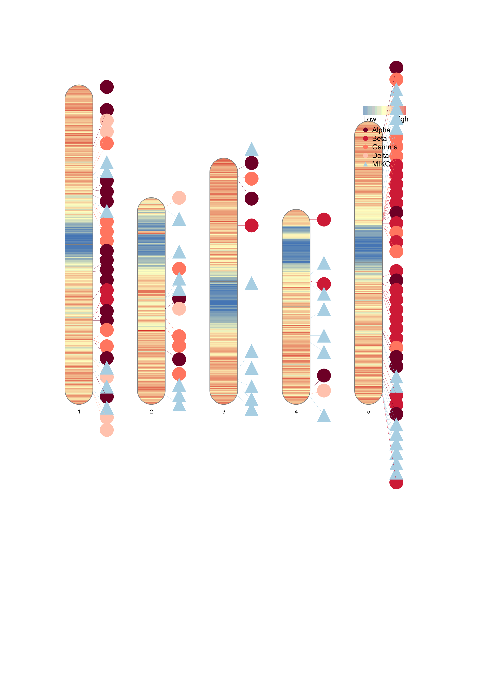

MADS-box localization
================
2021-12-01

-   [karyotypes](#karyotypes)
    -   [save long karyotypes](#save-long-karyotypes)
-   [filter karyotypes](#filter-karyotypes)
-   [rename contigs to chromosomes](#rename-contigs-to-chromosomes)
-   [save karyotypes](#save-karyotypes)

-   [1 add MADS locations](#add-mads-locations)
    -   [1.1 update anders Clades](#update-anders-clades)
-   [2 plot_location function](#plot_location-function)
    -   [2.1 plot arenosa](#plot-arenosa)
    -   [2.2 plot petraea](#plot-petraea)
    -   [2.3 plot thaliana](#plot-thaliana)
    -   [2.4 plot lyrata](#plot-lyrata)
-   [3 get gene names for labels](#get-gene-names-for-labels)

``` r
options(tidyverse.quiet = TRUE)
library(tidyverse)
library(RIdeogram)
```

# karyotypes

``` bash
mkdir MADS_localization
cd  MADS_localization

# petraea 
cp /cluster/projects/nn9525k/jonathan/petraea_curated/petraea_ordered_curated.fasta.gz .
cp /cluster/projects/nn9525k/jonathan/petraea_curated/braker_curated_sort.gtf.gz petraea_curated.gtf.gz

# arenosa
cp /cluster/projects/nn9525k/arenosa_genome/02_scaffolds/13_braker_arenosa_remasked/genome/arenosa_ordered.fasta.softmasked .
cp /cluster/projects/nn9525k/arenosa_genome/02_scaffolds/13_braker_arenosa_remasked/braker_prot/augustus.hints.gtf arenosa_remasked.gtf

# thaliana
cp /cluster/projects/nn9525k/mads_paper/01_genomes/01_included/Araport11/assembly/Athaliana_447_TAIR10.fa.gz .
cp /cluster/projects/nn9525k/mads_paper/01_genomes/01_included/Araport11/annotation/Athaliana_447_Araport11.gene.gff3.gz thaliana.gff3.gz

# lyrata reference 
cp /cluster/projects/nn9525k/mads_paper/01_genomes/01_included/GCF_000004255.2_v.1.0_Alyrata/GCF_000004255.2_v.1.0_genomic.fna.gz .
cp /cluster/projects/nn9525k/mads_paper/01_genomes/01_included/GCF_000004255.2_v.1.0_Alyrata/GCF_000004255.2_v.1.0_genomic.gff.gz lyrata.gff.gz
```

``` bash
module purge
module load R/3.6.2-foss-2019b
R
library("tidyverse")
library("Biostrings")
```

``` r
petraea <- fasta.seqlengths("petraea_ordered_curated.fasta.gz")

arenosa <- fasta.seqlengths("arenosa_ordered.fasta.softmasked")

thaliana <- fasta.seqlengths("Athaliana_447_TAIR10.fa.gz")

lyrata <- fasta.seqlengths("GCF_000004255.2_v.1.0_genomic.fna.gz")
```

``` r
Ape_karyotype_syn <- tibble(Chr = names(petraea), Start = 1, End = petraea,
                        fill = "2166AC", species = "petraea", size = 10, color = "2166AC")

Aaa_karyotype_syn <- tibble(Chr = names(arenosa), Start = 1, End = arenosa,
                        fill = "B2182B",species = "arenosa", size = 10, color = "B2182B")

Ath_karyotype_syn <- tibble(Chr = names(thaliana), Start = 1, End = thaliana,
                        fill = "216218",species = "thaliana", size = 10, color = "216218")

Aly_karyotype_syn <- tibble(Chr = names(lyrata), Start = 1, End = lyrata,
                        fill = "091F34",species = "lyrata", size = 10, color = "091F34")
```

``` r
Ape_karyotype_long <- tibble(Chr = names(petraea), Start = 1, End = petraea) %>% 
  mutate(CE_start = End/2, CE_end = End/2 + 500)
                        
Aaa_karyotype_long <- tibble(Chr = names(arenosa), Start = 1, End = arenosa) %>% 
  mutate(CE_start = End/2, CE_end = End/2 + 500)

Ath_karyotype_long <- tibble(Chr = names(thaliana), Start = 1, End = thaliana) %>% 
  mutate(CE_start = End/2, CE_end = End/2 + 500)

Aly_karyotype_long <- tibble(Chr = names(lyrata), Start = 1, End = lyrata) %>% 
  mutate(CE_start = End/2, CE_end = End/2 + 500)
```

## save long karyotypes

``` r
write_tsv(Aaa_karyotype_long, "Aaa_kar_long.tsv")
write_tsv(Ape_karyotype_long, "Ape_kar_long.tsv")
write_tsv(Ath_karyotype_long, "Ath_kar_long.tsv")
write_tsv(Aly_karyotype_long, "Aly_kar_long.tsv")
```

# filter karyotypes

``` r
Aly_karyotype_filter1 <- Aly_karyotype_syn %>% 
  filter(End > 15000000) %>% 
  mutate(Chr_id = str_extract(Chr, "^NW_\\w*"),
         Chr = str_extract(Chr, "scaffold_\\d*"))
# Aly_karyotype_filter1 %>% 
#   ggplot(aes(x = Chr, y = End))+
#   geom_col() +
#  geom_hline(yintercept = 15000000, color = "red")+
#   coord_flip()
```

``` r
Aaa_contigs <- paste0("scaffold_", 1:8)
Ape_contigs <- paste0("scaffold_", 1:8)
Ath_contigs <- paste0("Chr", 1:5)
Aly_contigs <- paste0("scaffold_", 1:8)
```

# rename contigs to chromosomes

``` r
Aaa_kar <- Aaa_karyotype_syn %>% 
  filter(Chr %in% Aaa_contigs) %>% 
  mutate(Chr = as.integer(str_remove(Chr, "scaffold_"))) %>% 
  arrange(Chr)
  
Ape_kar <- Ape_karyotype_syn %>% 
  filter(Chr %in% Ape_contigs) %>% 
  mutate(Chr = as.integer(str_remove(Chr, "scaffold_"))) %>% 
  arrange(Chr)

Ath_kar <- Ath_karyotype_syn %>% 
  mutate(Chr = str_extract(Chr, "^Chr\\w+")) %>%
  filter(Chr %in% Ath_contigs) %>% 
  mutate(Chr = as.integer(str_remove(Chr, "Chr")))

Aly_kar <- Aly_karyotype_filter1 %>% 
  filter(Chr %in% Ape_contigs) %>% 
  mutate(Chr = as.integer(str_remove(Chr, "scaffold_"))) %>% 
  arrange(Chr) %>% select(-"Chr_id")
```

# save karyotypes

``` r
write_tsv(Aaa_kar, "Aaa_kar.tsv")
write_tsv(Ape_kar, "Ape_kar.tsv")
write_tsv(Ath_kar, "Ath_kar.tsv")
write_tsv(Aly_kar, "Aly_kar.tsv")
q(save = "no")
```

# 1 add MADS locations

``` r
anders_mads <- read_tsv(here::here("localization/Arabidopsis_Mads_clades_rmv3_vAPTL.tab"))
```

## 1.1 update anders Clades

``` r
mads_phy2 <- read_csv2(here::here("mcscanx/Arabidopsis_Mads_clades_phy2.csv"))

anders_mads <- mads_phy2 %>% 
  filter(species %in% c("A.thaliana", "A.lyrata_lyrata", 
                                    "A.lyrata_petraea" , "A.arenosa_MJ09" )) %>% 
  select(id = gene_id, Clade = clade) 

```

# 2 plot_location function

``` r
plot_location <- function(acronym, karyotype, gff, contigs, output, ...) {
  gene_density <- GFFex(input = gff, karyotype = karyotype, feature = "gene", window = 100000) #1000000

gene_density <- gene_density %>% 
  filter(Chr %in% contigs) %>%
  mutate(Chr = as.integer(str_remove(Chr, "scaffold_|Chr"))) %>% 
  arrange(Chr)

karyotype <- read_tsv(karyotype) %>% 
  filter(Chr %in% contigs) %>% 
  mutate(Chr = as.integer(str_remove(Chr, "scaffold_|Chr"))) %>% 
  arrange(Chr)

mads <- anders_mads %>% 
  filter(str_detect(id, acronym)) %>% 
  mutate(gene_id = str_remove(id, paste0(acronym, "__"))) %>% 
  mutate(type = str_remove(Clade, "-.*$") %>% 
           str_replace("MiKC", "MIKC")) %>% 
  select(gene_id, type)

full_gff <- read_tsv(gff, comment = "#",
                     col_names = c("contig", "softw", "type", 
                                   "start", "end", "score", "strang", 
                                   "point","description"))

mads_gff <- full_gff %>% 
  filter(type == "gene") %>% 
  mutate(gene_id = str_remove_all(description, "gene_id \"|\"") %>% 
           str_remove(".*Name=")) %>% 
  right_join(mads, by = "gene_id") %>% 
  select(Type = type.y, Chr = contig, Start = start, End = end) %>% 
  mutate(Shape = if_else(Type == "MIKC", "triangle", "circle"),
         color = case_when(Type == "MIKC" ~ mads_colors[5], 
                           Type =="Alpha" ~ mads_colors[1],
                           Type =="Beta" ~ mads_colors[2],
                           Type =="Gamma" ~ mads_colors[3],
                           Type =="Delta" ~ mads_colors[4],
                           TRUE ~ "black")) %>% 
  filter(Chr %in% contigs) %>% 
  mutate(Chr = as.integer(str_remove(Chr, "scaffold_|Chr"))) %>% 
  arrange(Chr) %>% 
  select(Type, Shape, Chr, Start, End, color)

outname <- here::here(paste0("localization/", output, ".svg"))
ideogram(karyotype = karyotype, 
         overlaid = gene_density,
         label = mads_gff, label_type = "marker", 
         output = outname)
convertSVG(outname, file = output, device = "png")
}
```

## 2.1 plot arenosa

``` r
mads_colors  <- c(hcl.colors(n = 5, palette = "Reds")[-5], "#A7CEE2") %>% 
  str_remove("^#")

acronym <- "Aaa" #c("Ath", "Aaa", "Ape", "Aly")
karyotype <- here::here("localization/Aaa_kar_long.tsv")
gff <- here::here("localization/arenosa_remasked.gtf.gz")
contigs <- paste0("scaffold_", 1:8) #filter
output <- "Aaa_MADS_v3"

plot_location(acronym, karyotype, gff, contigs, output)
```

## 2.2 plot petraea

``` r
plot_location(acronym = "Ape",
              karyotype = here::here("localization/Ape_kar_long.tsv"),
              gff = here::here("localization/petraea_curated.gtf.gz"),
              contigs = paste0("scaffold_", 1:8),
              output = "Ape_MADS_v3") 
```

## 2.3 plot thaliana

``` r
acronym <- "Ath"
karyotype <- here::here("localization/Ath_kar_long.tsv")
gff <- here::here("localization/thaliana.gff3.gz")
contigs <- paste0("Chr", 1:5)
output <- "Ath_MADS_v3"

read_tsv(karyotype) %>% 
  mutate(Chr = str_remove(Chr, " .*")) %>% 
  write_tsv(here::here("localization/Ath_kar_long_v3.tsv"))
```

``` r
karyotype <- here::here("localization/Ath_kar_long_v3.tsv")
plot_location(acronym, karyotype, gff, contigs, output)
```

## 2.4 plot lyrata

``` r
acronym <- "Aly"
karyotype <- here::here("localization/Aly_kar_long.tsv")
gff <- here::here("localization/lyrata.gff.gz")
contigs <- paste0("scaffold_", 1:8)
output <- "Aly_MADS_v3"

Aly_Chr_lut <- read_tsv(karyotype) %>% 
  mutate(Chr_id = str_extract(Chr, "scaffold_\\d*"),
         Chr = str_remove(Chr, " .*")) %>% 
        #Chr_id = str_extract(Chr, "^NW_\\w*"),
  select(Chr, Chr_id)
```

``` r
read_tsv(karyotype) %>%  
  mutate(Chr = str_remove(Chr, " .*")) %>% 
  write_tsv(here::here("localization/Aly_kar_long_v3.tsv"))
```

``` r
karyotype <- here::here("localization/Aly_kar_long_v3.tsv")

contigs <- read_tsv(karyotype) %>% 
  filter(End > 15000000) %>% 
  left_join(Aly_Chr_lut, by = "Chr") %>% 
  pull(Chr)
```

``` r
#plot_location(acronym, karyotype, gff, contigs, output)

gene_density <- GFFex(input = gff, karyotype = karyotype, feature = "gene", window = 100000) #1000000

gene_density <- gene_density %>% 
  filter(Chr %in% contigs) %>%
  left_join(Aly_Chr_lut, by = "Chr") %>% 
  mutate(Chr = as.integer(str_remove(Chr_id, "scaffold_|Chr"))) %>% 
  arrange(Chr) %>% select(-Chr_id)

karyotype <- read_tsv(karyotype) %>% 
  filter(Chr %in% contigs) %>%
  left_join(Aly_Chr_lut, by = "Chr") %>% 
  mutate(Chr = as.integer(str_remove(Chr_id, "scaffold_|Chr"))) %>% 
  arrange(Chr) %>% select(-Chr_id)
```

``` r
mads <- anders_mads %>% 
  filter(str_detect(id, acronym)) %>% 
  mutate(gene_id = str_remove(id, paste0(acronym, "__"))) %>% 
  mutate(type = str_remove(Clade, "-.*$") %>%
           str_replace("MiKC", "MIKC")) %>% 
  select(gene_id, type)

full_gff <- read_tsv(gff, comment = "#",
                     col_names = c("contig", "softw", "type", 
                                   "start", "end", "score", "strang", 
                                   "point","description"))
```

``` r
# mads$gene_id
# full_gff %>% 
#   filter(type == "mRNA") %>%
#   mutate(gene_id = str_remove_all(description, "gene_id \"|\"") %>% 
#            str_remove(".*Name=") %>% 
#            str_remove(";.*") %>% 
#            str_remove("\\.\\d+$")) %>% 
#   pull(gene_id)

mads_gff <- full_gff %>% 
  filter(type == "CDS") %>%
  mutate(gene_id = str_remove_all(description, "gene_id \"|\"") %>% 
           str_remove(".*Name=") %>% 
           str_remove(";.*") %>% 
           str_remove("\\.\\d$")) %>%
  distinct(gene_id, .keep_all = TRUE) %>% 
  right_join(mads, by = "gene_id") %>% 
  select(Type = type.y, Chr = contig, Start = start, End = end) %>% 
  mutate(Shape = if_else(Type == "MIKC", "triangle", "circle"),
         color = case_when(Type == "MIKC" ~ mads_colors[5], 
                           Type =="Alpha" ~ mads_colors[1],
                           Type =="Beta" ~ mads_colors[2],
                           Type =="Gamma" ~ mads_colors[3],
                           Type =="Delta" ~ mads_colors[4],
                           TRUE ~ "black")) %>% 
  filter(Chr %in% contigs) %>%
  left_join(Aly_Chr_lut, by = "Chr") %>% 
  mutate(Chr = as.integer(str_remove(Chr_id, "scaffold_|Chr"))) %>% 
  arrange(Chr) %>%
  select(Type, Shape, Chr, Start, End, color)
```

``` r
outname <- here::here("localization/gene_density_tmp_v3.svg")

ideogram(karyotype = karyotype, 
         overlaid = gene_density,
         label = mads_gff, label_type = "marker", 
         output = outname)
convertSVG(outname, file = output, device = "png")
```


| Aly_MADS_v3.png                                  | Ape_MADS_v3.png                                  |
|--------------------------------------------------|--------------------------------------------------|
|  |  |
| Aaa_MADS_v3.png                                  | Ath_MADS_v3.png                                  |
| —                                                | —                                                |
|  |  |

# 3 get gene names for labels

``` r
get_gene_label <- function(acronym, gff, contigs, ...) {

  mads <- anders_mads %>% 
  filter(str_detect(id, acronym)) %>% 
  mutate(gene_id = str_remove(id, paste0(acronym, "__"))) %>% 
  mutate(type = str_remove(Clade, "-.*$") %>% 
           str_replace("MiKC", "MIKC")) %>% 
  select(gene_id, type, Clade)

full_gff <- read_tsv(gff, comment = "#",
                     col_names = c("contig", "softw", "type", 
                                   "start", "end", "score", "strang", 
                                   "point","description"))

mads_gff <- full_gff %>% 
  filter(type == "gene") %>% 
  mutate(gene_id = str_remove_all(description, "gene_id \"|\"") %>% 
           str_remove(".*Name=")) %>% 
  right_join(mads, by = "gene_id") %>% 
  select(Chr = contig, Start = start, End = end, gene_id, Clade, Type = type.y) %>% 
  mutate(Shape = if_else(Type == "MIKC", "triangle", "circle"),
         color = case_when(Type == "MIKC" ~ mads_colors[5], 
                           Type =="Alpha" ~ mads_colors[1],
                           Type =="Beta" ~ mads_colors[2],
                           Type =="Gamma" ~ mads_colors[3],
                           Type =="Delta" ~ mads_colors[4],
                           TRUE ~ "black")) %>% 
  filter(Chr %in% contigs) %>% 
  mutate(Chr = as.integer(str_remove(Chr, "scaffold_|Chr"))) %>% 
  arrange(Chr, Start)
 write_csv2(mads_gff, here::here(paste0("localization/", acronym, "_gene_labels_v3.csv")))
return(mads_gff)
}
```

``` r
get_gene_label("Ath", gff = here::here("localization/thaliana.gff3.gz"),
               contigs = paste0("Chr", 1:5))
```

``` r
get_gene_label(acronym = "Aaa", gff = here::here("localization/arenosa_remasked.gtf.gz"),
               contigs = paste0("scaffold_", 1:8))
```

    ## Rows: 621162 Columns: 9

    ## ── Column specification ────────────────────────────────────────────────────────
    ## Delimiter: "\t"
    ## chr (7): contig, softw, type, score, strang, point, description
    ## dbl (2): start, end

    ## 
    ## ℹ Use `spec()` to retrieve the full column specification for this data.
    ## ℹ Specify the column types or set `show_col_types = FALSE` to quiet this message.

    ## Warning: One or more parsing issues, see `problems()` for details

    ## # A tibble: 117 × 8
    ##      Chr    Start      End gene_id Clade    Type  Shape    color 
    ##    <int>    <dbl>    <dbl> <chr>   <chr>    <chr> <chr>    <chr> 
    ##  1     1   261077   262149 jg28468 Alpha-1  Alpha circle   6D0026
    ##  2     1  6732687  6733298 jg30256 Alpha-6  Alpha circle   6D0026
    ##  3     1  7292912  7295391 jg30399 Delta-3  Delta circle   FFC1AD
    ##  4     1  8742124  8744039 jg30773 Delta-4  Delta circle   FFC1AD
    ##  5     1  8937745  8940097 jg30819 Gamma-8  Gamma circle   FF755F
    ##  6     1 10110325 10113804 jg31128 MIKC-6   MIKC  triangle A7CEE2
    ##  7     1 10596322 10598463 jg31253 MIKC-3   MIKC  triangle A7CEE2
    ##  8     1 11714387 11714941 jg31539 Alpha-7a Alpha circle   6D0026
    ##  9     1 12555059 12556742 jg31720 MIKC-38  MIKC  triangle A7CEE2
    ## 10     1 12821754 12822650 jg31786 Gamma-2b Gamma circle   FF755F
    ## # … with 107 more rows

``` r
get_gene_label(
  acronym = "Ape", gff = here::here("localization/petraea_curated.gtf.gz"),
  contigs = paste0("scaffold_", 1:8)
)
```

    ## Rows: 633235 Columns: 9

    ## ── Column specification ────────────────────────────────────────────────────────
    ## Delimiter: "\t"
    ## chr (7): contig, softw, type, score, strang, point, description
    ## dbl (2): start, end

    ## 
    ## ℹ Use `spec()` to retrieve the full column specification for this data.
    ## ℹ Specify the column types or set `show_col_types = FALSE` to quiet this message.

    ## # A tibble: 109 × 8
    ##      Chr    Start      End gene_id Clade    Type  Shape    color 
    ##    <int>    <dbl>    <dbl> <chr>   <chr>    <chr> <chr>    <chr> 
    ##  1     1   293395   294504 jg7901  Alpha-1  Alpha circle   6D0026
    ##  2     1  7489742  7490383 jg9755  Alpha-6  Alpha circle   6D0026
    ##  3     1  8124230  8126643 jg9917  Delta-3  Delta circle   FFC1AD
    ##  4     1  9912372  9914731 jg10309 Delta-4  Delta circle   FFC1AD
    ##  5     1 10111237 10111728 jg10353 Gamma-8  Gamma circle   FF755F
    ##  6     1 11501768 11505388 jg10657 MIKC-6   MIKC  triangle A7CEE2
    ##  7     1 12055078 12057230 jg10776 MIKC-3   MIKC  triangle A7CEE2
    ##  8     1 13513402 13513956 jg11086 Alpha-7a Alpha circle   6D0026
    ##  9     1 14512834 14513742 jg11270 Gamma-2b Gamma circle   FF755F
    ## 10     1 14523666 14524667 jg11273 Gamma-2a Gamma circle   FF755F
    ## # … with 99 more rows

``` r
get_gene_label(acronym = "Aly", gff = here::here("localization/lyrata.gff.gz"),
               contigs = paste0("scaffold_", 1:8))
```
