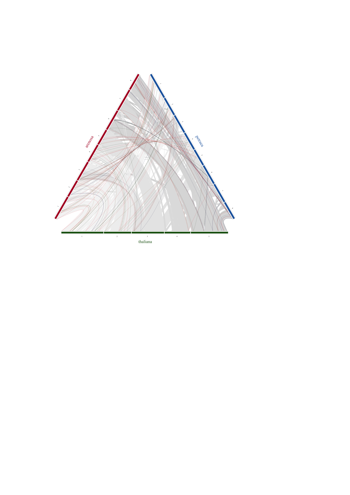

MCSanx-RIdeogram
================
2021-12-01

-   [1 karyotypes](#karyotypes)
    -   [1.1 filter karyotypes](#filter-karyotypes)
    -   [1.2 rename contigs to
        chromosomes](#rename-contigs-to-chromosomes)
-   [2 synteny](#synteny)
    -   [2.1 read syntney](#read-syntney)
    -   [2.2 filter & rename synteny](#filter--rename-synteny)
    -   [2.3 add color to arenosa petrea
        mb](#add-color-to-arenosa-petrea-mb)
    -   [2.4 add color to thaliana](#add-color-to-thaliana)
    -   [2.5 add color to lyrata petraea](#add-color-to-lyrata-petraea)
    -   [2.6 bring thaliana to the top](#bring-thaliana-to-the-top)
-   [3 add 1mb filter to synteny](#add-1mb-filter-to-synteny)
-   [4 plot in gray](#plot-in-gray)
-   [5 filter MADS and color
    highlight](#filter-mads-and-color-highlight)
    -   [5.1 read cleaned mads ids](#read-cleaned-mads-ids)
    -   [5.2 update phylogeny names and
        clades](#update-phylogeny-names-and-clades)
    -   [5.3 create_synteny function](#create_synteny-function)
    -   [5.4 filter & rename synteny](#filter--rename-synteny-1)
    -   [5.5 bind mads_synteny to
        gray_synteny](#bind-mads_synteny-to-gray_synteny)
    -   [5.6 plot Ath_Aaa_Ape](#plot-ath_aaa_ape)
    -   [5.7 plot arenosa petraea](#plot-arenosa-petraea)

``` r
library(tidyverse)
library(RIdeogram)
library(here)
library(Biostrings)
```

Add MADS localization.

See also [MCSanx-RIdeogram.md](../03_synteny/MCScanX/MCSanx-RIdeogram.md) for original synteny
plot.

following

<https://cran.r-project.org/web/packages/RIdeogram/vignettes/RIdeogram.html>

# 1 karyotypes

``` r
#petraea <- fasta.seqlengths(here("mcscanx/petraea_ordered_curated.fasta.gz"))
petraea <- fasta.seqlengths(here("02_lyrata_assembly/Arabidopsis_lyrata_petraea_genome.fna.gz"))

#arenosa <- fasta.seqlengths(here("mcscanx/arenosa_ordered.fasta.softmasked.gz"))
arenosa <- fasta.seqlengths(here("01_arenosa_assembly/Arabidopsis_arenosa_genome.fna.gz"))

thaliana <- fasta.seqlengths(here("mcscanx/Athaliana_447_TAIR10.fa.gz"))

lyrata <- fasta.seqlengths(here("mcscanx/GCF_000004255.2_v.1.0_genomic.fna.gz"))
```

``` r
Ape_karyotype <- tibble(Chr = names(petraea), Start = 1, End = petraea,
                        fill = "2166AC", species = "petraea", size = 10, color = "2166AC")

Aaa_karyotype <- tibble(Chr = names(arenosa), Start = 1, End = arenosa,
                        fill = "B2182B",species = "arenosa", size = 10, color = "B2182B")

Ath_karyotype <- tibble(Chr = names(thaliana), Start = 1, End = thaliana,
                        fill = "216218",species = "thaliana", size = 10, color = "216218")

Aly_karyotype <- tibble(Chr = names(lyrata), Start = 1, End = lyrata,
                        fill = "091F34",species = "lyrata", size = 10, color = "091F34")
```

## 1.1 filter karyotypes

``` r
Aly_karyotype_filter1 <- Aly_karyotype %>% 
  filter(End > 15000000) %>% 
  mutate(Chr_id = str_extract(Chr, "^NW_\\w*"),
         Chr = str_extract(Chr, "scaffold_\\d*"))
```

``` r
Aaa_contigs <- paste0("scaffold_", 1:8)
Ape_contigs <- paste0("scaffold_", 1:8)
Ath_contigs <- paste0("Chr", 1:5)
Aly_contigs <- paste0("scaffold_", 1:8)
```

## 1.2 rename contigs to chromosomes

``` r
Aaa_kar <- Aaa_karyotype %>% 
  filter(Chr %in% Aaa_contigs) %>% 
  mutate(Chr = as.integer(str_remove(Chr, "scaffold_"))) %>% 
  arrange(Chr)
  
Ape_kar <- Ape_karyotype %>% 
  filter(Chr %in% Ape_contigs) %>% 
  mutate(Chr = as.integer(str_remove(Chr, "scaffold_"))) %>% 
  arrange(Chr)

Ath_kar <- Ath_karyotype %>% 
  mutate(Chr = str_extract(Chr, "^Chr\\w+")) %>%
  filter(Chr %in% Ath_contigs) %>% 
  mutate(Chr = as.integer(str_remove(Chr, "Chr")))

Aly_kar <- Aly_karyotype_filter1 %>% 
  filter(Chr %in% Ape_contigs) %>% 
  mutate(Chr = as.integer(str_remove(Chr, "scaffold_"))) %>% 
  arrange(Chr) %>% select(-"Chr_id")

Aly_Ape_kar <- data.frame(bind_rows(Aly_kar, Ape_kar))
Aaa_Ape_kar <- data.frame(bind_rows(Aaa_kar, Ape_kar))
Ath_Aaa_Ape_kar <- data.frame(bind_rows(Ath_kar, Aaa_Ape_kar))
```

# 2 synteny

## 2.1 read syntney

``` r
syntney <- read_tsv(here("03_analysis/03_synteny/MCScanX/results/Aaa_Ape.synteny"))
```

    ## Rows: 572 Columns: 7

    ## ── Column specification ────────────────────────────────────────────────────────
    ## Delimiter: "\t"
    ## chr (1): fill
    ## dbl (6): Species_1, Start_1, End_1, Species_2, Start_2, End_2

    ## 
    ## ℹ Use `spec()` to retrieve the full column specification for this data.
    ## ℹ Specify the column types or set `show_col_types = FALSE` to quiet this message.

species karyotype information and being sorted in the order of species A
(thaliana), B (arenosa) and C (petraea). However, the synteny file is
different from that of dual genome syteny visualization. Because this
synteny file contains three comparisons, i.e., species A_vs_B, species
A_vs_C and species B_vs_C, we add one additional column with the number
“1” being representative of the species A_vs_B, “2” being representative
of the species A_vs_C and “3” being representative of the species
B_vs_C. Also, please sort the colourful lines to the last as possiable
as you can.
<https://cran.r-project.org/web/packages/RIdeogram/vignettes/RIdeogram.html>

``` r
Aaa_Ath_1_synteny <- read_tsv(here("03_analysis/03_synteny/MCScanX/results/Aaa_Ath.synteny")) %>% 
  add_column(type = 1)

Ape_Ath_2_synteny <- read_tsv(here("03_analysis/03_synteny/MCScanX/results/Ape_Ath.synteny")) %>% 
  add_column(type = 2)

Aaa_Ape_3_synteny <- read_tsv(here("03_analysis/03_synteny/MCScanX/results/Aaa_Ape.synteny")) %>% 
  add_column(type = 3)

Ape_Aly_0_synteny <- read_tsv(here("03_analysis/03_synteny/MCScanX/results/Ape_Aly.synteny")) %>% 
  add_column(type = 0) 
```

## 2.2 filter & rename synteny

``` r
Ath_Aaa_1_syn <- Aaa_Ath_1_synteny %>% 
  mutate(Species_X = Species_2, Start_X = Start_2, End_X = End_2, 
         Species_2 = Species_1, Start_2 = Start_1, End_2 = End_1) %>% 
  select(Species_1 = Species_X, Start_1 = Start_X, 
         End_1 = End_X, Species_2, Start_2, End_2, fill, type) %>% 
  filter(Species_1 %in% 1:5, Species_2 %in% 1:8)

Ath_Ape_2_syn <- Ape_Ath_2_synteny %>% 
  mutate(Species_X = Species_2, Start_X = Start_2, End_X = End_2, 
         Species_2 = Species_1, Start_2 = Start_1, End_2 = End_1) %>% 
  select(Species_1 = Species_X, Start_1 = Start_X, 
         End_1 = End_X, Species_2, Start_2, End_2, fill, type) %>% 
  filter(Species_1 %in% 1:5, Species_2 %in% 1:8)

Aaa_Ape_3_syn <- Aaa_Ape_3_synteny %>% 
  filter(Species_1 %in% 1:8, Species_2 %in% 1:8)

Aly_chr <- 1:8 
names(Aly_chr) <- as.integer(str_remove(Aly_karyotype_filter1$Chr_id, "NW_"))

Aly_Ape_0_syn <- Ape_Aly_0_synteny %>% 
  # order switched in Ape_Aly.collinearity file probably do to alphabetical order 
  #mutate(Species_X = Species_2, Start_X = Start_2, End_X = End_2, 
  #       Species_2 = Species_1, Start_2 = Start_1, End_2 = End_1) %>% 
  #select(Species_1 = Species_X, Start_1 = Start_X, 
  #       End_1 = End_X, Species_2, Start_2, End_2, fill, type) %>% 
  filter(Species_1 %in% as.integer(names(Aly_chr)), Species_2 %in% 1:8) %>% 
  mutate(Species_1 = Aly_chr[as.character(Species_1)])

#head(synteny_ternary_comparison)

syn_Ath_Aaa_Ape <- bind_rows(Ath_Aaa_1_syn, Ath_Ape_2_syn) %>% 
  bind_rows(Aaa_Ape_3_syn) %>% data.frame()
```

## 2.3 add color to arenosa petrea mb

``` r
col_syn_Ath_Aaa_Ape <- syn_Ath_Aaa_Ape %>% 
  mutate(fill = if_else(type == 3, "2166AC",fill))
```

## 2.4 add color to thaliana

``` r
color_tha <- c("F59A24", "EEE82C", "598B2C", "004F2D", "0D2818")
color_lyr <- c("091F34", "103356", "174778", "1A5289", "2166AC",
               "277ACE", "438FDB", "5499DE") # "76ADE5", "98C2EB"
names(color_tha) <-(1:5)
names(color_lyr) <-(1:8)

col_syn <- col_syn_Ath_Aaa_Ape %>% 
    mutate(fill = case_when(type == 3 ~ color_lyr[Species_1],
                            type == 1 ~ color_tha[Species_1],
                            type == 2 ~ color_tha[Species_1],
                            TRUE ~ "cccccc"))
```

## 2.5 add color to lyrata petraea

``` r
col_Aly_Ape_0_syn <- Aly_Ape_0_syn %>% 
    mutate(fill = color_lyr[Species_1])
```

## 2.6 bring thaliana to the top

``` r
col_order_syn <- col_syn %>% 
  arrange(desc(type))
```

# 3 add 1mb filter to synteny

``` r
col_order_syn %>% 
  mutate(size_1 = abs(End_1 - Start_1),
         size_2 = abs(End_2 - Start_2)) %>% 
  ggplot(aes(x = size_1, y = size_2))+
  geom_point(size = 0.2)+
  geom_hline(yintercept = 1000000, color = "red")+
  geom_vline(xintercept = 1000000, color = "red")
```

<!-- -->

``` r
col_1mb_syn <- col_order_syn %>% 
  mutate(size_1 = abs(End_1 - Start_1),
         size_2 = abs(End_2 - Start_2)) %>% 
  filter(size_1 >= 1000000, size_2 >= 1000000) %>% 
  select(-starts_with("size_")) %>% 
  data.frame()

col_1mb_Aly_Ape_0_syn <- col_Aly_Ape_0_syn %>% 
  mutate(size_1 = abs(End_1 - Start_1),
         size_2 = abs(End_2 - Start_2)) %>% 
  filter(size_1 >= 1000000, size_2 >= 1000000) %>% 
  select(-starts_with("size_")) %>% 
  data.frame()
```

``` r
outname <- here::here("03_analysis/03_synteny/MCScanX/results/Ath_Aaa_Ape_syn_1mb_col_v3.svg")
ideogram(karyotype = Ath_Aaa_Ape_kar, 
         synteny = col_1mb_syn, 
         output = outname)
convertSVG(outname, file = str_remove_all(outname, ".*compare_hic/|.svg$"), device = "png")
```

# 4 plot in gray

``` r
# col_1mb_syn_gray <- col_1mb_syn %>% 
#   mutate(fill = if_else(fill %in% color_tha, "DCDCDC", "F5F5F5"))

col_1mb_syn_gray <- col_1mb_syn %>% 
  mutate(fill = case_when(fill == color_tha[1] ~ "F5F5F5",
                          fill == color_tha[2] ~ "F0F0F0",
                          fill == color_tha[3] ~ "E8E8E8",
                          fill == color_tha[4] ~ "E0E0E0",
                          fill == color_tha[5] ~ "DCDCDC",
                          fill == color_lyr[1] ~ "F5F5F5",
                          fill == color_lyr[2] ~ "F0F0F0",
                          fill == color_lyr[3] ~ "E8E8E8",
                          fill == color_lyr[4] ~ "E0E0E0",
                          fill == color_lyr[5] ~ "DCDCDC",
                          fill == color_lyr[6] ~ "D8D8D8",
                          fill == color_lyr[7] ~ "D3D3D3",
                          fill == color_lyr[8] ~ "D0D0D0",
                          TRUE ~ "C0C0C0"))
```

``` r
outname <- here::here("03_analysis/07_MADS_localization/localization/Ath_Aaa_Ape_syn_1mb_gray_v2.svg")
ideogram(karyotype = Ath_Aaa_Ape_kar, 
         synteny = col_1mb_syn_gray, 
         output = outname)
convertSVG(outname, file = str_remove_all(outname, ".*compare_hic/|.svg$"), device = "png")
```

# 5 filter MADS and color highlight

## 5.1 read cleaned mads ids

## 5.2 update phylogeny names and clades

``` r
mads_old <- read_tsv(here("03_analysis/07_MADS_localization/localization/Arabidopsis_Mads_clades_update.tab"))

mads <- read_csv2(here("03_analysis/07_MADS_localization/localization/Arabidopsis_Mads_clades_phy2.csv")

mads_set <- read_csv2(here("03_analysis/07_MADS_localization/localization/Arabidopsis_Mads_clades_set_phy2.csv")

mads_t1 <- mads %>% 
  mutate(type = str_extract(clade, "^\\w*")) %>% 
  filter(type != "MIKC")
```

## 5.3 create_synteny function

``` r
species <- "Aaa_Ape"
#c(Aaa_Ath, Ape_Ath, Aaa_Ape, Ape_Aly)
create_synteny <- function(species) {
  ## read collinearity
  collinearity <- read_tsv(here(paste0("03_analysis/03_synteny/MCScanX/results/", species, ".collinearity")), 
                         comment = "#",
                         col_names = c("link_id", "gene_a", "gene_b", "e_value")) %>%
                mutate(link_id = str_remove_all(link_id, " |:")) %>% 
                separate(link_id, c("block","gene"), sep = "-", remove = FALSE, convert = TRUE)  

  gff <- read_tsv(here(paste0("03_analysis/03_synteny/MCScanX/results/", species, ".gff")),
                col_names = c("chr", "gene", "start", "end")) %>% 
       mutate(chr_n = str_extract(chr, "\\d+") %>% as.integer())

  ## filter gff for MADS 
  mads_collinearity <- collinearity %>%
   mutate(
    id_a = str_remove(gene_a, "\\.t1"),
    id_b = str_remove(gene_b, "\\.t1")
  ) %>%
  filter(id_a %in% mads_t1$gene_id) %>%
  filter(id_b %in% mads_t1$gene_id) %>%
  left_join(select(gff, c("chr_n", "start", "end", "gene")), by = c("gene_a" = "gene")) %>%
  left_join(select(gff, c("chr_n", "start", "end", "gene")), by = c("gene_b" = "gene")) %>%
  left_join(select(mads_t1, gene_id, type), by = c("id_a" = "gene_id"))
  
 mads_synteny <- mads_collinearity %>% 
  group_by(gene_a) %>% 
  mutate(top_gene_b = dplyr::first(gene_b, order_by = e_value)) %>% 
  ungroup() %>% 
  filter(gene_b == top_gene_b) %>% 
  transmute(
    Species_1 = chr_n.x,
    Start_1 = start.x,
    End_1 = end.x,
    Species_2 = chr_n.y,
    Start_2 = start.y,
    End_2 = end.y,
    fill = case_when(
      type == "Alpha" ~ "DB4348",
      type == "Beta" ~ "43426B",
      type == "Gamma" ~ "3E5733",
      type == "Delta" ~ "A37945",
      type == "MIKC" ~ "AB293C",
      TRUE ~ "000000"
    )
  )
 mads_synteny
}

create_synteny("Aaa_Ape")
```

    ## Rows: 31164 Columns: 4

    ## ── Column specification ────────────────────────────────────────────────────────
    ## Delimiter: "\t"
    ## chr (3): link_id, gene_a, gene_b
    ## dbl (1): e_value

    ## 
    ## ℹ Use `spec()` to retrieve the full column specification for this data.
    ## ℹ Specify the column types or set `show_col_types = FALSE` to quiet this message.

    ## Rows: 70235 Columns: 4

    ## ── Column specification ────────────────────────────────────────────────────────
    ## Delimiter: "\t"
    ## chr (2): chr, gene
    ## dbl (2): start, end

    ## 
    ## ℹ Use `spec()` to retrieve the full column specification for this data.
    ## ℹ Specify the column types or set `show_col_types = FALSE` to quiet this message.

    ## # A tibble: 49 × 7
    ##    Species_1  Start_1    End_1 Species_2  Start_2    End_2 fill  
    ##        <int>    <dbl>    <dbl>     <int>    <dbl>    <dbl> <chr> 
    ##  1         1   261077   262149         1   293395   294504 DB4348
    ##  2         1  6732687  6733298         1  7489742  7490383 DB4348
    ##  3         1  7292912  7295391         1  8124230  8126643 A37945
    ##  4         1  8742124  8744039         1  9912372  9914731 A37945
    ##  5         1  8937745  8940097         1 10111237 10111728 3E5733
    ##  6         1 11714387 11714941         1 13513402 13513956 DB4348
    ##  7         1 18685305 18685950         1 24438323 24438964 DB4348
    ##  8         2 15422166 15424049         1  9912372  9914731 A37945
    ##  9         2  9640114  9640767         2 13249123 13249770 3E5733
    ## 10         2  9650059  9650773         2 13257811 13258775 DB4348
    ## # … with 39 more rows

``` r
Aaa_Ath_1_mads_synteny <- create_synteny("Aaa_Ath") %>% 
  add_column(type = 1)
```

    ## Rows: 29610 Columns: 4

    ## ── Column specification ────────────────────────────────────────────────────────
    ## Delimiter: "\t"
    ## chr (3): link_id, gene_a, gene_b
    ## dbl (1): e_value

    ## 
    ## ℹ Use `spec()` to retrieve the full column specification for this data.
    ## ℹ Specify the column types or set `show_col_types = FALSE` to quiet this message.

    ## Rows: 62402 Columns: 4

    ## ── Column specification ────────────────────────────────────────────────────────
    ## Delimiter: "\t"
    ## chr (2): chr, gene
    ## dbl (2): start, end

    ## 
    ## ℹ Use `spec()` to retrieve the full column specification for this data.
    ## ℹ Specify the column types or set `show_col_types = FALSE` to quiet this message.

``` r
Ape_Ath_2_mads_synteny <- create_synteny("Ape_Ath") %>% 
  add_column(type = 2)
```

    ## Rows: 29053 Columns: 4

    ## ── Column specification ────────────────────────────────────────────────────────
    ## Delimiter: "\t"
    ## chr (3): link_id, gene_a, gene_b
    ## dbl (1): e_value

    ## 
    ## ℹ Use `spec()` to retrieve the full column specification for this data.
    ## ℹ Specify the column types or set `show_col_types = FALSE` to quiet this message.

    ## Rows: 63337 Columns: 4

    ## ── Column specification ────────────────────────────────────────────────────────
    ## Delimiter: "\t"
    ## chr (2): chr, gene
    ## dbl (2): start, end

    ## 
    ## ℹ Use `spec()` to retrieve the full column specification for this data.
    ## ℹ Specify the column types or set `show_col_types = FALSE` to quiet this message.

``` r
Aaa_Ape_3_mads_synteny <- create_synteny("Aaa_Ape") %>% 
  add_column(type = 3)
```

    ## Rows: 31164 Columns: 4

    ## ── Column specification ────────────────────────────────────────────────────────
    ## Delimiter: "\t"
    ## chr (3): link_id, gene_a, gene_b
    ## dbl (1): e_value

    ## 
    ## ℹ Use `spec()` to retrieve the full column specification for this data.
    ## ℹ Specify the column types or set `show_col_types = FALSE` to quiet this message.

    ## Rows: 70235 Columns: 4

    ## ── Column specification ────────────────────────────────────────────────────────
    ## Delimiter: "\t"
    ## chr (2): chr, gene
    ## dbl (2): start, end

    ## 
    ## ℹ Use `spec()` to retrieve the full column specification for this data.
    ## ℹ Specify the column types or set `show_col_types = FALSE` to quiet this message.

``` r
Ape_Aly_0_mads_synteny <- create_synteny("Ape_Aly") %>% 
  add_column(type = 0) 
```

    ## Rows: 30064 Columns: 4

    ## ── Column specification ────────────────────────────────────────────────────────
    ## Delimiter: "\t"
    ## chr (3): link_id, gene_a, gene_b
    ## dbl (1): e_value

    ## 
    ## ℹ Use `spec()` to retrieve the full column specification for this data.
    ## ℹ Specify the column types or set `show_col_types = FALSE` to quiet this message.

    ## Rows: 74661 Columns: 4

    ## ── Column specification ────────────────────────────────────────────────────────
    ## Delimiter: "\t"
    ## chr (2): chr, gene
    ## dbl (2): start, end

    ## 
    ## ℹ Use `spec()` to retrieve the full column specification for this data.
    ## ℹ Specify the column types or set `show_col_types = FALSE` to quiet this message.

## 5.4 filter & rename synteny

``` r
Ath_Aaa_1_syn <- Aaa_Ath_1_mads_synteny %>% 
  mutate(Species_X = Species_2, Start_X = Start_2, End_X = End_2, 
         Species_2 = Species_1, Start_2 = Start_1, End_2 = End_1) %>% 
  select(Species_1 = Species_X, Start_1 = Start_X, 
         End_1 = End_X, Species_2, Start_2, End_2, fill, type) %>% 
  filter(Species_1 %in% 1:5, Species_2 %in% 1:8)

Ath_Ape_2_syn <- Ape_Ath_2_mads_synteny %>% 
  mutate(Species_X = Species_2, Start_X = Start_2, End_X = End_2, 
         Species_2 = Species_1, Start_2 = Start_1, End_2 = End_1) %>% 
  select(Species_1 = Species_X, Start_1 = Start_X, 
         End_1 = End_X, Species_2, Start_2, End_2, fill, type) %>% 
  filter(Species_1 %in% 1:5, Species_2 %in% 1:8)

Aaa_Ape_3_syn <- Aaa_Ape_3_mads_synteny %>% 
  filter(Species_1 %in% 1:8, Species_2 %in% 1:8)

Aly_chr <- 1:8 
names(Aly_chr) <- as.integer(str_remove(Aly_karyotype_filter1$Chr_id, "NW_"))

Aly_Ape_0_syn <- Ape_Aly_0_mads_synteny %>% 
  # order switched in Ape_Aly.collinearity file probably do to alphabetical order 
  #mutate(Species_X = Species_2, Start_X = Start_2, End_X = End_2, 
  #       Species_2 = Species_1, Start_2 = Start_1, End_2 = End_1) %>% 
  #select(Species_1 = Species_X, Start_1 = Start_X, 
  #       End_1 = End_X, Species_2, Start_2, End_2, fill, type) %>% 
  filter(Species_1 %in% as.integer(names(Aly_chr)), Species_2 %in% 1:8) %>% 
  mutate(Species_1 = Aly_chr[as.character(Species_1)])

#head(synteny_ternary_comparison)

syn_Ath_Aaa_Ape_mads <- bind_rows(Ath_Aaa_1_syn, Ath_Ape_2_syn) %>% 
  bind_rows(Aaa_Ape_3_syn) %>% data.frame()
```

## 5.5 bind mads_synteny to gray_synteny

``` r
col_1mb_syn_gray_mad <- bind_rows(col_1mb_syn_gray, syn_Ath_Aaa_Ape_mads) %>% data.frame()
```

## 5.6 plot Ath_Aaa_Ape

``` r
outname <- here::here("03_analysis/07_MADS_localization/localization/Ath_Aaa_Ape_syn_1mb_gray_mads_v2.svg")
ideogram(karyotype = Ath_Aaa_Ape_kar, 
         synteny = col_1mb_syn_gray_mad, 
         output = outname)
convertSVG(outname, file = str_remove_all(outname, ".*compare_hic/|.svg$"), device = "png")
```

## 5.7 plot arenosa petraea

``` r
outname <- here::here("03_analysis/07_MADS_localization/localization/Aaa_Ape_syn_1mb_gray_mads_v2.svg")
ideogram(karyotype = Ath_Aaa_Ape_kar %>% filter(species != "thaliana"), 
         synteny = col_1mb_syn_gray_mad %>% filter(type == 3), 
         output = outname)
convertSVG(outname, file = str_remove_all(outname, ".*compare_hic/|.svg$"), device = "png")
```

``` r
outname <- here::here("03_analysis/07_MADS_localization/localization/Ath_Aaa_syn_1mb_gray_mads_v2.svg")
ideogram(karyotype = Ath_Aaa_Ape_kar %>% filter(species != "petraea"), 
         synteny = col_1mb_syn_gray_mad %>% filter(type == 1), 
         output = outname)
convertSVG(outname, file = str_remove_all(outname, ".*compare_hic/|.svg$"), device = "png")
```

``` r
outname <- here::here("03_analysis/07_MADS_localization/localization/Ath_Ape_syn_1mb_gray_mads_v2.svg")
ideogram(karyotype = Ath_Aaa_Ape_kar %>% filter(species != "arenosa"), 
         synteny = col_1mb_syn_gray_mad %>% filter(type == 2), 
         output = outname)
convertSVG(outname, file = str_remove_all(outname, ".*compare_hic/|.svg$"), device = "png")
```

| Aaa_Ape_syn_1mb_v1                    | Ath_Aaa_syn_1mb_v1                        |
|---------------------------------------|-------------------------------------------|
|  |      |
|  |  |

| Aaa_Ape_syn_1mb_v2                    | Ath_Aaa_syn_1mb_v2                        |
|---------------------------------------|-------------------------------------------|
|  |      |
|  |  |

``` r
outname <- here::here("03_analysis/03_synteny/MCScanX/results/Aly_Ape_syn_1mb_col_v3.svg")
ideogram(karyotype = Aly_Ape_kar, 
         synteny = col_1mb_Aly_Ape_0_syn, 
         output = outname)
convertSVG(outname, file = str_remove_all(outname, ".*compare_hic/|.svg$"), device = "png")
```

 
